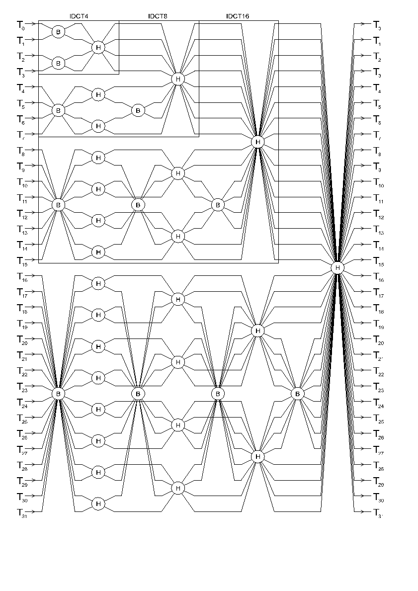

### 5.8 Inverse DCT structure

The two-dimensional inverse transforms used for processing blocks of
coefficients are executed by performing one-dimensional inverse transforms on
first the rows of the block followed by the columns of the intermediate result
from the row transforms.

The inverse DCT works by first shuffling the input data into bit-reversed
address order followed by a series of stages of butterfly operations. Each
butterfly takes two input values, and produces two output values. The butterfly
can be considered as performing a 2D rotation of the input values.

There are two types of butterfly (represented by B and H). The H type of
butterfly represents a matrix combined with scaling such that it can be
implemented with one addition and one subtraction operation whereas the B type
of butterfly requires the use of multiplication.

 The structure of the 32 point inverse DCT is shown in the butterfly diagram
 below (not including the input shuffle). The structure of the 2n
 point inverse DCT is such that it contains the 2n-1 point inverse
 DCT within it. This recursion is highlighted in the diagram to also show the
 4, 8, and 16 point inverse DCTs.

<figure>
  
  <figcaption></figcaption>
</figure>

