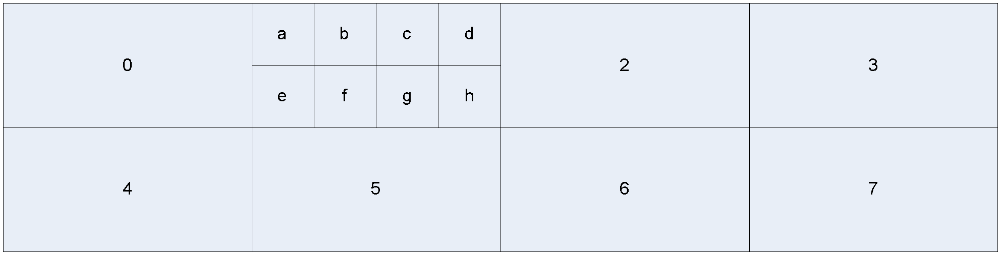

### 5.14 Tiles

The 64 by 64 superblocks in a frame are sent in raster order within rectangular
tiles as detailed in section 5.6 and the tiles are sent in raster order within
the frame. T diagram below shows a possible set of tiles within a frame
(numbered in raster scan order) including the individual 64 by 64 superblocks
for tile 1 (labelled a-h).

<figure>
  
  <figcaption></figcaption>
</figure>

Tiles have dimensions that are multiples of 64 by 64 superblocks and are evenly
spaced, as far as possible.

Tiles are not intended to help reduce bandwidth (in fact they can hurt
compression a small amount), but the objective is to allow implementations to
take advantage of parallel processing by encoding/decoding different tiles at
the same time. The tile sizes are sent at the start of each tile (except the
last) so a decoder can know the start points if it wishes to do parallel
decoding.
