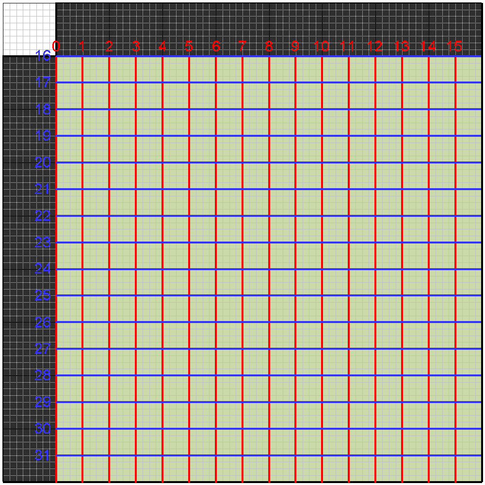

### Loop Filter Ordering and Filters

The loop filter operates on a raster scan order of superblocks.

For each superblock, the loop filter is first applied to the left vertical
boundary and all internal vertical boundaries (shown in red in the diagram
below).

The loop filter is then applied to the top horizontal boundary and all internal
horizontal boundaries (shown in blue).

<figure>
  
  <figcaption></figcaption>
</figure>

The numbers indicate the order in which the boundaries are processed.

For each boundary, the filtering operations depends on up to 8 samples on
either side of the edge, and may modify up to 7 samples on either side of the
edge. (This is true for both luma and chroma and in both subsampled and
non-subsampled modes of operation.) The regions outside the superblock which
may be used by the filter process are shaded grey in the diagram.
