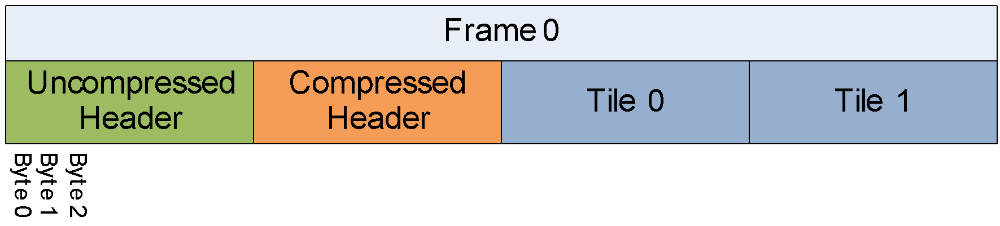

### 5.25 Frame structure

The coded bytes are stored in sequence as shown below:

<figure>
  
  <figcaption></figcaption>
</figure>

The first bytes contain the uncompressed header. This contains almost all the
frame level information using raw binary encodings (i.e. no arithmetic coding).

The compressed header follows the uncompressed header and specifies the
transform size to use during the frame plus information about which
probabilities to adjust. The information in this second header is compressed
using arithmetic coding.

The headers are followed by the bytes for each tile in turn. Each tile contains
the tile size (omitted for the final tile) followed by the arithmetic coded
data for the tile.

This structure is used for normal frames. There are also short frames that
simply contain 1 byte of uncompressed header (or 2 for profile 3) that indicate
that the decoder should show a previously decoded frame. These short frames
have no compressed header and no tile data.
