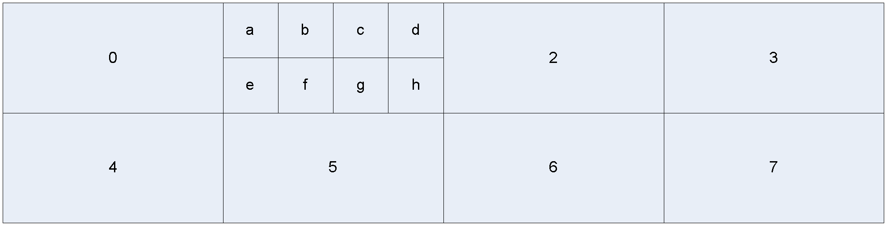

## Overview of the Decoding Process (Informative)

The purpose of this section is to provide a gentler introduction to the
features and motivation of the AV1 specification for readers who are less
familiar with video codecs. This section is just provided for background and
is not an integral part of the specification.

### Purpose of AV1

This specification defines the AV1 video compression format which is a
bandwidth-efficient way of storing and transmitting video sequences. Video data
is very high bandwidth (e.g. a video of width 1920 pixels, and height 1080
pixels may contain 30 frames every second. Each pixel needs around 12 bits
resulting in a bandwidth of 1920 * 1080 * 30 * 12 = 746 million bits per
second.) The goal of AV1 is to provide a way that this video can be stored in a
compressed form that uses orders of magnitude fewer bits.

This specification describes the decoding process that takes a sequence of
compressed frames and turns it into a sequence of decompressed video frames
that can be displayed. All AV1 compliant decoders must decode compressed
frames in exactly the same way.

**Note** that the encoding process is not described here. There are many ways of
choosing how to encode the frames. Different ways can be better or worse
depending on how much they change the source image in ways that matter to the
human visual system and how many bits they end up using.
{:.alert .alert-info }

### Compressing Image Data

Suppose we have some 8-bit image data to compress and we zoom right into the
image until we see the individual pixels in a 4x4 grid - for the moment we
ignore color so each pixel is represented a single value from 0 (black) to 255
(white):

|         |         |         |         |
|:-------:|:-------:|:-------:|:-------:|
| 162     | 160     | 160     | 158     |
| 161     | 160     | 161     | 160     |
| 159     | 161     | 160     | 159     |
| 160     | 160     | 162     | 160     |
{:.table .table-sm .table-bordered .table-nohead }

We have sixteen 8 bit numbers here which need 16 * 8 = 128 bits to store in a raw
format. However, this part of the image is so flat that we could probably
represent it as a flat area with a single value of 160 without an observer
noticing any difference. This would only need 8 bits. Similarly, suppose we had
an area that looked like this:

|         |         |         |         |
|:-------:|:-------:|:-------:|:-------:|
| 10      | 20      | 30      | 40      |
| 10      | 20      | 30      | 40      |
| 10      | 20      | 30      | 40      |
| 10      | 20      | 30      | 40      |
{:.table .table-sm .table-bordered .table-nohead }

In this case the image gradually increases from left to right so if we had some
way of specifying the slope we could represent all 16 values with fewer bits.

AV1 approaches this is by means of a reversible **transform** that adjusts the
numbers to try and make most numbers small and a few numbers large. The essence
of the approach is to take two numbers (e.g. 162 and 160) and transform these
into the sum of the numbers, and the difference between the numbers
(162+160=322 and 162-160=2). If the decoder is given the 322 and 2 it can
reconstruct the original numbers by computing the sum and difference divided
by two (322+2)/2 = 162 and (322-2)/2 = 160. The full transform takes the sum
and differences of pairs of pixels, and performs further similar operations on
both the rows and the columns.

Overall this results in a transform that takes the 16 original pixels into 16
transformed values. The transformed values are still in a square grid, but now
the axes represent horizontal and vertical frequency. This means that if the
image is flat the transform will have just a single non-zero coefficient in the
top left (called the DC coefficient).

This transform is useful because we can compact a block of similar pixel values
into a smaller number of non-zero transform coefficients in the frequency
domain, so that the transformed coefficients can typically be represented by
fewer bits than the original.

### Quantization and Lossy Compression

In the example above our almost flat image would transform into a large DC
coefficient and small values for the other coefficients (called AC
coefficients). Although this is already an improvement, we can compress better
by quantizing the coefficients. This means that we divide the coefficients by a
**quantization** factor before encoding them, and then in the decode process
multiply by the quantization factor.

For example, suppose that we used a quantization factor of 10. Instead of
sending the numbers 322 and 2, we would instead send 322/10=32 and 2/10=0
(where we have rounded down to keep the numbers as integers). In the decoding
process we would compute 32 * 10 = 320 and 0 * 10 = 0, followed by the
transform (320 + 0) / 2 = 160 and (320 - 0) / 2 = 160.

So this has resulted in the decode of two values (160 and 160) that are close,
but not exactly the same as our source image for the benefit of only needing to
transmit the numbers 32 and 0. As we no longer decode to an exact match of the
source data, this is known as **lossy compression**.

Lossy compression is used for most broadcast videos as it results in large
bandwidth savings, but for some applications (such as video editing) it is
useful to be able to use lossless compression. Lossless compression avoids the
growth of the small errors introduced by each repeated application of lossy
compression if the same video sequence were to be repeatedly decompressed and
recompressed.

AV1 supports both lossy and lossless coding. Lossless coding is indicated by
using the smallest quantization factor and this automatically switches to use a
perfectly invertible transform known as the Walsh-Hadamard transform.

### Predicting Image Data

Suppose we are part way through decoding an image and have decoded the pixels
shown below.

| 160     | 160     | 160     | 200    | 200     |
|:-------:|:-------:|:-------:|:------:|:-------:|
| 160     | ?       | ?       | ?      | ?       |
| 160     | ?       | ?       | ?      | ?       |
| 160     | ?       | ?       | ?      | ?       |
| 160     | ?       | ?       | ?      | ?       |
{:.table .table-sm .table-bordered .table-xyhead }

The green cells represent pixels that we have already decoded, while the
question marks represent a 4 by 4 block of pixels that we are about to decode.

It seems natural to predict that some of the missing pixels on the left are at
least close to the value 160 even before we have seen them, while some of the
ones on the right are probably close to 200. However, it is quite possible that
the image looks like:

| 160     | 160     | 160     | 200    | 200     |
|:-------:|:-------:|:-------:|:------:|:-------:|
| 160     | 160     | 160     | 200    | 200     |
| 160     | 160     | 160     | 200    | 200     |
| 160     | 160     | 160     | 200    | 200     |
| 160     | 160     | 160     | 200    | 200     |
{:.table .table-sm .table-bordered .table-xyhead }

or like

| 160     | 160     | 160     | 200    | 200     |
|:-------:|:-------:|:-------:|:------:|:-------:|
| 160     | 160     | 160     | 200    | 200     |
| 160     | 160     | 160     | 160    | 200     |
| 160     | 160     | 160     | 160    | 160     |
| 160     | 160     | 160     | 160    | 160     |
{:.table .table-sm .table-bordered .table-xyhead }

AV1 contains what is called an intra mode that specifies a direction such as
vertical for the first case, or 45 degrees for the second case. When decoding a
block the decoder first reads the intra mode, and uses that to filter already
decoded pixels from the current frame to form a prediction for the contents of
the block. This is known as intra prediction and this method is called decoding
an **intra block**.

Of course, the actual content of our source image data is unlikely to be
exactly the same as the prediction.

Suppose the actual contents are:

|         |         |        |         |
|:-------:|:-------:|:------:|:-------:|
| 160     | 160     | 200    | 200     |
| 160     | 160     | 200    | 200     |
| 170     | 170     | 210    | 210     |
| 170     | 170     | 210    | 210     |
{:.table .table-sm .table-bordered .table-nohead }

Consider the **residual** block. This is defined to be the difference between
the prediction (assume we have been instructed to use vertical prediction) and
the source image:

|         |         |        |         |
|:-------:|:-------:|:------:|:-------:|
| 0       | 0       | 0      | 0       |
| 0       | 0       | 0      | 0       |
| 10      | 10      | 10     | 10      |
| 10      | 10      | 10     | 10      |
{:.table .table-sm .table-bordered .table-nohead }

The residual only contains small numbers, so is cheaper to represent than the
original contents.

In AV1 all blocks are represented by some information specifying how to predict
the contents of the block (in this case the intra mode), plus transform
coefficients of the residual block. The decoder works by first computing the
prediction, and then inverse transforming the transform coefficients and adding
the result (the residual) to this prediction.

This process is followed even for the first blocks in the video where we do not
have any decoded pixels. In these cases the decoder pretends that it has
decoded pixels with a fixed value for the off-screen locations.

### Inter Prediction

Suppose we are now trying to compress a whole video sequence.

Consider what we can predict about the next image from the previous one: there
may be some still parts of the image in the background, so some blocks may be
identical to their contents in the previous frame. Similarly, if the camera is
panning or some object is moving, there may be blocks that are very similar to
a slightly shifted part of the previous frame.

AV1 takes advantage of these cases by using **inter blocks**. An inter block
contains a motion vector that specifies the offset in the previous frame of the
part of the image to use as a prediction for this block. So, for example, still
blocks will be represented by a zero motion vector. The motion vector contains
information about both a vertical and horizontal offset to allow for both types
of movement.

As for intra blocks, the decoding process works by first computing the
prediction, and then inverse transforming the transform coefficients and adding
the result (the residual) to this prediction.

The motion vectors can specify shifts in units of whole pixels, or shifts
containing a fractional pixel offset. When a fractional pixel shift is used,
the previous frame is filtered in order to give a more accurate prediction.

It is also possible to choose the type of **interpolation filter** used in this
filtering. The main difference is in the filter bandwidth. If the source frames
are noisy, it can be appropriate to use a narrow bandwidth filter to discard
the noise, while if the source frames are clean we can use a higher bandwidth
filter to try and preserve more of the high frequency texture. This choice can
either be made for all blocks in a frame, or specified per block.

### Superblocks

In some parts of the image there may be a large region that can all be predicted
at the same time (e.g. a still background image), while in other parts there may
be some fine details that are changing (e.g. in a talking head) and a smaller
block size would be appropriate. AV1 provides the ability to vary the block size
to handle a range of prediction sizes.

The decoder decodes each image in units of 64 by 64 pixel **superblocks**. Each
superblock has a **partition** which specifies how it is to be encoded. It can
consist of:

  * A single 64 by 64 block
  * Two 64 by 32 blocks
  * Two 32 by 64 blocks
  * Four 32 by 32 blocks

The individual parts are decoded in raster order.

Each 32 by 32 block can also be partitioned in a similar way all the way down
until we reach a 4x4 block size.

An example partitioning of a 64 by 64 superblock is shown below:

<figure class="figure center-block">
  
  <figcaption class="figure-caption">Partitioned 64 x 64 superblock</figcaption>
</figure>

The numbers give the decode order of the blocks, while the numbers in brackets
give the block sizes (sizes for blocks smaller than 8x8 are omitted).

### Multiple Transforms

AV1 specifies a number of different transforms that can be applied to the
residual. These differ in size (4x4, 8x8, 16x16, 32x32 are supported) and in
the type of transform. The type of transform can be varied independently for
rows and columns as being either an integer precision version of a
**Discrete Cosine Transform** or an **Asymmetric Discrete Sine Transform.**
The choice of transform type is deduced from the intra mode, while the choice
of transform size can either be specified at a frame level, or given on a
per-block basis.

The idea is that when we are doing intra prediction, normally the samples near
the known edges are predicted better than the ones further away so the errors
are usually small at one side. The Asymmetric Discrete Sine Transform does a
better job of transforming this shape because it has basis vectors that tend to
vanish at the known boundary, and maximize energy at the unknown boundary.

When the transform size is smaller than the block size, the transform blocks
are predicted and reconstructed in raster order. For example, suppose we had a
64x64 intra block using a 16x16 transform size. The blocks would be processed
in this order:

<figure class="figure center-block">
  
  <figcaption class="figure-caption">Raster transform order</figcaption>
</figure>

Each of these 16 blocks would in turn have the following apply:

  1. The 16x16 block is predicted from previously decoded pixels.

  2. The 16x16 block of transform coefficients is inverse transformed to
     compute the residual.

  3. The prediction is added to the residual to compute the decoded pixels.

**Note** that the prediction for the second 16x16 block can depend on the
decoded pixels from the first. (However, also note that the loop filtering is
only applied once the complete frame is decoded.)
{:.alert .alert-info }

### Inverse DCT Structure

The two-dimensional inverse transforms used for processing blocks of
coefficients are executed by performing one-dimensional inverse transforms on
first the rows of the block followed by the columns of the intermediate result
from the row transforms.

The inverse DCT works by first shuffling the input data into bit-reversed
address order followed by a series of stages of butterfly operations. Each
butterfly takes two input values, and produces two output values. The butterfly
can be considered as performing a 2D rotation of the input values.

There are two types of butterfly (represented by B and H). The H type of
butterfly represents a matrix combined with scaling such that it can be
implemented with one addition and one subtraction operation whereas the B type
of butterfly requires the use of multiplication.

 The structure of the 32 point inverse DCT is shown in the butterfly diagram
 below (not including the input shuffle). The structure of the 2n
 point inverse DCT is such that it contains the 2n-1 point inverse
 DCT within it. This recursion is highlighted in the diagram to also show the
 4, 8, and 16 point inverse DCTs.

<figure class="figure center-block">
  
  <figcaption class="figure-caption"></figcaption>
</figure>

### Inverse ADST Structure

The ADST is an alternative 1D transform which may be used to transform arrays
of length 4, 8, or 16.

In some stages, the ADST uses an array S of higher precision intermediate
results.  The butterfly operation SB stores its output in S, and the butterfly
operation SH takes its input from S.

The structure of the 8 point inverse ADST used for AV1 is shown in the diagram
below.

<figure class="figure center-block">
  
  <figcaption class="figure-caption">Description: diagram_iadst8_bd665e1</figcaption>
</figure>

The structure of the 16 point inverse ADST is shown in the diagram below.

<figure class="figure center-block">
  
  <figcaption class="figure-caption">Description: diagram_iadst16_fa24788</figcaption>
</figure>

The 4 point ADST is treated as a special case and is implemented as eight
multiplications followed by a number of addition/subtraction/shift operations.

### Reference Frames

If an object is moving across a scene it can happen that the best source of an
inter prediction for a block is not the previous frame (where the block was
obscured by the moving object), but the frame before that.

AV1 provides options for inter blocks to specify which frame is used as the
reference frame. A decoder maintains 8 slots, each slot with a decoded
reference frame. When a new frame is decoded, the frame header specifies which
of the slots should be overwritten with the new frame.

Although 8 slots are maintained, any particular frame can make use of at most 3
reference frames. Which reference frames to use are specified in the frame
header, and then the detailed choice between these 3 is specified in the mode
info at the coding block level. Each block is
allowed to use up to 2 reference frames.

### Hidden Frames

When a frame is decoded it will normally be shown. However, there is also an
option to decode a frame but not show it. The frame can still be saved into the
reference frame slots for use in inter prediction of future frames.

This option can be used to make a **golden frame** that contains a high quality
version of various objects in the scene. This frame can be used to construct
other frames.

It is also possible to send a very short frame (just one or two bytes) that
tells the decoder to directly show one of the frame slots.

### Compound Prediction

As mentioned above, an inter block can be predicted using either a single
reference frame or a combination of two reference frames. The latter is called
**compound prediction** in which 2 motion vectors and 2 reference frames are
specified for an inter block.

In this case the prediction is first formed from each reference frame, and then
the final prediction is produced as an averaged combination of these two. The
hope is that the average is an even better predictor than either of the
originals.

The choice of compound prediction can either be made at the frame level, or
specified in the mode info for inter blocks.

### Motion Vector Prediction

Quite often many blocks share the same motion vector (e.g. with a panning
camera). AV1 takes advantage of this by scanning already decoded inter blocks
to form a prediction of the most likely motion vectors that will be used for
the current block. It prefers blocks that are nearby and share the same choice
of reference frame, but gradually expands its search scope until it has found
up to 2 different predictions. When the spatial neighbors do not provide
sufficient information, it can fall back to using the motion vectors from the
previous decoded frame. The first found motion vector is called nearest motion
vector, and the second found motion vector is called near motion vector
(nearmv).

The block contains the **inter mode** which indicates whether to use the
nearest or near motion vector, or to use a zero motion vector, or to use a new
motion vector.

In the new motion vector case, what is coded in the bitstream is a motion
vector difference. The decoder reads this motion vector difference and adds it
to the nearest motion vector to compute the actual motion vector.

The effective motion vector can be specified at up to 1/8 (one eighth) pixel
accuracy. When the predicted motion vector has either component whose magnitude
is above 64 (i.e., 8 full pixels), the maximum accuracy of the effective motion
vector is automatically capped at 1/4 (one quarter) pixel accuracy.

### Tiles

The 64 by 64 superblocks in a frame are sent in raster order within rectangular
tiles as detailed in [section 5.6][] and the tiles are sent in raster order within
the frame. T diagram below shows a possible set of tiles within a frame
(numbered in raster scan order) including the individual 64 by 64 superblocks
for tile 1 (labelled a-h).

<figure class="figure center-block">
  
  <figcaption class="figure-caption"></figcaption>
</figure>

Tiles have dimensions that are multiples of 64 by 64 superblocks and are evenly
spaced, as far as possible.

Tiles are not intended to help reduce bandwidth (in fact they can hurt
compression a small amount), but the objective is to allow implementations to
take advantage of parallel processing by encoding/decoding different tiles at
the same time. The tile sizes are sent at the start of each tile (except the
last) so a decoder can know the start points if it wishes to do parallel
decoding.

### Segmentation Map

AV1 provides a means of segmenting the image and then applying various signals
or adjustments at the segment level. Segmentation can be particularly efficient
and useful when the segmentation of a video sequence persists or changes little
for many frames.

Up to 8 segments may be specified for any given frame. For each of these
segments it is possible to specify:

  * a quantizer,
  * a loop filter strength,
  * a prediction reference frame,
  * a block skip mode that implies the use of a zero motion vector and that no
    residual will be coded.

Each of these data values for each segment may be individually updated at the
frame level. Where a value is not updated in a given frame, the value from the
previous frame persists. The exceptions to this are key frames, intra only
frames or other frames where independence from past frame values is required
(for example to enable error resilience). In such cases all values are reset to
a default.

It is possible to indicate segment affiliation for any prediction block of size
4x4 pixels or greater. Updates to this **segmentation map** are explicitly
coded using either a temporal coding or direct coding strategy (chosen at the
frame level).

If no explicit update is coded for a block's segment affiliation, then it
persists from frame to frame with the same provisos detailed above for the
segment data values. In regard to key frames, intra only frames and frames
where independence from past frames is required, the segment affiliation for
each block defaults to 0 unless explicitly updated.

Internally, segment affiliation is stored at the resolution of 4x4 blocks (a
segment map). This can lead to conflicts when, for example, a transform size of
32x32 is selected for a 64x64 region. If the different component 4x4 blocks
that comprise a larger region have different segment affiliations, then the
segment affiliation for the larger region is defined as being the lowest
segment id of any of the contributing 4x4 regions.

### Reference Frame Scaling

It is legal for different decoded frames to have different frame sizes (and
aspect ratios). AV1 automatically handles resizing predictions from reference
frames of different sizes.

However, reference frames must share the same color depth and subsampling
format for reference frame scaling to be allowed, and the amount of up/down
scaling is limited to be no more than 16x larger and no less than 2x smaller
(e.g. the new frame must not be more than 16 times wider or higher than any of
its used reference frames).

### Arithmetic Coding

Suppose we have 4 symbols (for example, the inter mode can be NEW, NEAREST,
NEAR, ZERO), that we wish to encode. If these are all equally likely then
encoding each with 2 bits would be fine:

| MODE      | BITS      |
|:---------:|:---------:|
| NEW       | 00        |
| NEAR      | 01        |
| NEAREST   | 10        |
| ZERO      | 11        |
{:.table .table-sm .table-bordered }

However, suppose ZERO happened 50% of the time, NEAREST 25%, and NEAR/NEW
12.5%. In this case we could use the variable length codes:

| MODE      | BITS      |
|:---------:|:---------:|
| NEW       | 000       |
| NEAR      | 001       |
| NEAREST   | 01        |
| ZERO      | 1         |
{:.table .table-sm .table-bordered }

This scheme would now give fewer bits on average than the uniform encoding
scheme.

Now suppose that ZERO happened 90% of the time. **Arithmetic coding** provides
a way to allow us to effectively use a fraction of a bit in this case.

At the lowest level AV1 contains a **boolean decoder** which decodes one
boolean value (0 or 1) at a time given an input containing the estimated
probability of the value. If the boolean value is much more likely to be a 1
than a 0 (or the other way around), then it can be faithfully coded using less
than 1 bit per boolean value on average using an arithmetic coder.

The boolean decoder works using a small set of unsigned 16-bit integers and an
unsigned 16-bit multiplication operation.

### Probability Updates

The boolean decoder produces fewest bits when the estimated probabilities for
the different syntax elements match the actual frequency with which the
different cases occur.

AV1 provides two mechanisms to match these up:

  1. The probabilities can be explicitly changed in the frame headers. (In
     fact the probability changes are themselves coded using an arithmetic
     coder to reduce the cost of this process.)

  2. The boolean decoder keeps track of how many times each type of syntax
     element is decoded and can be told to automatically adjust the
     probabilities at the end of the frame to match the observed frequencies.

The idea with the first method is that we can reduce the number of bits to
code the frame by setting the probabilities accurately -- but the cost is that
we need to spend bits to perform the updates.

The idea with the second method is that the probabilities for the next frame
are probably quite similar to the ones for this frame, so adapting the
probabilities at the end of the frame can help to improve compression.

### Chroma Format

The human visual system is said to be less sensitive to color than to luminance
so images are often coded with fewer chroma samples than luminance samples.

AV1 provides the option for the 2 chroma planes (called U and V) to be
subsampled in either the horizontal or vertical direction (or both, or neither).

In profiles 0 and 2, only 4:2:0 format is allowed, which means that chroma is
subsampled in both the horizontal and vertical direction. In profiles 1 and 3,
all other subsampling formats are allowed.

### High Bit Depth

AV1 supports the option to output pixels using either 8, 10, or 12 bits per
color sample.

In profiles 0 and 1, only 8 bits per color sample is allowed.

In profiles 2 and 3, only greater than 8 bits per color sample is allowed.

### Probability Contexts

When coding a syntax element, such as whether the block is skipped, AV1 defines
a process to determine which probability to use. The choice of probability is
based on the context of the syntax element, e.g. on how that syntax element has
been decoded in the past for blocks that are similar in some way – such as
being close or being of the same size.

This process makes it more likely that the decoder can accurately predict the
probability distribution of a syntax element and therefore can represent the
syntax element using fewer bits on average.

### Zigzag Ordering

The transform coefficients of natural blocks tend to be clustered around the
low frequency end. This means that there are often only a few non-zero
coefficients in a block and these are clustered in one corner of the
transformed block.

AV1 decodes the coefficients in a special zig-zag order such that the first
coefficient read is the DC coefficient, and then the order gradually moves
outward to higher frequency coefficients.

A bool is decoded after each non-zero coefficient that signals whether there
are any more non-zero coefficients in the whole transform block. When this
condition is detected, the decoder can immediately fill in the whole rest of
the transform block with zeros without consuming any more bits from the
bitstream.

Depending on the direction of intra prediction, the transform coefficients are
often clustered towards the left or the top side of the transform block.
Therefore AV1 selects the scan order based on the intra prediction direction.

An example scan ordering for a 4x4 block is illustrated in the diagram below,
where the numbers and arrows indicate the order of the decode process.

<figure class="figure center-block">
  
  <figcaption class="figure-caption"></figcaption>
</figure>

### Loop Filter

When we are using lossy compression the quantization means that errors are
introduced into the decoded data. For example, suppose we have some source data:

|       |       |       |       |       |       |       |       |
|:-----:|:-----:|:-----:|:-----:|:-----:|:-----:|:-----:|:-----:|
| 100   | 102   | 104   | 106   | 108   | 110   | 112   | 114   |
| 100   | 102   | 104   | 106   | 108   | 110   | 112   | 114   |
| 100   | 102   | 104   | 106   | 108   | 110   | 112   | 114   |
| 100   | 102   | 104   | 106   | 108   | 110   | 112   | 114   |
{:.table .table-sm .table-bordered .table-nohead }

but due to lossy compression this decodes as two flat blocks:

|       |       |       |       |       |       |       |       |
|:-----:|:-----:|:-----:|:-----:|:-----:|:-----:|:-----:|:-----:|
| 103   | 103   | 103   | 103   | 111   | 111   | 111   | 111   |
| 103   | 103   | 103   | 103   | 111   | 111   | 111   | 111   |
| 103   | 103   | 103   | 103   | 111   | 111   | 111   | 111   |
| 103   | 103   | 103   | 103   | 111   | 111   | 111   | 111   |
{:.table .table-sm .table-bordered .table-nohead }

Each of the individual 4x4 blocks looks reasonably close to the original, but
the discontinuity in the middle stands out. This is quite a common problem and
block edges appear in the decoded images.

To reduce the impact of these errors, a process called the loop filter is
applied to the block edges in the image. This process filters the image pixels
across the block boundaries in an attempt to smooth off such sudden
discontinuities. The block boundaries that are filtered include both the edges
between transform blocks and the edges between different mode info blocks.

This process is known as an in-loop filter because the filtered versions of
frames are used for reference in inter prediction.

### Loop Filter Ordering and Filters

For each frame, the loop filter is first applied to all vertical
boundaries.

The loop filter is then applied to all
horizontal boundaries.

For each boundary, the filtering operations depends on up to 8 samples on
either side of the edge, and may modify up to 7 samples on either side of the
edge.

The size of the filter depends on the transform size used for the blocks
on both sides of the boundary in such a way that there is no feedback within
a filtering pass.  This means that the vertical boundaries can be filtered
in any order, and the horizontal boundaries can be filtered in any order
(although is it still true that the horizontal filtering depends on the output
of the vertical filtering).

### Frame Structure

The coded bytes are stored in sequence as shown below:

<figure class="figure center-block">
  
  <figcaption class="figure-caption"></figcaption>
</figure>

The first bytes contain the uncompressed header. This contains almost all the
frame level information using raw binary encodings (i.e. no arithmetic coding).

The compressed header follows the uncompressed header and specifies the
transform size to use during the frame plus information about which
probabilities to adjust. The information in this second header is compressed
using arithmetic coding.

The headers are followed by the bytes for each tile in turn. Each tile contains
the tile size (omitted for the final tile) followed by the arithmetic coded
data for the tile.

This structure is used for normal frames. There are also short frames that
simply contain 1 byte of uncompressed header (or 2 for profile 3) that indicate
that the decoder should show a previously decoded frame. These short frames
have no compressed header and no tile data.

### Superframes

AV1 supports consolidating multiple compressed video frames into one single
chunk called a superframe. The superframe index is stored in the last bytes of
the chunk (and is up to 34 bytes long). The enclosed frames can be located by
parsing this superframe index:

<figure class="figure center-block">
  
  <figcaption class="figure-caption"></figcaption>
</figure>

From the point of view of the container format, this whole superframe is stored
together. This format can be useful to ensure that each superframe produces a
single decoded frame even though the video is coded using unshown frames.
However, it is also legal for a superframe to result in multiple output frames,
or even no output frames.

### Palette prediction

For certain types of image, such as PC screen content, it is likely that the majority
of colors come from a very small subset of the color space. This subset is referred to
as a palette. AV1 supports palette prediction, whereby non-inter frames are predicted
from a palette containing the most likely colors. AV1 improves the efficiency further
by ranking the most likely colors within the palette based on the colors of surrounding
pixels and thus transmitting these with fewer bits. The residual, as described in the
[prediction section](#predicting-image-data), is applied after palette prediction.
