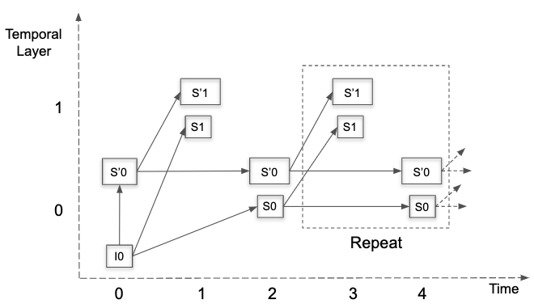
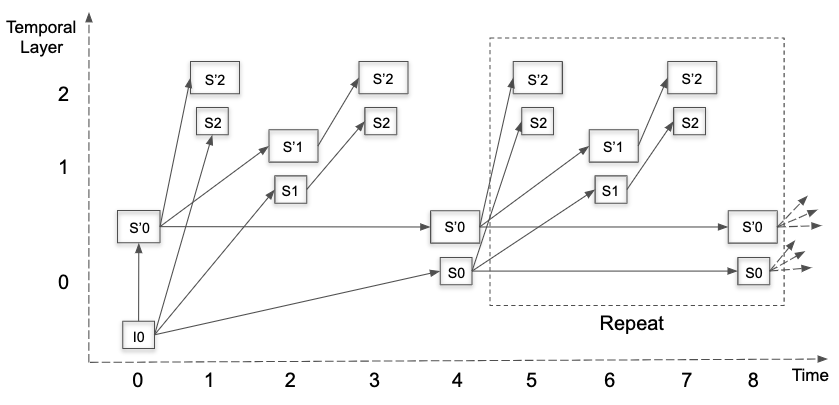
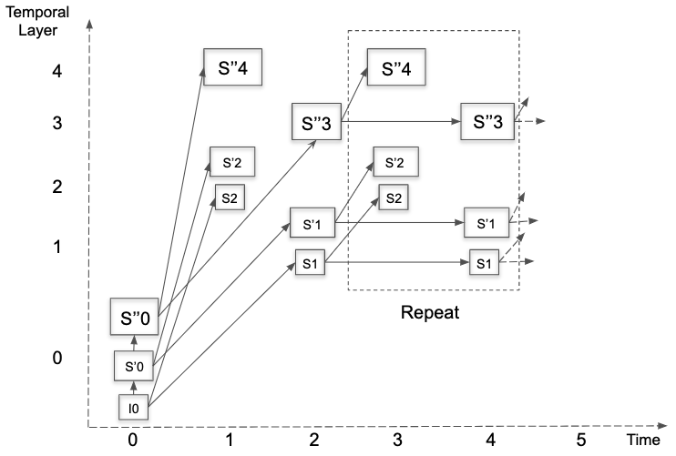
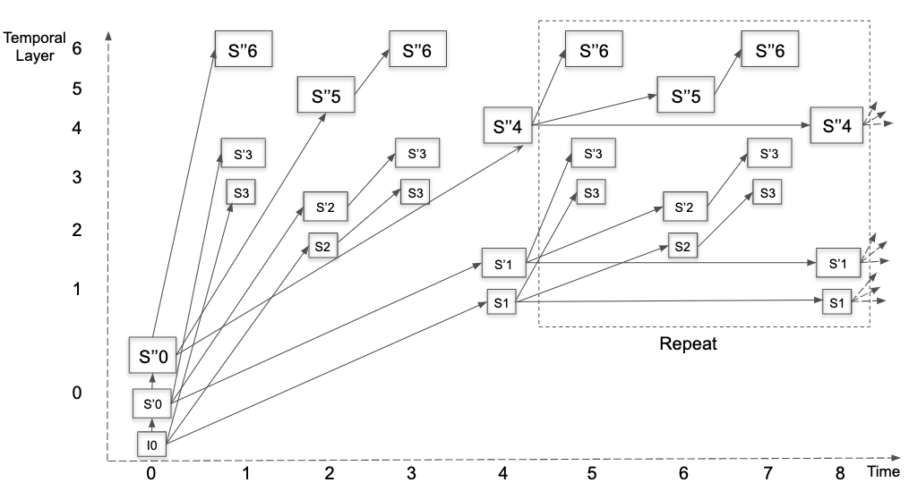
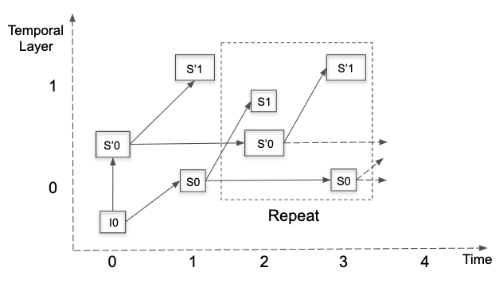
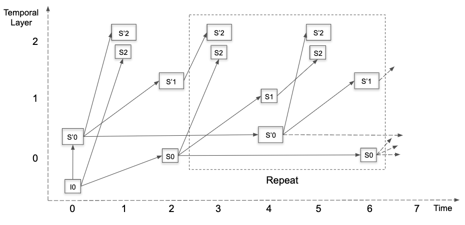
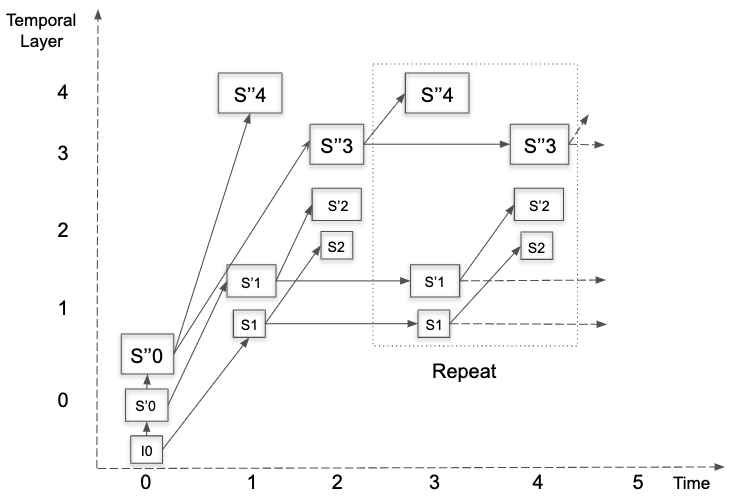
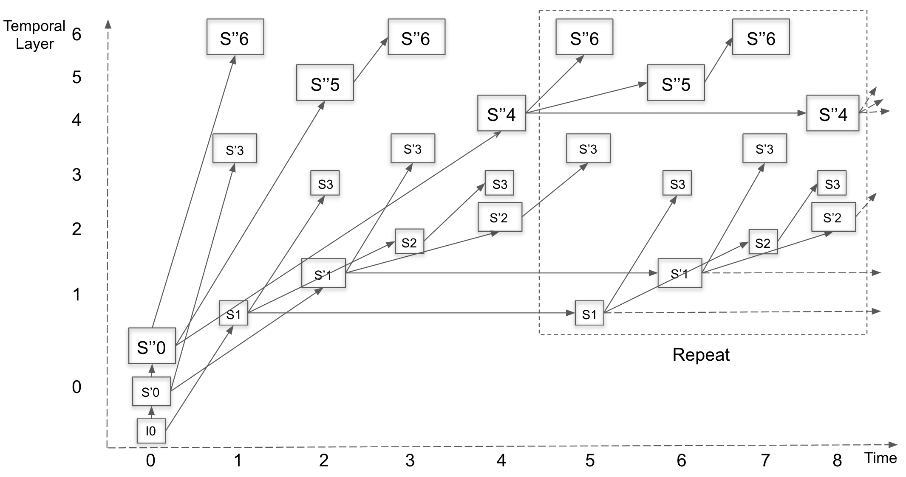

## Syntax structures semantics

### General

This section specifies the meaning of the syntax elements read in the syntax
structures.

Important variables and function calls are also described.

### OBU semantics

#### General OBU semantics

An ordered series of OBUs is presented to the decoding process. Each OBU is
given to the decoding process as a string of bytes along with a variable sz that
identifies the total number of bytes in the OBU.

If the syntax element obu_has_size_field (in the OBU header) is equal to 1,
then the variable sz will be unused and does not have to be provided.

**obu_size** contains the size in bytes of the OBU not including the bytes within obu_header or the obu_size syntax element.

Methods of framing the OBUs (i.e. of identifying the series of OBUs and their size
and payload data) in a delivery or container format may be established in a manner
outside the scope of this Specification. One simple method is described in Annex
B.

OBU data starts on the first (most significant) bit and ends on the last bit of the given bytes. The
payload of an OBU lies between the first bit of the given bytes and the last bit
before the first trailing bit. Trailing bits are always present, unless the OBU
consists of only the header. Trailing bits achieve byte alignment when the payload
of an OBU is not byte aligned. The trailing bits may also used for additional byte
padding, and if used are taken into account in the sz value. In all cases, the pattern
used for the trailing bits guarantees that all OBUs (except header-only OBUs) end
with the same pattern: one bit set to one, optionally followed by zeros.

**Note:** As a validity check for malformed encoded data and for operation in
environments in which losses and errors can occur, decoders may detect an error
if the end of the parsed data is not directly followed by the correct trailing bits
pattern or if the parsing of the OBU header and payload leads to the consumption
of bits within the trailing bits (except for tile group data which is allowed to read
a small distance into the trailing bits as described in [section 8.2.4][]).
{:.alert .alert-info }

**drop_obu( )** is a function call that indicates when the decoding process should
ignore an OBU because it is not contained in the selected operating point.
When an OBU is not in the selected operating point
the contents have no effect on the decoding process.

When this function is called, the bitstream position indicator should be
advanced by obu_size * 8 bits.

#### OBU header semantics

OBUs are structured with a header and a payload.
The header identifies the type of the payload using the obu_type header parameter.

**obu_forbidden_bit** must be set to 0.

**Note:** This ensures that MPEG2 transport is
possible by preventing emulation of MPEG2 transport stream ids.
{:.alert .alert-info }

**obu_type** specifies the type of data structure contained in the OBU payload:

| obu_type | Name of obu_type       | Layer-specific
| -------- | ----------------       | ------------
| 0        | Reserved               | -
| 1        | OBU_SEQUENCE_HEADER.   | N
| 2        | OBU_TEMPORAL_DELIMITER | N
| 3        | OBU_FRAME_HEADER       | Y
| 4        | OBU_TILE_GROUP         | Y
| 5        | OBU_METADATA           | See Table in Section 6.7.1
| 6        | OBU_FRAME              | Y
| 7        | OBU_REDUNDANT_FRAME_HEADER | Y
| 8        | OBU_TILE_LIST          | N
| 9-14     | Reserved               | -
| 15       | OBU_PADDING            | Either
{:.table .table-sm .table-bordered }

Reserved units are for future use and shall be ignored by AV1 decoder.

The column “Layer-specific” indicates if the corresponding OBU type is considered to be associated with
a specific layer  ("Y"), or not ("N"). OBUs that are not layer-specific must have the obu_extension_flag set to 0. 

Metadata OBU types may or may not be layer-specific, depending on the metadata type. The table in Section 6.7.1 specifies which types of metadata OBUs are layer-specific and which are not.

Padding OBUs may or may not be layer-specific. If the obu_extension_flag is set to 1 they are layer-specific, whereas when the obu_extension_flag is set to 0 they are not.   

**obu_extension_flag** indicates if the optional obu_extension_header is present.

**obu_has_size_field** equal to 1 indicates that the obu_size syntax element
will be present.  obu_has_size_field equal to 0 indicates that the obu_size
syntax element will not be present.

**obu_reserved_1bit** must be set to 0. The value is ignored by a decoder.

#### OBU extension header semantics

**temporal_id** specifies the temporal level of the data contained in the OBU.
In layer-specific OBUs, when temporal_id is not present it is inferred to be equal to 0.

**spatial_id** specifies the spatial level of the data contained in the OBU.
In layer-specific OBUs, when spatial_id is not present it is inferred to be equal to 0.

**Note:** The term "spatial" refers to the fact that
the enhancement here occurs in the spatial dimension: either as an increase in spatial resolution, or an
increase in spatial fidelity (increased SNR).
{:.alert .alert-info }

Tile group OBU data associated with spatial_id and temporal_id equal to 0 are referred to as the
base layer, whereas tile group OBU data that are associated with spatial_id greater than 0 or
temporal_id greater than 0 are referred to as enhancement layer(s).

Coded video data of a temporal level with temporal_id T and spatial level with spatial_id S
are only allowed to reference previously coded video data of temporal_id T' and spatial_id S',
where T' <= T and S' <= S.

**extension_header_reserved_3bits** must be set to 0. The value is ignored by a decoder.

#### Trailing bits semantics

**Note:** Tile group OBUs, tile List OBUs, and frame OBUs do end with trailing bits,
but for these cases, the trailing bits are consumed by the exit_symbol process.
{:.alert .alert-info }

**trailing_one_bit** shall be equal to 1.

When the syntax element trailing_one_bit is read, it is a requirement that nbBits is greater than zero.

**trailing_zero_bit** shall be equal to 0 and is inserted into the bitstream to align
the bit position to a multiple of 8 bits and add optional zero padding bytes to the OBU.

#### Byte alignment semantics

**zero_bit** shall be equal to 0 and is inserted into the bitstream to align
the bit position to a multiple of 8 bits.

### Reserved OBU semantics

The reserved OBU allows the extension of this specification with additional OBU
types in a way that allows older decoders to ignore them.

### Sequence header OBU semantics

#### General sequence header OBU semantics

**seq_profile** specifies the features that can be used in the coded video sequence.

| seq_profile | Bit depth | Monochrome support      | Chroma subsampling
| ----------- | --------- | ----------------------- | ------------------
| 0           | 8 or 10   | Yes                     | YUV 4:2:0
| 1           | 8 or 10   | No                      | YUV 4:4:4
| 2           | 8 or 10   | Yes                     | YUV 4:2:2
| 2           | 12        | Yes                     | YUV 4:2:0, YUV 4:2:2, YUV 4:4:4
{:.table .table-sm .table-bordered }

It is a requirement of bitstream conformance that seq_profile is not greater than 2 (values 3 to 7 are reserved).

Monochrome can only be signaled when seq_profile is equal to 0 or 2.

AV1 profiles are defined in Annex A.

**still_picture** equal to 1 specifies that the coded video sequence contains only one coded frame.
still_picture equal to 0 specifies that the coded video sequence contains one or more coded frames.

**reduced_still_picture_header** specifies that the syntax elements not needed by a still picture are omitted.

If reduced_still_picture_header is equal to 1, it is a requirement of bitstream conformance that still_picture is equal to 1.

**Note:** It is allowed to have still_picture equal to 1 and reduced_still_picture_header equal to 0.
This allows a video frame to be converted to a still picture by changing a single bit.
{:.alert .alert-info }

**timing_info_present_flag** specifies whether timing info is present in the coded video sequence.

**decoder_model_info_present_flag** specifies whether decoder model information is present in the coded video sequence.

**initial_display_delay_present_flag** specifies whether initial display delay information is present in the coded video sequence.

**operating_points_cnt_minus_1** indicates the number of operating points minus 1 present in the coded video sequence.

An operating point specifies which spatial and temporal layers should be decoded.

**operating_point_idc[ i ]** contains a bitmask that indicates which spatial and temporal layers should be decoded for operating point i.
Bit k is equal to 1 if temporal layer k should be decoded (for k between 0 and 7).
Bit j+8 is equal to 1 if spatial layer j should be decoded (for j between 0 and 3).

However, if operating_point_idc[ i ] is equal to 0 then the coded video sequence
has no scalability information in OBU extension headers and the operating
point applies to the entire coded video sequence.  This means that all OBUs must be decoded.

It is a requirement of bitstream conformance that operating_point_idc[ i ] is not equal to operating_point_idc[ j ] for j = 0..(i - 1).

**Note:** This constraint means it is not allowed for two operating points to have the same value of operating_point_idc.
{:.alert .alert-info }

If operating_point_idc[ op ] is not equal to 0 for any value of op from 0 to operating_points_cnt_minus_1, it is a requirement of bitstream conformance that obu_extension_flag is equal to 1 for all layer-specific OBUs in the coded video sequence.

**seq_level_idx[ i ]** specifies the level that the coded video sequence conforms to when operating point i is selected.

**Note:** Encoders should select the lowest level that is satisfied by the operating point
to maximize the number of decoders that can decode the stream, but this is not a requirement of bitstream conformance.
{:.alert .alert-info }

**seq_tier[ i ]** specifies the tier that the coded video sequence conforms to when operating point i is selected.

**decoder_model_present_for_this_op[ i ]** equal to one indicates that there is a decoder model
associated with operating point i.
decoder_model_present_for_this_op[ i ] equal to zero indicates that there is not a decoder model
associated with operating point i.

**initial_display_delay_present_for_this_op[ i ]** equal to 1 indicates that initial_display_delay_minus_1 is
specified for operating point i.
initial_display_delay_present_for_this_op[ i ] equal to 0 indicates that initial_display_delay_minus_1
is not specified for operating point i.

**initial_display_delay_minus_1[ i ]** plus 1 specifies, for operating point i, the number of
decoded frames that should be present in the buffer pool before the first presentable frame is displayed.
This will ensure that all presentable frames in the sequence can be decoded at or before the time
that they are scheduled for display.
If not signaled then initial_display_delay_minus_1[ i ] = BUFFER_POOL_MAX_SIZE - 1.

**choose_operating_point( )** is a function call that indicates that the operating point should be selected.

The implementation of this function depends on the
capabilities of the chosen implementation.
The order of operating points indicates the preferred order for producing an output: a decoder should
select the earliest operating point in the list that meets its decoding capabilities as expressed by the level
associated with each operating point.

A decoder must return a value from choose_operating_point between 0 and operating_points_cnt_minus_1, or abandon the decoding process
if no level within the decoder's capabilities can be found.

**Note:** To help with conformance testing, decoders may allow the operating point to be explicitly signaled by external means.
{:.alert .alert-info }

**Note:** A decoder may need to change the operating point selection when a new coded video sequence begins.
{:.alert .alert-info }

**OperatingPointIdc** specifies the value of operating_point_idc for the selected operating point.

It is a requirement of bitstream conformance that if OperatingPointIdc is equal to 0, then
obu_extension_flag is equal to 0 for all OBUs that follow this sequence header until the next sequence header.

**frame_width_bits_minus_1** specifies the number of bits minus 1 used for transmitting the frame width syntax elements.

**frame_height_bits_minus_1** specifies the number of bits minus 1 used for transmitting the frame height syntax elements.

**max_frame_width_minus_1** specifies the maximum frame width minus 1 for the frames represented by this sequence header.

**max_frame_height_minus_1** specifies the maximum frame height minus 1 for the frames represented by this sequence header.

**frame_id_numbers_present_flag** specifies whether frame id numbers are present in the coded video sequence.

**Note:** The frame id numbers (represented in display_frame_id, current_frame_id, and RefFrameId[ i ]) are not needed by the decoding process,
but allow decoders to spot when frames have been missed and take an appropriate action.
{:.alert .alert-info }

**additional_frame_id_length_minus_1** is used to calculate the number of bits used to encode the display_frame_id or current_frame_id syntax element.

**delta_frame_id_length_minus_2** specifies the number of bits minus 2 used to encode delta_frame_id_minus_1 syntax elements.

**use_128x128_superblock**, when equal to 1, indicates that superblocks contain
128x128 luma samples. When equal to 0, it indicates that superblocks contain 64x64
luma samples. (The number of contained chroma samples depends on subsampling_x and subsampling_y.)

**enable_filter_intra** equal to 1 specifies that the use_filter_intra syntax element
may be present.
enable_filter_intra equal to 0 specifies that the use_filter_intra syntax element
will not be present.

**enable_intra_edge_filter** specifies whether the intra edge filtering process
should be enabled.

**enable_interintra_compound** equal to 1 specifies that the mode info for inter
blocks may contain the syntax element interintra. enable_interintra_compound
equal to 0 specifies that the syntax element interintra will not be present.

**enable_masked_compound** equal to 1 specifies that the mode info for inter
blocks may contain the syntax element compound_type. enable_masked_compound equal
to 0 specifies that the syntax element compound_type will not be present.

**enable_warped_motion** equal to 1 indicates that the allow_warped_motion
syntax element may be present.
enable_warped_motion equal to 0 indicates that the allow_warped_motion
syntax element will not be present.

**enable_order_hint** equal to 1 indicates that tools based on the values of
order hints may be used. enable_order_hint equal to 0 indicates that
tools based on order hints are disabled.

**enable_dual_filter** equal to 1 indicates that the inter prediction filter
type may be specified independently in the horizontal and vertical directions.
If the flag is equal to 0, only one filter type may be specified, which is
then used in both directions.

**enable_jnt_comp** equal to 1 indicates that the distance weights process
may be used for inter prediction.

**enable_ref_frame_mvs** equal to 1 indicates that the use_ref_frame_mvs
syntax element may be present.
enable_ref_frame_mvs equal to 0 indicates that the use_ref_frame_mvs
syntax element will not be present.

**seq_choose_screen_content_tools** equal to 0 indicates that the seq_force_screen_content_tools syntax element
will be present.  seq_choose_screen_content_tools equal to 1 indicates that seq_force_screen_content_tools
should be set equal to SELECT_SCREEN_CONTENT_TOOLS.

**seq_force_screen_content_tools** equal to SELECT_SCREEN_CONTENT_TOOLS indicates that the allow_screen_content_tools
syntax element will be present in the frame header.  Otherwise,
seq_force_screen_content_tools contains the value for allow_screen_content_tools.

**seq_choose_integer_mv** equal to 0 indicates that the seq_force_integer_mv syntax element
will be present.  seq_choose_integer_mv equal to 1 indicates that seq_force_integer_mv should be set
equal to SELECT_INTEGER_MV.

**seq_force_integer_mv** equal to SELECT_INTEGER_MV indicates that the force_integer_mv syntax element
will be present in the frame header (providing allow_screen_content_tools is equal to 1).  Otherwise, seq_force_integer_mv
contains the value for force_integer_mv.

**order_hint_bits_minus_1** is used to compute OrderHintBits.

**OrderHintBits** specifies the number of bits used for the order_hint syntax element.

**enable_superres** equal to 1 specifies that the use_superres syntax element will be present in the uncompressed header.
enable_superres equal to 0 specifies that the use_superres syntax element will not be present
(instead use_superres will be set to 0 in the uncompressed header without being read).

**Note:** It is allowed to set enable_superres equal to 1 even when use_superres is not
equal to 1 for any frame in the coded video sequence.
{:.alert .alert-info }

**enable_cdef** equal to 1 specifies that cdef filtering may be enabled.
enable_cdef equal to 0 specifies that cdef filtering is disabled.

**Note:** It is allowed to set enable_cdef equal to 1 even when cdef filtering is not
used on any frame in the coded video sequence.
{:.alert .alert-info }

**enable_restoration** equal to 1 specifies that loop restoration filtering may be enabled.
enable_restoration equal to 0 specifies that loop restoration filtering is disabled.

**Note:** It is allowed to set enable_restoration equal to 1 even when loop restoration is not
used on any frame in the coded video sequence.
{:.alert .alert-info }

**film_grain_params_present** specifies whether film grain parameters are present in the coded video sequence.

#### Color config semantics

**high_bitdepth** and **twelve_bit** are syntax elements which, together with seq_profile,
determine the bit depth.

**mono_chrome** equal to 1 indicates that the video does not contain U and V color planes.
mono_chrome equal to 0 indicates that the video contains Y, U, and V color planes.

**color_description_present_flag** equal to 1 specifies that color_primaries,
transfer_characteristics, and matrix_coefficients are present.
color_description_present_flag
equal to 0 specifies that color_primaries, transfer_characteristics and matrix_coefficients are
not present.

**color_primaries** is an integer that is defined by the "Color primaries" section of
ISO/IEC 23091-4/ITU-T H.273.

| color_primaries | Name of color primaries | Description
|:-----------:|:-------------------:| -----------
| 1           | CP_BT_709           | BT.709
| 2           | CP_UNSPECIFIED      | Unspecified
| 4           | CP_BT_470_M         | BT.470 System M (historical)
| 5           | CP_BT_470_B_G       | BT.470 System B, G (historical)
| 6           | CP_BT_601           | BT.601
| 7           | CP_SMPTE_240        | SMPTE 240
| 8           | CP_GENERIC_FILM     | Generic film (color filters using illuminant C)
| 9           | CP_BT_2020          | BT.2020, BT.2100
| 10          | CP_XYZ              | SMPTE 428 (CIE 1921 XYZ)
| 11          | CP_SMPTE_431        | SMPTE RP 431-2
| 12          | CP_SMPTE_432        | SMPTE EG 432-1
| 22          | CP_EBU_3213         | EBU Tech. 3213-E
{:.table .table-sm .table-bordered }

**transfer_characteristics** is an integer that is defined by the "Transfer characteristics"
section of ISO/IEC 23091-4/ITU-T H.273.

| transfer_characteristics | Name of transfer characteristics | Description
|:-----------:|:-------------------:| -----------
| 0           | TC_RESERVED_0   | For future use
| 1           | TC_BT_709       | BT.709
| 2           | TC_UNSPECIFIED  | Unspecified
| 3           | TC_RESERVED_3   | For future use
| 4           | TC_BT_470_M     | BT.470 System M (historical)
| 5           | TC_BT_470_B_G   | BT.470 System B, G (historical)
| 6           | TC_BT_601       | BT.601
| 7           | TC_SMPTE_240    | SMPTE 240 M
| 8           | TC_LINEAR       | Linear
| 9           | TC_LOG_100      | Logarithmic (100 : 1 range)
| 10          | TC_LOG_100_SQRT10  | Logarithmic (100 * Sqrt(10) : 1 range)
| 11          | TC_IEC_61966   | IEC 61966-2-4
| 12          | TC_BT_1361     | BT.1361
| 13          | TC_SRGB        | sRGB or sYCC
| 14          | TC_BT_2020_10_BIT  | BT.2020 10-bit systems
| 15          | TC_BT_2020_12_BIT  | BT.2020 12-bit systems
| 16          | TC_SMPTE_2084      | SMPTE ST 2084, ITU BT.2100 PQ
| 17          | TC_SMPTE_428       | SMPTE ST 428
| 18          | TC_HLG             | BT.2100 HLG, ARIB STD-B67
{:.table .table-sm .table-bordered }

**matrix_coefficients** is an integer that is defined by the "Matrix coefficients" section of
ISO/IEC 23091-4/ITU-T H.273.

| matrix_coefficients | Name of matrix coefficients | Description
|:-----------:|:-------------------:| -----------
| 0           | MC_IDENTITY      |  Identity matrix
| 1           | MC_BT_709        |  BT.709
| 2           | MC_UNSPECIFIED   |  Unspecified
| 3           | MC_RESERVED_3    |  For future use
| 4           | MC_FCC           |  US FCC 73.628
| 5           | MC_BT_470_B_G    |  BT.470 System B, G (historical)
| 6           | MC_BT_601        |  BT.601
| 7           | MC_SMPTE_240     |  SMPTE 240 M
| 8           | MC_SMPTE_YCGCO   |  YCgCo
| 9           | MC_BT_2020_NCL   |  BT.2020 non-constant luminance, BT.2100 YCbCr
| 10          | MC_BT_2020_CL    |  BT.2020 constant luminance
| 11          | MC_SMPTE_2085    |  SMPTE ST 2085 YDzDx
| 12          | MC_CHROMAT_NCL   |  Chromaticity-derived non-constant luminance
| 13          | MC_CHROMAT_CL    |  Chromaticity-derived constant luminance
| 14          | MC_ICTCP         |  BT.2100 ICtCp
{:.table .table-sm .table-bordered }

**color_range** is a binary value that is associated with the VideoFullRangeFlag variable specified in ISO/IEC 23091-4/ITU-T H.273.
color range equal to 0 shall be referred to as the studio swing representation and
color range equal to 1 shall be referred to as the full swing representation for all intents relating to this specification.

**Note:** Note that this specification does not enforce the range
when signaled as Studio swing. Therefore the application
should perform additional clamping and color conversion operations according to
the specified range.
{:.alert .alert-info }

**subsampling_x**, **subsampling_y** specify the chroma subsampling format:

| subsampling_x | subsampling_y | mono_chrome | Description
| ------------- | ------------- | ----------- | -----------
| 0             | 0             | 0           | YUV 4:4:4
| 1             | 0             | 0           | YUV 4:2:2
| 1             | 1             | 0           | YUV 4:2:0
| 1             | 1             | 1           | Monochrome 4:0:0
{:.table .table-sm .table-bordered }

If matrix_coefficients is equal to MC_IDENTITY, it is a requirement of bitstream conformance
that subsampling_x is equal to 0 and subsampling_y is equal to 0.

**chroma_sample_position** specifies the sample position for subsampled streams:

| chroma_sample_position | Name of chroma sample position| Description
|:----------------------:|:------------------------------: -----------
| 0                      | CSP_UNKNOWN                   | Unknown (in this case the source video transfer function must be signaled outside the AV1 bitstream)
| 1                      | CSP_VERTICAL                  | Horizontally co-located with (0, 0) luma sample, vertical position in the middle between two luma samples
| 2                      | CSP_COLOCATED                 | co-located with (0, 0) luma sample
| 3                      | CSP_RESERVED                  |
{:.table .table-sm .table-bordered }

**separate_uv_delta_q** equal to 1 indicates that the U and V planes may have separate delta quantizer values.
separate_uv_delta_q equal to 0 indicates that the U and V planes will share the same delta quantizer value.

#### Timing info semantics

**num_units_in_display_tick** is the number of time units of a clock operating at the frequency
time_scale Hz that corresponds to one increment of a clock tick counter.
A display clock tick, in seconds, is equal to num_units_in_display_tick divided by time_scale:

~~~~~ c
DispCT = num_units_in_display_tick ÷ time_scale
~~~~~

**Note:** The ÷ operator represents standard mathematical division (in contrast to the / operator which represents integer division).
{:.alert .alert-info }

It is a requirement of bitstream conformance that num_units_in_display_tick is greater than 0.

**time_scale** is the number of time units that pass in one second.

It is a requirement of bitstream conformance that time_scale is greater than 0.

**equal_picture_interval** equal to 1 indicates that pictures should be displayed according
to their output order with the number of ticks between two consecutive pictures (without
dropping frames) specified by num_ticks_per_picture_minus_1 + 1.
equal_picture_interval equal to 0 indicates that the interval between two consecutive
pictures is not specified.

**num_ticks_per_picture_minus_1** plus 1 specifies the number of clock ticks
corresponding to output time between two consecutive pictures in the output order.

It is a requirement of bitstream conformance that the
value of num_ticks_per_picture_minus_1 shall be in the range of 0 to (1 \<\< 32) − 2, inclusive.

**Note:** The frame rate, when specified explicitly, applies to the top temporal layer of the
bitstream. If bitstream is expected to be manipulated, e.g. by intermediate network
elements, then the resulting frame rate may not match the specified one. In this case, an
encoder is advised to use explicit time codes or some mechanisms that convey picture
timing information outside the bitstream.
{:.alert .alert-info }

#### Decoder model info semantics

**buffer_delay_length_minus_1** plus 1 specifies the length of the
decoder_buffer_delay and the encoder_buffer_delay syntax elements, in bits.

**num_units_in_decoding_tick** is the number of time units of a decoding clock operating
at the frequency time_scale Hz that corresponds to one increment of a clock tick counter:

~~~~~ c
DecCT = num_units_in_decoding_tick ÷ time_scale
~~~~~

**Note:** The ÷ operator represents standard mathematical division (in contrast to the / operator which represents integer division).
{:.alert .alert-info }

num_units_in_decoding_tick shall be greater than 0.
DecCT represents the expected time to decode a single frame or a common divisor of the expected times
to decode frames of different sizes and dimensions present in the coded video sequence.

**buffer_removal_time_length_minus_1** plus 1 specifies the length of the buffer_removal_time syntax element, in bits.

**frame_presentation_time_length_minus_1** plus 1 specifies the length of the frame_presentation_time syntax element, in bits.

#### Operating parameters info semantics

**decoder_buffer_delay[ op ]** specifies the time interval between the arrival of the first bit
in the smoothing buffer and the subsequent removal of the data that belongs to the
first coded frame for operating point op, measured in units of 1/90000 seconds.
The length of decoder_buffer_delay is specified by buffer_delay_length_minus_1 + 1, in bits.

**encoder_buffer_delay[ op ]** specifies, in combination with decoder_buffer_delay[ op ] syntax element,
the first bit arrival time of frames to be decoded to the smoothing buffer.
encoder_buffer_delay is measured in units of 1/90000 seconds.

For a video sequence that includes one or more random access points the sum of decoder_buffer_delay
and encoder_buffer_delay shall be kept constant.

**low_delay_mode_flag[ op ]** equal to 1 indicates that the smoothing buffer operates in low-delay mode for operating point op.
In low-delay mode late decode times and buffer underflow are both permitted.
low_delay_mode_flag[ op ] equal to 0 indicates that the smoothing buffer operates in strict mode,
where buffer underflow is not allowed.

### Temporal delimiter OBU semantics

**SeenFrameHeader** is a variable used to mark whether the frame header for the current frame has been received.
It is initialized to zero.

### Padding OBU semantics

Multiple padding units can be present, each padding with an arbitrary number of bytes.

**obu_padding_byte** is a padding byte.  Padding bytes may have arbitrary values and have no effect on the decoding process.

### Metadata OBU semantics

#### General metadata OBU semantics

Metadata OBUs may or may not have an OBU extension header. If there is no extension header, the metadata OBU’s layer scope is all operating points in the coded video sequence, starting from the point the metadata OBU appears in the bitstream. If there is an extension header, the metadata OBU’s layer scope is for the specific layer identified in the OBU extension header, starting from the point it appears in the bitstream.  Specific metadata OBU types may have additional constraints on the presence and use of the OBU extension header. The metadata_type table below indicates which metadata OBU types are layer-specific and thus include an OBU extension header.

**metadata_type** indicates the type of metadata:

| metadata_type  | Name of metadata_type       | Layer-specific
| -------------- | --------------------------- | --------------
| 0              | Reserved for AOM use        | -
| 1              | METADATA_TYPE_HDR_CLL       | N
| 2              | METADATA_TYPE_HDR_MDCV      | N
| 3              | METADATA_TYPE_SCALABILITY   | N
| 4              | METADATA_TYPE_ITUT_T35      | payload-specific
| 5              | METADATA_TYPE_TIMECODE      | N
| 6-31           | Unregistered user private   | -
| 32 and greater | Reserved for AOM use        | -
{:.table .table-sm .table-bordered }

The semantics of the column “Layer-specific” and its values are defined in Section 6.2.2. 

#### Metadata ITUT T35 semantics

**itu_t_t35_country_code** shall be a byte having a value specified as a country code by Annex A
of Recommendation ITU-T T.35.

**itu_t_t35_country_code_extension_byte** shall be a byte having a value specified as a country
code by Annex B of Recommendation ITU-T T.35.

**itu_t_t35_payload_bytes** shall be bytes containing data registered as specified in
Recommendation ITU-T T.35.

The ITU-T T.35 terminal provider code and terminal provider oriented code shall be contained in
the first one or more bytes of the itu_t_t35_payload_bytes, in the format specified by the
Administration that issued the terminal provider code. Any remaining bytes in
itu_t_t35_payload_bytes data shall be data having syntax and semantics as specified by the
entity identified by the ITU-T T.35 country code and terminal provider code.

#### Metadata high dynamic range content light level semantics

**max_cll** specifies the maximum content light level as specified in CEA-861.3, Appendix A.

**max_fall** specifies the maximum frame-average light level as specified in CEA-861.3, Appendix A.

#### Metadata high dynamic range mastering display color volume semantics

**primary_chromaticity_x[ i ]** specifies a 0.16 fixed-point X chromaticity coordinate as defined by CIE 1931, where i = 0,1,2 specifies Red, Green, Blue respectively.

**primary_chromaticity_y[ i ]** specifies a 0.16 fixed-point Y chromaticity coordinate as defined by CIE 1931, where i = 0,1,2 specifies Red, Green, Blue respectively.

**white_point_chromaticity_x** specifies a 0.16 fixed-point white X chromaticity coordinate as defined by CIE 1931.

**white_point_chromaticity_y** specifies a 0.16 fixed-point white Y chromaticity coordinate as defined by CIE 1931.

**luminance_max** is a 24.8 fixed-point maximum luminance, represented in candelas per square meter.

**luminance_min** is a 18.14 fixed-point minimum luminance, represented in candelas per square meter.

#### Metadata scalability semantics

**Note:** The scalability metadata OBU is intended for use by intermediate processing entities that may
perform selective layer elimination.  Its presence allows these entities to know the structure of the
original coded video sequence without having to decode individual frames. If the received bitstream has been modified by an intermediate processing entity, then some of the layers and/or individual frames may be absent from the bitstream.
{:.alert .alert-info }

If scalability metadata is present it should be placed between the first sequence header and the first frame header of a coded video sequence. The information present in a scalability metadata OBU applies to the entire coded video sequence in which it is contained, and only that sequence. Redundant copies of a scalability metadata OBU may occur in any temporal unit of a coded video sequence.

**scalability_mode_idc** indicates the picture prediction structure of the coded video sequence.

| scalability_mode_idc | Name of scalability_mode_idc |
| -------------------- | ---------------------------- |
| 0                    | SCALABILITY_L1T2
| 1                    | SCALABILITY_L1T3
| 2                    | SCALABILITY_L2T1
| 3                    | SCALABILITY_L2T2
| 4                    | SCALABILITY_L2T3
| 5                    | SCALABILITY_S2T1
| 6                    | SCALABILITY_S2T2
| 7                    | SCALABILITY_S2T3
| 8                    | SCALABILITY_L2T1h
| 9                    | SCALABILITY_L2T2h
| 10                   | SCALABILITY_L2T3h
| 11                   | SCALABILITY_S2T1h
| 12                   | SCALABILITY_S2T2h
| 13                   | SCALABILITY_S2T3h
| 14                   | SCALABILITY_SS
| 15                   | SCALABILITY_L3T1
| 16                   | SCALABILITY_L3T2
| 17                   | SCALABILITY_L3T3
| 18                   | SCALABILITY_S3T1
| 19                   | SCALABILITY_S3T2
| 20                   | SCALABILITY_S3T3
| 21                   | SCALABILITY_L3T2_KEY
| 22                   | SCALABILITY_L3T3_KEY
| 23                   | SCALABILITY_L4T5_KEY
| 24                   | SCALABILITY_L4T7_KEY
| 25                   | SCALABILITY_L3T2_KEY_SHIFT
| 26                   | SCALABILITY_L3T3_KEY_SHIFT
| 27                   | SCALABILITY_L4T5_KEY_SHIFT
| 28                   | SCALABILITY_L4T7_KEY_SHIFT
| 29-255               | reserved
{:.table .table-sm .table-bordered }

The scalability metadata provides two mechanisms for describing the underlying picture prediction structure
of the bitstream:

  1. Selection among a set of preconfigured structures, or modes, covering a number of cases that have found wide use in applications.
  2. A facility for specifying picture prediction structures to accommodate a variety of special cases.

The preconfigured modes are described below.  The mechanism for describing alternative structures is
described in scalability_structure() below.

All predefined modes follow a dyadic, hierarchical picture prediction structure.  They support up to seven
temporal layers, in combinations with up to four spatial layers.  The second spatial layer may have
twice or one and a half times the resolution of the base layer in each dimension, depending on the mode.
There is also support for a spatial layer that uses no inter-layer prediction (i.e., the second spatial
layer does not use its corresponding base layer as a reference) and a spatial layer that uses inter-layer prediction only at key frames.
The following table lists the predefined scalability structures.

| Name of scalability_mode_idc | Spatial Layers | Resolution Ratio | Temporal Layers | Inter-layer dependency
| ---------------------------- | -------------- | ---------------- | --------------- | ----------------------
| SCALABILITY_L1T2             | 1              |                  | 2               |
| SCALABILITY_L1T3             | 1              |                  | 3               |
| SCALABILITY_L2T1             | 2              | 2:1              | 1               | Yes
| SCALABILITY_L2T2             | 2              | 2:1              | 2               | Yes
| SCALABILITY_L2T3             | 2              | 2:1              | 3               | Yes
| SCALABILITY_S2T1             | 2              | 2:1              | 1               | No
| SCALABILITY_S2T2             | 2              | 2:1              | 2               | No
| SCALABILITY_S2T3             | 2              | 2:1              | 3               | No
| SCALABILITY_L2T1h            | 2              | 1.5:1            | 1               | Yes
| SCALABILITY_L2T2h            | 2              | 1.5:1            | 2               | Yes
| SCALABILITY_L2T3h            | 2              | 1.5:1            | 3               | Yes
| SCALABILITY_S2T1h            | 2              | 1.5:1            | 1               | No
| SCALABILITY_S2T2h            | 2              | 1.5:1            | 2               | No
| SCALABILITY_S2T3h            | 2              | 1.5:1            | 3               | No
| SCALABILITY_L3T1             | 3              | 2:1              | 1               | Yes
| SCALABILITY_L3T2             | 3              | 2:1              | 2               | Yes
| SCALABILITY_L3T3             | 3              | 2:1              | 3               | Yes
| SCALABILITY_S3T1             | 3              | 2:1              | 1               | No
| SCALABILITY_S3T2             | 3              | 2:1              | 2               | No
| SCALABILITY_S3T3             | 3              | 2:1              | 3               | No
| SCALABILITY_L3T2_KEY         | 3              | 2:1              | 2               | Yes
| SCALABILITY_L3T3_KEY         | 3              | 2:1              | 3               | Yes
| SCALABILITY_L4T5_KEY         | 4              | 2:1              | 5               | Yes
| SCALABILITY_L4T7_KEY         | 4              | 2:1              | 7               | Yes
| SCALABILITY_L3T2_KEY_SHIFT   | 3              | 2:1              | 2               | Yes
| SCALABILITY_L3T3_KEY_SHIFT   | 3              | 2:1              | 3               | Yes
| SCALABILITY_L4T5_KEY_SHIFT   | 4              | 2:1              | 5               | Yes
| SCALABILITY_L4T7_KEY_SHIFT   | 4              | 2:1              | 7               | Yes
{:.table .table-sm .table-bordered }

The following figures show the picture prediction structures for certain modes:

<figure class="figure center-block">
  
  <figcaption class="figure-caption">L1T2</figcaption>
</figure>

<figure class="figure center-block">
  
  <figcaption class="figure-caption">L1T3</figcaption>
</figure>

<figure class="figure center-block">
  
  <figcaption class="figure-caption">L2T1</figcaption>
</figure>

<figure class="figure center-block">
  
  <figcaption class="figure-caption">L2T2</figcaption>
</figure>

<figure class="figure center-block">
  
  <figcaption class="figure-caption">L2T3</figcaption>
</figure>

<figure class="figure center-block">
  
  <figcaption class="figure-caption">S2T1</figcaption>
</figure>

<figure class="figure center-block">
  
  <figcaption class="figure-caption">S2T2</figcaption>
</figure>

<figure class="figure center-block">
  
  <figcaption class="figure-caption">S2T3</figcaption>
</figure>

<figure class="figure center-block">
  
  <figcaption class="figure-caption">L3T2_KEY</figcaption>
</figure>

<figure class="figure center-block">
  
  <figcaption class="figure-caption">L3T3_KEY</figcaption>
</figure>

<figure class="figure center-block">
  
  <figcaption class="figure-caption">L4T5_KEY</figcaption>
</figure>

<figure class="figure center-block">
  
  <figcaption class="figure-caption">L4T7_KEY</figcaption>
</figure>

<figure class="figure center-block">
  
  <figcaption class="figure-caption">L3T2_KEY_SHIFT</figcaption>
</figure>

<figure class="figure center-block">
  
  <figcaption class="figure-caption">L3T3_KEY_SHIFT</figcaption>
</figure>

<figure class="figure center-block">
  
  <figcaption class="figure-caption">L4T5_KEY_SHIFT</figcaption>
</figure>

<figure class="figure center-block">
  
  <figcaption class="figure-caption">L4T7_KEY_SHIFT</figcaption>
</figure>

#### Scalability structure semantics

##### General

**Note:** The scalability_structure is intended for use by intermediate processing entities that may
perform selective layer elimination.  Its presence allows these entities to know the structure of the
video bitstream without have to decode individual frames.  Scalability structures should be placed
immediately after the sequence header so that these entities are informed of the scalability
structure of the video sequence as early as possible.
{:.alert .alert-info }

**spatial_layers_cnt_minus_1** indicates the number of spatial layers present in the coded video sequence minus one.

**spatial_layer_description_present_flag** indicates when set to 1 that the
spatial_layer_ref_id is present for each of the (spatial_layers_cnt_minus_1 + 1) layers, or that it is
not present when set to 0.

**spatial_layer_dimensions_present_flag** indicates when set to 1 that the
spatial_layer_max_width and spatial_layer_max_height parameters are present for each of
the (spatial_layers_cnt_minus_1 + 1) layers, or that it they are not present when set to 0.

**temporal_group_description_present_flag** indicates when set to 1 that the temporal dependency
information is present, or that it is not when set to 0.
When any temporal unit in a coded video sequence contains OBU extension headers
that have temporal_id values that are not equal to each other,
temporal_group_description_present_flag must be equal to 0.

**scalability_structure_reserved_3bits** must be set to zero and be ignored by decoders.

**spatial_layer_max_width[ i ]** specifies the maximum frame width for the frames with
spatial_id equal to i. This number must not be larger than max_frame_width_minus_1 + 1.

**spatial_layer_max_height[ i ]** specifies the maximum frame height for the frames with
spatial_id equal to i.  This number must not be larger than max_frame_height_minus_1 + 1.

**spatial_layer_ref_id[ i ]** specifies the spatial_id value of the frame within the current
temporal unit that the frame of layer i uses for reference. If no frame within the current temporal unit is
used for reference the value must be equal to 255.

**temporal_group_size** indicates the number of pictures in a temporal picture group. If the
temporal_group_size is greater than 0, then the scalability structure data allows the inter-picture
temporal dependency structure of the coded video sequence to be specified.  If the temporal_group_size is
greater than 0, then for temporal_group_size pictures in the temporal group, each picture's temporal
layer id (temporal_id), switch up points (temporal_group_temporal_switching_up_point_flag and
temporal_group_spatial_switching_up_point_flag), and the reference
picture indices (temporal_group_ref_pic_diff) are specified.

The first picture specified in a temporal group must have temporal_id equal to 0.

If the parameter temporal_group_size is not present or set to 0, then either there is only one temporal
layer or there is no fixed inter-picture temporal dependency present in the coded video sequence.

Note that for a given picture, all frames follow the same inter-picture temporal dependency structure.
However, the frame rate of each layer can be different from each other.  The specified dependency
structure in the scalability structure data must be for the highest frame rate layer.

**temporal_group_temporal_id[ i ]** specifies the temporal_id value for the i-th picture in the temporal group.

**temporal_group_temporal_switching_up_point_flag[ i ]** is set to 1 if subsequent (in decoding order) pictures with
a temporal_id higher than temporal_group_temporal_id[ i ] do not depend on any picture preceding the
current picture (in coding order) with temporal_id higher than temporal_group_temporal_id[ i ].

**Note:** This condition ensures that switching up to a higher frame rate is possible at the current
picture.
{:.alert .alert-info }

**temporal_group_spatial_switching_up_point_flag[ i ]**] is set to 1 if spatial layers of the
current picture in the temporal group (i.e., pictures with a spatial_id higher than zero) do not depend on
any picture preceding the current picture in the temporal group.

**temporal_group_ref_cnt[ i ]** indicates the number of reference pictures used by the i-th picture in the
temporal group.

**temporal_group_ref_pic_diff[ i ][ j ]** indicates, for the i-th picture in the temporal group, the temporal
distance between the i-th picture and the j-th reference picture used by the i-th picture.  The temporal
distance is measured in frames, counting only frames of identical spatial_id values.

**Note:** The scalability structure description does not allow different temporal prediction
structures across non-temporal layers (i.e., layers with different spatial_id values).  It also
only allows for a single reference picture for inter-layer prediction.
{:.alert .alert-info }

The following sections contain the value of these syntax elements for certain predefined modes.
Prediction structures having scalability_mode_idc values in the range 21 to 28, inclusive, cannot
be described using temporal group description syntax and are not described in the sections that follow.

##### L1T2 (Informative)

| ----------- | ------------------------------------------------ | ---------------- |
| **Layer** | **Spatial Layers Description**  | **Value**
|  | spatial_layers_cnt_minus_1 | 0
|  |  |
| **Picture** | **Temporal Group Description**  | **Value**
|  | temporal_group_size | 2
| 0 | temporal_group_temporal_id[0] | 0
|  | temporal_group_temporal_switching_up_point_flag[0] | 1
|  | temporal_group_spatial_switching_up_point_flag[0] | 0
|  | temporal_group_ref_cnt[0] | 1
|  |     temporal_group_ref_pic_diff[0][0] | 2
| 1 | temporal_group_temporal_id[1] | 1
|  | temporal_group_temporal_switching_up_point_flag[1] | 1
|  | temporal_group_spatial_switching_up_point_flag[1] | 0
|  | temporal_group_ref_cnt[1] | 1
|  |     temporal_group_ref_pic_diff[0][0] | 1
{:.table .table-sm .table-bordered }

##### L1T3 (Informative)

| ----------- | ------------------------------------------------ | ---------------- |
| **Layer** | **Spatial Layers Description**  | **Value**
|  | spatial_layers_cnt_minus_1 | 0
|  |  |
| **Picture** | **Temporal Group Description**  | **Value**
|  | temporal_group_size | 4
| 0 | temporal_group_temporal_id[0] | 0
|  | temporal_group_temporal_switching_up_point_flag[0] | 1
|  | temporal_group_spatial_switching_up_point_flag[0] | 0
|  | temporal_group_ref_cnt[0] | 1
|  |     temporal_group_ref_pic_diff[0][0] | 4
| 1 | temporal_group_temporal_id[1] | 2
|  | temporal_group_temporal_switching_up_point_flag[1] | 1
|  | temporal_group_spatial_switching_up_point_flag[1] | 0
|  | temporal_group_ref_cnt[1] | 1
|  |     temporal_group_ref_pic_diff[1][0] | 1
| 2 | temporal_group_temporal_id[2] | 1
|  | temporal_group_temporal_switching_up_point_flag[1] | 0
|  | temporal_group_ref_cnt[2] | 1
|  |     temporal_group_ref_pic_diff[2][0] | 2
| 3 | temporal_group_temporal_id[3] | 2
|  | temporal_group_temporal_switching_up_point_flag[1] | 1
|  | temporal_group_spatial_switching_up_point_flag[1] | 0
|  | temporal_group_ref_cnt[3] | 1
|  |     temporal_group_ref_pic_diff[3][0] | 1
{:.table .table-sm .table-bordered }

##### L2T1 / L2T1h (Informative)

| ----------- | ------------------------------------------------ | ---------------- |
| **Layer** | **Spatial Layers Description**  | **Value**
|  | spatial_layers_cnt_minus_1 | 1
| 0 | spatial_layer_ref_id[0] | 255
| 1 |  spatial_layer_ref_id[1] | 0
|  |  |
| **Picture** | **Temporal Group Description**  | **Value**
|  | temporal_group_size | 1
| 0 | temporal_group_temporal_id[0] | 0
|  | temporal_group_temporal_switching_up_point_flag[0] | 1
|  | temporal_group_spatial_switching_up_point_flag[0] | 0
|  | temporal_group_ref_cnt[0] | 1
|  |     temporal_group_ref_pic_diff[0][0] | 1
{:.table .table-sm .table-bordered }

##### L2T2 / L2T2h (Informative)

| ----------- | ------------------------------------------------ | ---------------- |
| **Layer** | **Spatial Layers Description**  | **Value**
|  | spatial_layers_cnt_minus_1 | 1
| 0 | spatial_layer_ref_id[0] | 255
| 1 |  spatial_layer_ref_id[1] | 0
|  |  |
| **Picture** | **Temporal Group Description**  | **Value**
|  | temporal_group_size | 2
| 0 | temporal_group_temporal_id[0] | 0
|  | temporal_group_temporal_switching_up_point_flag[0] | 1
|  | temporal_group_spatial_switching_up_point_flag[0] | 0
|  | temporal_group_ref_cnt[0] | 1
|  |     temporal_group_ref_pic_diff[0][0] | 2
| 1 | temporal_group_temporal_id[1] | 1
|  | temporal_group_temporal_switching_up_point_flag[1] | 1
|  | temporal_group_spatial_switching_up_point_flag[1] | 0
|  | temporal_group_ref_cnt[1] | 1
|  |     temporal_group_ref_pic_diff[1][0] | 1
{:.table .table-sm .table-bordered }

##### L2T3 / L2T3h (Informative)

| ----------- | ------------------------------------------------ | ---------------- |
| **Layer** | **Spatial Layers Description**  | **Value**
|  | spatial_layers_cnt_minus_1 | 1
| 0 | spatial_layer_ref_id[0] | 255
| 1 |  spatial_layer_ref_id[1] | 0
|  |  |
| **Picture** | **Temporal Group Description**  | **Value**
|  | temporal_group_size | 4
| 0 | temporal_group_temporal_id[0] | 0
|  | temporal_group_temporal_switching_up_point_flag[0] | 1
|  | temporal_group_spatial_switching_up_point_flag[0] | 0
|  | temporal_group_ref_cnt[0] | 1
|  |     temporal_group_ref_pic_diff[0][0] | 4
| 1 | temporal_group_temporal_id[1] | 2
|  | temporal_group_temporal_switching_up_point_flag[1] | 1
|  | temporal_group_spatial_switching_up_point_flag[1] | 0
|  | temporal_group_ref_cnt[1] | 1
|  |     temporal_group_ref_pic_diff[1][0] | 1
| 2 | temporal_group_temporal_id[2] | 1
|  | temporal_group_temporal_switching_up_point_flag[1] | 0
|  | temporal_group_ref_cnt[2] | 1
|  |     temporal_group_ref_pic_diff[2][0] | 2
| 3 | temporal_group_temporal_id[3] | 2
|  | temporal_group_temporal_switching_up_point_flag[1] | 1
|  | temporal_group_spatial_switching_up_point_flag[1] | 0
|  | temporal_group_ref_cnt[3] | 1
|  |     temporal_group_ref_pic_diff[3][0] | 1
{:.table .table-sm .table-bordered }

##### S2T1 / S2T1h (Informative)

| ----------- | ------------------------------------------------ | ---------------- |
| **Layer** | **Spatial Layers Description**  | **Value**
|  | spatial_layers_cnt_minus_1 | 1
| 0 | spatial_layer_ref_id[0] | 255
| 1 |  spatial_layer_ref_id[1] | 255
|  |  |
| **Picture** | **Temporal Group Description**  | **Value**
|  | temporal_group_size | 1
| 0 | temporal_group_temporal_id[0] | 0
|  | temporal_group_temporal_switching_up_point_flag[0] | 1
|  | temporal_group_spatial_switching_up_point_flag[0] | 0
|  | temporal_group_ref_cnt[0] | 1
|  |     temporal_group_ref_pic_diff[0][0] | 1
{:.table .table-sm .table-bordered }

##### S2T2 / S2T2h (Informative)

| ----------- | ------------------------------------------------ | ---------------- |
| **Layer** | **Spatial Layers Description**  | **Value**
|  | spatial_layers_cnt_minus_1 | 1
| 0 | spatial_layer_ref_id[0] | 255
| 1 |  spatial_layer_ref_id[1] | 255
|  |  |
| **Picture** | **Temporal Group Description**  | **Value**
|  | temporal_group_size | 2
| 0 | temporal_group_temporal_id[0] | 0
|  | temporal_group_temporal_switching_up_point_flag[0] | 1
|  | temporal_group_spatial_switching_up_point_flag[0] | 0
|  | temporal_group_ref_cnt[0] | 1
|  |     temporal_group_ref_pic_diff[0][0] | 2
| 1 | temporal_group_temporal_id[1] | 1
|  | temporal_group_temporal_switching_up_point_flag[1] | 1
|  | temporal_group_spatial_switching_up_point_flag[1] | 0
|  | temporal_group_ref_cnt[1] | 1
|  |     temporal_group_ref_pic_diff[1][0] | 1
{:.table .table-sm .table-bordered }

##### S2T3 / S2T3h (Informative)

| ----------- | ------------------------------------------------ | ---------------- |
| **Layer** | **Spatial Layers Description**  | **Value**
|  | spatial_layers_cnt_minus_1 | 1
| 0 | spatial_layer_ref_id[0] | 255
| 1 |  spatial_layer_ref_id[1] | 255
|  |  |
| **Picture** | **Temporal Group Description**  | **Value**
|  | temporal_group_size | 4
| 0 | temporal_group_temporal_id[0] | 0
|  | temporal_group_temporal_switching_up_point_flag[0] | 1
|  | temporal_group_spatial_switching_up_point_flag[0] | 0
|  | temporal_group_ref_cnt[0] | 1
|  |     temporal_group_ref_pic_diff[0][0] | 4
| 1 | temporal_group_temporal_id[1] | 2
|  | temporal_group_temporal_switching_up_point_flag[1] | 1
|  | temporal_group_spatial_switching_up_point_flag[1] | 0
|  | temporal_group_ref_cnt[1] | 1
|  |     temporal_group_ref_pic_diff[1][0] | 1
| 2 | temporal_group_temporal_id[2] | 1
|  | temporal_group_temporal_switching_up_point_flag[1] | 0
|  | temporal_group_ref_cnt[2] | 1
|  |     temporal_group_ref_pic_diff[2][0] | 2
| 3 | temporal_group_temporal_id[3] | 2
|  | temporal_group_temporal_switching_up_point_flag[1] | 1
|  | temporal_group_spatial_switching_up_point_flag[1] | 0
|  | temporal_group_ref_cnt[3] | 1
|  |     temporal_group_ref_pic_diff[3][0] | 1
{:.table .table-sm .table-bordered }

##### L3T1 (Informative)

| ----------- | ------------------------------------------------ | ---------------- |
| **Layer** | **Spatial Layers Description**  | **Value**
|  | spatial_layers_cnt_minus_1 | 1
| 0 | spatial_layer_ref_id[0] | 255
| 1 |  spatial_layer_ref_id[1] | 0
| 2 |  spatial_layer_ref_id[1] | 1

|  |  |
| **Picture** | **Temporal Group Description**  | **Value**
|  | temporal_group_size | 1
| 0 | temporal_group_temporal_id[0] | 0
|  | temporal_group_temporal_switching_up_point_flag[0] | 1
|  | temporal_group_spatial_switching_up_point_flag[0] | 0
|  | temporal_group_ref_cnt[0] | 1
|  |     temporal_group_ref_pic_diff[0][0] | 1
{:.table .table-sm .table-bordered }

##### L3T2 (Informative)

| ----------- | ------------------------------------------------ | ---------------- |
| **Layer** | **Spatial Layers Description**  | **Value**
|  | spatial_layers_cnt_minus_1 | 1
| 0 | spatial_layer_ref_id[0] | 255
| 1 |  spatial_layer_ref_id[1] | 0
| 2 |  spatial_layer_ref_id[1] | 1
|  |  |
| **Picture** | **Temporal Group Description**  | **Value**
|  | temporal_group_size | 2
| 0 | temporal_group_temporal_id[0] | 0
|  | temporal_group_temporal_switching_up_point_flag[0] | 1
|  | temporal_group_spatial_switching_up_point_flag[0] | 0
|  | temporal_group_ref_cnt[0] | 1
|  |     temporal_group_ref_pic_diff[0][0] | 2
| 1 | temporal_group_temporal_id[1] | 1
|  | temporal_group_temporal_switching_up_point_flag[1] | 1
|  | temporal_group_spatial_switching_up_point_flag[1] | 0
|  | temporal_group_ref_cnt[1] | 1
|  |     temporal_group_ref_pic_diff[1][0] | 1
{:.table .table-sm .table-bordered }

##### L3T3 (Informative)

| ----------- | ------------------------------------------------ | ---------------- |
| **Layer** | **Spatial Layers Description**  | **Value**
|  | spatial_layers_cnt_minus_1 | 1
| 0 | spatial_layer_ref_id[0] | 255
| 1 |  spatial_layer_ref_id[1] | 0
| 2 |  spatial_layer_ref_id[1] | 1
|  |  |
| **Picture** | **Temporal Group Description**  | **Value**
|  | temporal_group_size | 4
| 0 | temporal_group_temporal_id[0] | 0
|  | temporal_group_temporal_switching_up_point_flag[0] | 1
|  | temporal_group_spatial_switching_up_point_flag[0] | 0
|  | temporal_group_ref_cnt[0] | 1
|  |     temporal_group_ref_pic_diff[0][0] | 4
| 1 | temporal_group_temporal_id[1] | 2
|  | temporal_group_temporal_switching_up_point_flag[1] | 1
|  | temporal_group_spatial_switching_up_point_flag[1] | 0
|  | temporal_group_ref_cnt[1] | 1
|  |     temporal_group_ref_pic_diff[1][0] | 1
| 2 | temporal_group_temporal_id[2] | 1
|  | temporal_group_temporal_switching_up_point_flag[1] | 0
|  | temporal_group_ref_cnt[2] | 1
|  |     temporal_group_ref_pic_diff[2][0] | 2
| 3 | temporal_group_temporal_id[3] | 2
|  | temporal_group_temporal_switching_up_point_flag[1] | 1
|  | temporal_group_spatial_switching_up_point_flag[1] | 0
|  | temporal_group_ref_cnt[3] | 1
|  |     temporal_group_ref_pic_diff[3][0] | 1
{:.table .table-sm .table-bordered }

##### S3T1 (Informative)

| ----------- | ------------------------------------------------ | ---------------- |
| **Layer** | **Spatial Layers Description**  | **Value**
|  | spatial_layers_cnt_minus_1 | 1
| 0 | spatial_layer_ref_id[0] | 255
| 1 |  spatial_layer_ref_id[1] | 255
| 2 |  spatial_layer_ref_id[1] | 255

|  |  |
| **Picture** | **Temporal Group Description**  | **Value**
|  | temporal_group_size | 1
| 0 | temporal_group_temporal_id[0] | 0
|  | temporal_group_temporal_switching_up_point_flag[0] | 1
|  | temporal_group_spatial_switching_up_point_flag[0] | 0
|  | temporal_group_ref_cnt[0] | 1
|  |     temporal_group_ref_pic_diff[0][0] | 1
{:.table .table-sm .table-bordered }

##### S3T2 (Informative)

| ----------- | ------------------------------------------------ | ---------------- |
| **Layer** | **Spatial Layers Description**  | **Value**
|  | spatial_layers_cnt_minus_1 | 1
| 0 | spatial_layer_ref_id[0] | 255
| 1 |  spatial_layer_ref_id[1] | 255
| 2 |  spatial_layer_ref_id[1] | 255
|  |  |
| **Picture** | **Temporal Group Description**  | **Value**
|  | temporal_group_size | 2
| 0 | temporal_group_temporal_id[0] | 0
|  | temporal_group_temporal_switching_up_point_flag[0] | 1
|  | temporal_group_spatial_switching_up_point_flag[0] | 0
|  | temporal_group_ref_cnt[0] | 1
|  |     temporal_group_ref_pic_diff[0][0] | 2
| 1 | temporal_group_temporal_id[1] | 1
|  | temporal_group_temporal_switching_up_point_flag[1] | 1
|  | temporal_group_spatial_switching_up_point_flag[1] | 0
|  | temporal_group_ref_cnt[1] | 1
|  |     temporal_group_ref_pic_diff[1][0] | 1
{:.table .table-sm .table-bordered }

##### S3T3 (Informative)

| ----------- | ------------------------------------------------ | ---------------- |
| **Layer** | **Spatial Layers Description**  | **Value**
|  | spatial_layers_cnt_minus_1 | 1
| 0 | spatial_layer_ref_id[0] | 255
| 1 |  spatial_layer_ref_id[1] | 255
| 2 |  spatial_layer_ref_id[1] | 255
|  |  |
| **Picture** | **Temporal Group Description**  | **Value**
|  | temporal_group_size | 4
| 0 | temporal_group_temporal_id[0] | 0
|  | temporal_group_temporal_switching_up_point_flag[0] | 1
|  | temporal_group_spatial_switching_up_point_flag[0] | 0
|  | temporal_group_ref_cnt[0] | 1
|  |     temporal_group_ref_pic_diff[0][0] | 4
| 1 | temporal_group_temporal_id[1] | 2
|  | temporal_group_temporal_switching_up_point_flag[1] | 1
|  | temporal_group_spatial_switching_up_point_flag[1] | 0
|  | temporal_group_ref_cnt[1] | 1
|  |     temporal_group_ref_pic_diff[1][0] | 1
| 2 | temporal_group_temporal_id[2] | 1
|  | temporal_group_temporal_switching_up_point_flag[1] | 0
|  | temporal_group_ref_cnt[2] | 1
|  |     temporal_group_ref_pic_diff[2][0] | 2
| 3 | temporal_group_temporal_id[3] | 2
|  | temporal_group_temporal_switching_up_point_flag[1] | 1
|  | temporal_group_spatial_switching_up_point_flag[1] | 0
|  | temporal_group_ref_cnt[3] | 1
|  |     temporal_group_ref_pic_diff[3][0] | 1
{:.table .table-sm .table-bordered }

#### Metadata timecode semantics

**counting_type** specifies the method of dropping values of the n_frames syntax element
as specified in the table below. counting_type should be the same for all
pictures in the coded video sequence.

| counting_type | Meaning
| ------------- | ------------------
| 0             | no dropping of n_frames count values and no use of time_offset_value
| 1             | no dropping of n_frames count values
| 2             | dropping of individual zero values of n_frames count
| 3             | dropping of individual values of n_frames count equal to maxFps − 1
| 4             | dropping of the two lowest (value 0 and 1) n_frames counts when seconds_value is equal to 0 and minutes_value is not an integer multiple of 10
| 5             | dropping of unspecified individual n_frames count values
| 6             | dropping of unspecified numbers of unspecified n_frames count values
| 7..31         | reserved
{:.table .table-sm .table-bordered }

**full_timestamp_flag** equal to 1 indicates that the the seconds_value, minutes_value, hours_value syntax elements will be present.
full_timestamp_flag equal to 0 indicates that there are flags to control the presence of these syntax elements.

When timing_info_present_flag is equal to 1, the contents of the clock timestamp indicate a
time of origin, capture, or ideal display. This indicated time is computed as follows:

~~~~~c
if ( equal_picture_interval ) {
  ticksPerPicture = num_ticks_per_picture_minus_1 + 1
} else {
  ticksPerPicture = 1
}
ss = ( ( hours_value * 60 + minutes_value) * 60 + seconds_value )
clockTimestamp = ss * time_scale + n_frames * ticksPerPicture + time_offset_value
~~~~~

clockTimestamp is in units of clock ticks of a clock with clock frequency equal to time_scale Hz, relative to
some unspecified point in time for which clockTimestamp would be equal to 0.

**discontinuity_flag** equal to 0 indicates that the difference between the current value of
clockTimestamp and the value of clockTimestamp computed from the previous set of
timestamp syntax elements in output order can be interpreted as the time difference
between the times of origin or capture of the associated frames or fields.
discontinuity_flag equal to 1 indicates that the difference between the current value of
clockTimestamp and the value of clockTimestamp computed from the previous set of
clock timestamp syntax elements in output order should not be interpreted as the time
difference between the times of origin or capture of the associated frames or fields.

When timing_info_present_flag is equal to 1 and discontinuity_flag is equal to 0, the
value of clockTimestamp shall be greater than or equal to the value of clockTimestamp
for the previous set of clock timestamp syntax elements in output order.

**cnt_dropped_flag** specifies the skipping of one or more values of n_frames using the
counting method specified by counting_type.

**n_frames** is used to compute clockTimestamp. When
timing_info_present_flag is equal to 1, n_frames shall be less than maxFps, where
maxFps is specified by maxFps = ceil( time_scale / ( 2 * num_units_in_display_tick ) ).

**seconds_flag** equal to 1 specifies that seconds_value and minutes_flag are present
when full_timestamp_flag is equal to 0. seconds_flag equal to 0 specifies that
seconds_value and minutes_flag are not present.

**seconds_value** is used to compute clockTimestamp and shall be
in the range of 0 to 59. When seconds_value is not present, its value is inferred to be
equal to the value of seconds_value for the previous set of clock timestamp syntax
elements in decoding order, and it is required that such a previous seconds_value shall
have been present.

**minutes_flag** equal to 1 specifies that minutes_value and hours_flag are present when
full_timestamp_flag is equal to 0 and seconds_flag is equal to 1. minutes_flag equal to 0
specifies that minutes_value and hours_flag are not present.

**minutes_value** specifies the value of mm used to compute clockTimestamp and shall
be in the range of 0 to 59, inclusive. When minutes_value is not present, its value is
inferred to be equal to the value of minutes_value for the previous set of clock
timestamp syntax elements in decoding order, and it is required that such a previous
minutes_value shall have been present.

**hours_flag** equal to 1 specifies that hours_value is present when full_timestamp_flag is
equal to 0 and seconds_flag is equal to 1 and minutes_flag is equal to 1.

**hours_value** is used to compute clockTimestamp and shall be in
the range of 0 to 23, inclusive. When hours_value is not present, its value is inferred to
be equal to the value of hours_value for the previous set of clock timestamp syntax
elements in decoding order, and it is required that such a previous hours_value shall
have been present.

**time_offset_length** greater than 0 specifies the length in bits of the time_offset_value
syntax element. time_offset_length equal to 0 specifies that the time_offset_value syntax
element is not present. time_offset_length should be the same for all pictures in the
coded video sequence.

**time_offset_value** is used to compute clockTimestamp. The
number of bits used to represent time_offset_value is equal to time_offset_length. When
time_offset_value is not present, its value is inferred to be equal to 0.

### Frame header OBU semantics

#### General frame header OBU semantics

It is a requirement of bitstream conformance that a sequence header OBU has been received
before a frame header OBU.

**frame_header_copy** is a function call that indicates that a copy of the previous
frame_header_obu should be inserted at this point.

**Note:** Bitstreams may contain several copies of the frame_header_obu interspersed
with tile_group_obu to allow for greater error resilience.
However, the copies must contain identical contents to the original frame_header_obu.
{:.alert .alert-info }

If obu_type is equal to OBU_FRAME_HEADER or obu_type is equal to OBU_FRAME, it is a requirement of bitstream conformance that
SeenFrameHeader is equal to 0.

If obu_type is equal to OBU_REDUNDANT_FRAME_HEADER, it is a requirement of bitstream conformance that
SeenFrameHeader is equal to 1.

**Note:** These requirements ensure that the first frame header for a frame has obu_type equal to OBU_FRAME_HEADER,
while later copies of this frame header (if present) have obu_type equal to OBU_REDUNDANT_FRAME_HEADER.
{:.alert .alert-info }

**TileNum** is a variable giving the index (zero-based) of the current tile.

**decode_frame_wrapup** is a function call that indicates that the decode frame wrapup process
specified in [section 7.4][] should be invoked.

#### Uncompressed header semantics

**show_existing_frame** equal to 1, indicates the frame indexed by
frame_to_show_map_idx is to be output; show_existing_frame equal to 0
indicates that further processing is required.

If obu_type is equal to OBU_FRAME, it is a requirement of bitstream conformance that show_existing_frame is equal to 0.

**frame_to_show_map_idx** specifies the frame to be output. It is only
available if show_existing_frame is 1.

**display_frame_id** provides the frame id number for the frame to output.
It is a requirement of bitstream conformance that whenever display_frame_id is read, the value matches RefFrameId[ frame_to_show_map_idx ]
(the value of current_frame_id at the time that the frame indexed by
frame_to_show_map_idx was stored), and that RefValid[ frame_to_show_map_idx ] is equal to 1.

It is a requirement of bitstream conformance that the number of bits needed to read display_frame_id
does not exceed 16.  This is equivalent to the constraint that idLen <= 16.

**frame_type** specifies the type of the frame:

| frame_type | Name of frame_type
| ---------- | ------------------
| 0          | KEY_FRAME
| 1          | INTER_FRAME
| 2          | INTRA_ONLY_FRAME
| 3          | SWITCH_FRAME
{:.table .table-sm .table-bordered }

**show_frame** equal to 1 specifies that this frame should be immediately output once decoded.
show_frame equal to 0 specifies that this frame should not be immediately output.
(It may be output later if a later uncompressed header uses show_existing_frame equal to 1).

**showable_frame** equal to 1 specifies that the frame may be output using the show_existing_frame mechanism.
showable_frame equal to 0 specifies that this frame will not be output using the show_existing_frame mechanism.

It is a requirement of bitstream conformance that when show_existing_frame is used to show a previous frame,
that the value of showable_frame for the previous frame was equal to 1.

It is a requirement of bitstream conformance that when show_existing_frame is used to show a previous frame with RefFrameType[ frame_to_show_map_idx ] equal to KEY_FRAME,
that the frame is output via the show_existing_frame mechanism at most once.

**Note:** This requirement also forbids storing a frame with frame_type equal to KEY_FRAME into multiple reference frames and then using show_existing_frame for each reference frame.
{:.alert .alert-info }

**error_resilient_mode** equal to 1 indicates that error resilient mode is
enabled; error_resilient_mode equal to 0 indicates that error resilient mode
is disabled.

**Note:** Error resilient mode allows the syntax of a frame to be parsed
independently of previously decoded frames.
{:.alert .alert-info }

**disable_cdf_update** specifies whether the CDF update in the symbol decoding process should be
disabled.

**current_frame_id** specifies the frame id number for the current frame.
Frame id numbers are additional information that do not affect the decoding process, but provide decoders
with a way of detecting missing reference frames so that appropriate action can be taken.

If frame_type is not equal to KEY_FRAME or show_frame is equal to 0, it is a requirement of bitstream conformance
that all of the following conditions are true:

  * current_frame_id is not equal to PrevFrameID,

  * DiffFrameID is less than 1 \<\< ( idLen - 1 )

where DiffFrameID is specified as follows:

  * If current_frame_id is greater than PrevFrameID, DiffFrameID is equal to current_frame_id - PrevFrameID.

  * Otherwise, DiffFrameID is equal to ( 1 \<\< idLen ) + current_frame_id - PrevFrameID.

**frame_size_override_flag** equal to 0 specifies that the frame size is equal to the size in the sequence header.
frame_size_override_flag equal to 1 specifies that the frame size
will either be specified as the size of one of the reference frames, or computed from the
frame_width_minus_1 and frame_height_minus_1 syntax elements.

**order_hint** is used to compute OrderHint.

**OrderHint** specifies OrderHintBits least significant bits of the expected output order for this frame.

**Note:** There is no requirement that OrderHint should reflect the true output order.
As a guideline, the motion vector prediction is expected to be more accurate if the true output order is used for frames that will be shown later.
If a frame is never to be shown (e.g. it has been constructed as an average of several frames for reference purposes),
the encoder is free to choose whichever value of OrderHint will give the best compression.
{:.alert .alert-info }

**primary_ref_frame** specifies which reference frame contains the CDF values and other state that should be loaded at the start of the frame.

**Note:** It is allowed for primary_ref_frame to be coded as PRIMARY_REF_NONE, this will cause default
values to be used for the CDF values and other state.
{:.alert .alert-info }

**buffer_removal_time_present_flag** equal to 1 specifies that buffer_removal_time is present.
buffer_removal_time_present_flag equal to 0 specifies that buffer_removal_time is not present.

**buffer_removal_time[ opNum ]** specifies the frame removal time in units of DecCT
clock ticks counted from the removal time of the last random access point
for operating point opNum when the current frame is not associated with a random access point and from
the previous random access point when the current frame is associated with a random access point.
buffer_removal_time is signaled as a fixed length unsigned integer with a length in bits
given by buffer_removal_time_length_minus_1 + 1.

buffer_removal_time is the remainder of a modulo 1 \<\< ( buffer_removal_time_length_minus_1 + 1 ) counter.

**allow_screen_content_tools** equal to 1 indicates that intra blocks may use
palette encoding; allow_screen_content_tools equal to 0 indicates that palette
encoding is never used.

**allow_intrabc** equal to 1 indicates that intra block copy may be used in this frame.
allow_intrabc equal to 0 indicates that intra block copy is not allowed in this frame.

**Note:** intra block copy is only allowed in intra frames, and disables all loop filtering.
force_integer_mv will be equal to 1 for intra frames, so only integer offsets are allowed in block copy mode.
{:.alert .alert-info }

**force_integer_mv** equal to 1 specifies that motion vectors will always be integers.
force_integer_mv equal to 0 specifies that motion vectors can contain fractional bits.

**ref_order_hint[ i ]** specifies the expected output order hint for each reference frame.

**Note:**
The values in the ref_order_hint array are provided to allow implementations to gracefully handle
cases when some frames have been lost.
{:.alert .alert-info }

**Note:** When scalability is used, the values in RefOrderHint during the decode process
may depend on the selected operating point.
{:.alert .alert-info }

**refresh_frame_flags** contains a bitmask that specifies which reference frame
slots will be updated with the current frame after it is decoded.

If frame_type is equal to INTRA_ONLY_FRAME, it is a requirement of bitstream conformance
that refresh_frame_flags is not equal to 0xff.

**Note:** This restriction encourages encoders to correctly label random access points
(by forcing frame_type to be equal to KEY_FRAME when an intra frame is used to reset the decoding process).
{:.alert .alert-info }

See [section 7.20][] for details of the frame update process.

**frame_refs_short_signaling** equal to 1 indicates that only two reference frames are explicitly signaled.
frame_refs_short_signaling equal to 0 indicates that all reference frames are explicitly signaled.

**last_frame_idx** specifies the reference frame to use for LAST_FRAME.

**gold_frame_idx** specifies the reference frame to use for GOLDEN_FRAME.

**set_frame_refs** is a function call that indicates the conceptual point where
the ref_frame_idx values are computed (in the case when frame_refs_short_signaling is equal to 1, these syntax elements are computed instead of being explicitly signaled).
When this function is called, the set frame refs
process specified in [section 7.8][] is invoked.

**ref_frame_idx[ i ]** specifies which reference frames are used by inter frames. It
is a requirement of bitstream conformance that RefValid[ ref_frame_idx[ i ] ] is equal
to 1, and that the selected reference frames match the current frame in bit depth,
profile, chroma subsampling, and color space.

**Note:** Syntax elements indicate a reference (such as LAST_FRAME, ALTREF_FRAME).
These references are looked up in the ref_frame_idx array to find which reference frame should
be used during inter prediction.
There is no requirement that the values in ref_frame_idx should be distinct.
{:.alert .alert-info }

**RefFrameSignBias** specifies the intended direction of the motion vector
in time for each reference frame. A sign bias equal to 0 indicates that the
reference frame is a forwards reference (i.e. the reference frame is expected to
be output before the current frame); a sign bias equal to 1 indicates that
the reference frame is a backwards reference.

**Note:** The sign bias is just an indication that can improve the accuracy of
motion vector prediction and is not constrained to reflect the actual output
order of pictures.
{:.alert .alert-info }

**delta_frame_id_minus_1** is used to calculate DeltaFrameId.

**DeltaFrameId** specifies the distance to the frame id for the reference frame.

**RefFrameId[ i ]** specifies the frame id for each reference frame.

**expectedFrameId[ i ]** specifies the frame id for each frame used for
reference. It is a requirement of bitstream conformance that whenever
expectedFrameId[ i ] is calculated, the value matches
RefFrameId[ ref_frame_idx[ i ] ]
(this contains the value of current_frame_id at the time that the frame indexed
by ref_frame_idx[ i ] was stored).

**allow_high_precision_mv** equal to 0 specifies that motion vectors are
specified to quarter pel precision; allow_high_precision_mv equal to 1
specifies that motion vectors are specified to eighth pel precision.

**is_motion_mode_switchable** equal to 0 specifies that only the SIMPLE
motion mode will be used.

**use_ref_frame_mvs** equal to 1 specifies that motion vector information
from a previous frame can be used when decoding the current frame.
use_ref_frame_mvs equal to 0 specifies that this information will not be used.

**disable_frame_end_update_cdf** equal to 1 indicates that the end of frame CDF update is disabled;
disable_frame_end_update_cdf equal to 0 indicates that the end of frame CDF update is enabled.

**Note:** It can be useful to disable the CDF update because it means the next frame can start to be decoded
as soon as the frame headers of the current frame have been processed.
{:.alert .alert-info }

**motion_field_estimation** is a function call which indicates that the motion field estimation process in [section 7.9][] should be
invoked.

**OrderHints** specifies the expected output order for each reference frame.

**CodedLossless** is a variable that is equal to 1 when all segments use lossless
encoding.  This indicates that the frame is fully lossless at the coded resolution of FrameWidth by FrameHeight.
In this case, the loop filter and CDEF filter are disabled.

It is a requirement of bitstream conformance that delta_q_present is equal to 0 when CodedLossless is equal to 1.

**AllLossless** is a variable that is equal to 1 when CodedLossless is equal to 1 and FrameWidth is equal to UpscaledWidth.
This indicates that the frame is fully lossless at the upscaled resolution.
In this case, the loop filter, CDEF filter, and loop restoration are disabled.

**allow_warped_motion** equal to 1 indicates that the syntax element motion_mode may be present.
allow_warped_motion equal to 0 indicates that the syntax element motion_mode will not be present
(this means that LOCALWARP cannot be signaled if allow_warped_motion is equal to 0).

**reduced_tx_set** equal to 1 specifies that the frame is restricted to a
reduced subset of the full set of transform types.

**setup_past_independence** is a function call that indicates that this frame
can be decoded without dependence on previous coded frames. When this function
is invoked the following takes place:

  * FeatureData[ i ][ j ] and FeatureEnabled[ i ][ j ] are set equal to 0 for
    i = 0..MAX_SEGMENTS-1 and j = 0..SEG_LVL_MAX-1.

  * PrevSegmentIds[ row ][ col ] is set equal to 0 for row = 0..MiRows-1 and
    col = 0..MiCols-1.

  * PrevGmParams[ ref ][ i ] is set equal to ( ( i % 3 == 2 ) ? 1 \<\< WARPEDMODEL_PREC_BITS : 0 )
    for ref = LAST_FRAME..ALTREF_FRAME, for i = 0..5.

  * loop_filter_delta_enabled is set equal to 1.

  * loop_filter_ref_deltas[ INTRA_FRAME ] is set equal to 1.

  * loop_filter_ref_deltas[ LAST_FRAME ] is set equal to 0.

  * loop_filter_ref_deltas[ LAST2_FRAME ] is set equal to 0.

  * loop_filter_ref_deltas[ LAST3_FRAME ] is set equal to 0.

  * loop_filter_ref_deltas[ BWDREF_FRAME ] is set equal to 0.

  * loop_filter_ref_deltas[ GOLDEN_FRAME ] is set equal to -1.

  * loop_filter_ref_deltas[ ALTREF_FRAME ] is set equal to -1.

  * loop_filter_ref_deltas[ ALTREF2_FRAME ] is set equal to -1.

  * loop_filter_mode_deltas[ i ] is set equal to 0 for i = 0..1.

**init_non_coeff_cdfs** is a function call that indicates that the CDF tables
which are not used in the coeff( ) syntax structure should be initialised. When
this function is invoked, the following steps apply:

  * YModeCdf is set to a copy of Default_Y_Mode_Cdf

  * UVModeCflNotAllowedCdf is set to a copy of Default_Uv_Mode_Cfl_Not_Allowed_Cdf

  * UVModeCflAllowedCdf is set to a copy of Default_Uv_Mode_Cfl_Allowed_Cdf

  * AngleDeltaCdf is set to a copy of Default_Angle_Delta_Cdf

  * IntrabcCdf is set to a copy of Default_Intrabc_Cdf

  * PartitionW8Cdf is set to a copy of Default_Partition_W8_Cdf

  * PartitionW16Cdf is set to a copy of Default_Partition_W16_Cdf

  * PartitionW32Cdf is set to a copy of Default_Partition_W32_Cdf

  * PartitionW64Cdf is set to a copy of Default_Partition_W64_Cdf

  * PartitionW128Cdf is set to a copy of Default_Partition_W128_Cdf

  * SegmentIdCdf is set to a copy of Default_Segment_Id_Cdf

  * SegmentIdPredictedCdf is set to a copy of Default_Segment_Id_Predicted_Cdf

  * Tx8x8Cdf is set to a copy of Default_Tx_8x8_Cdf

  * Tx16x16Cdf is set to a copy of Default_Tx_16x16_Cdf

  * Tx32x32Cdf is set to a copy of Default_Tx_32x32_Cdf

  * Tx64x64Cdf is set to a copy of Default_Tx_64x64_Cdf

  * TxfmSplitCdf is set to a copy of Default_Txfm_Split_Cdf

  * FilterIntraModeCdf is set to a copy of Default_Filter_Intra_Mode_Cdf

  * FilterIntraCdf is set to a copy of Default_Filter_Intra_Cdf

  * InterpFilterCdf is set to a copy of Default_Interp_Filter_Cdf

  * MotionModeCdf is set to a copy of Default_Motion_Mode_Cdf

  * NewMvCdf is set to a copy of Default_New_Mv_Cdf

  * ZeroMvCdf is set to a copy of Default_Zero_Mv_Cdf

  * RefMvCdf is set to a copy of Default_Ref_Mv_Cdf

  * CompoundModeCdf is set to a copy of Default_Compound_Mode_Cdf

  * DrlModeCdf is set to a copy of Default_Drl_Mode_Cdf

  * IsInterCdf is set to a copy of Default_Is_Inter_Cdf

  * CompModeCdf is set to a copy of Default_Comp_Mode_Cdf

  * SkipModeCdf is set to a copy of Default_Skip_Mode_Cdf

  * SkipCdf is set to a copy of Default_Skip_Cdf

  * CompRefCdf is set to a copy of Default_Comp_Ref_Cdf

  * CompBwdRefCdf is set to a copy of Default_Comp_Bwd_Ref_Cdf

  * SingleRefCdf is set to a copy of Default_Single_Ref_Cdf

  * MvJointCdf[ i ] is set to a copy of Default_Mv_Joint_Cdf for i = 0..MV_CONTEXTS-1

  * MvClassCdf[ i ] is set to a copy of Default_Mv_Class_Cdf for i = 0..MV_CONTEXTS-1

  * MvClass0BitCdf[ i ][ comp ] is set to a copy of Default_Mv_Class0_Bit_Cdf for i = 0..MV_CONTEXTS-1 and comp = 0..1

  * MvFrCdf[ i ] is set to a copy of Default_Mv_Fr_Cdf for i = 0..MV_CONTEXTS-1

  * MvClass0FrCdf[ i ] is set to a copy of Default_Mv_Class0_Fr_Cdf for i = 0..MV_CONTEXTS-1

  * MvClass0HpCdf[ i ][ comp ] is set to a copy of Default_Mv_Class0_Hp_Cdf for i = 0..MV_CONTEXTS-1 and comp = 0..1

  * MvSignCdf[ i ][ comp ] is set to a copy of Default_Mv_Sign_Cdf for i = 0..MV_CONTEXTS-1 and comp = 0..1

  * MvBitCdf[ i ][ comp ] is set to a copy of Default_Mv_Bit_Cdf for i = 0..MV_CONTEXTS-1 and comp = 0..1

  * MvHpCdf[ i ][ comp ] is set to a copy of Default_Mv_Hp_Cdf for i = 0..MV_CONTEXTS-1 and comp = 0..1

  * PaletteYModeCdf is set to a copy of Default_Palette_Y_Mode_Cdf

  * PaletteUVModeCdf is set to a copy of Default_Palette_Uv_Mode_Cdf

  * PaletteYSizeCdf is set to a copy of Default_Palette_Y_Size_Cdf

  * PaletteUVSizeCdf is set to a copy of Default_Palette_Uv_Size_Cdf

  * PaletteSize2YColorCdf is set to a copy of
    Default_Palette_Size_2_Y_Color_Cdf

  * PaletteSize2UVColorCdf is set to a copy of
    Default_Palette_Size_2_Uv_Color_Cdf

  * PaletteSize3YColorCdf is set to a copy of
    Default_Palette_Size_3_Y_Color_Cdf

  * PaletteSize3UVColorCdf is set to a copy of
    Default_Palette_Size_3_Uv_Color_Cdf

  * PaletteSize4YColorCdf is set to a copy of
    Default_Palette_Size_4_Y_Color_Cdf

  * PaletteSize4UVColorCdf is set to a copy of
    Default_Palette_Size_4_Uv_Color_Cdf

  * PaletteSize5YColorCdf is set to a copy of
    Default_Palette_Size_5_Y_Color_Cdf

  * PaletteSize5UVColorCdf is set to a copy of
    Default_Palette_Size_5_Uv_Color_Cdf

  * PaletteSize6YColorCdf is set to a copy of
    Default_Palette_Size_6_Y_Color_Cdf

  * PaletteSize6UVColorCdf is set to a copy of
    Default_Palette_Size_6_Uv_Color_Cdf

  * PaletteSize7YColorCdf is set to a copy of
    Default_Palette_Size_7_Y_Color_Cdf

  * PaletteSize7UVColorCdf is set to a copy of
    Default_Palette_Size_7_Uv_Color_Cdf

  * PaletteSize8YColorCdf is set to a copy of
    Default_Palette_Size_8_Y_Color_Cdf

  * PaletteSize8UVColorCdf is set to a copy of
    Default_Palette_Size_8_Uv_Color_Cdf

  * DeltaQCdf is set to a copy of Default_Delta_Q_Cdf

  * DeltaLFCdf is set to a copy of Default_Delta_Lf_Cdf

  * DeltaLFMultiCdf[ i ] is set to a copy of Default_Delta_Lf_Cdf for i = 0..FRAME_LF_COUNT-1

  * IntraTxTypeSet1Cdf is set to a copy of Default_Intra_Tx_Type_Set1_Cdf

  * IntraTxTypeSet2Cdf is set to a copy of Default_Intra_Tx_Type_Set2_Cdf

  * InterTxTypeSet1Cdf is set to a copy of Default_Inter_Tx_Type_Set1_Cdf

  * InterTxTypeSet2Cdf is set to a copy of Default_Inter_Tx_Type_Set2_Cdf

  * InterTxTypeSet3Cdf is set to a copy of Default_Inter_Tx_Type_Set3_Cdf

  * UseObmcCdf is set to a copy of Default_Use_Obmc_Cdf

  * InterIntraCdf is set to a copy of Default_Inter_Intra_Cdf

  * CompRefTypeCdf is set to a copy of Default_Comp_Ref_Type_Cdf

  * CflSignCdf is set to a copy of Default_Cfl_Sign_Cdf

  * UniCompRefCdf is set to a copy of Default_Uni_Comp_Ref_Cdf

  * WedgeInterIntraCdf is set to a copy of Default_Wedge_Inter_Intra_Cdf

  * CompGroupIdxCdf is set to a copy of Default_Comp_Group_Idx_Cdf

  * CompoundIdxCdf is set to a copy of Default_Compound_Idx_Cdf

  * CompoundTypeCdf is set to a copy of Default_Compound_Type_Cdf

  * InterIntraModeCdf is set to a copy of Default_Inter_Intra_Mode_Cdf

  * WedgeIndexCdf is set to a copy of Default_Wedge_Index_Cdf

  * CflAlphaCdf is set to a copy of Default_Cfl_Alpha_Cdf

  * UseWienerCdf is set to a copy of Default_Use_Wiener_Cdf

  * UseSgrprojCdf is set to a copy of Default_Use_Sgrproj_Cdf

  * RestorationTypeCdf is set to a copy of Default_Restoration_Type_Cdf

**init_coeff_cdfs( )** is a function call that indicates that the CDF tables
used in the coeff( ) syntax structure should be initialised. When this function
is invoked, the following steps apply:

  * The variable idx is derived as follows:

    * If base_q_idx is less than or equal to 20, idx is set equal to 0.

    * Otherwise, if base_q_idx is less than or equal to 60, idx is set equal to 1.

    * Otherwise, if base_q_idx is less than or equal to 120, idx is set equal to 2.

    * Otherwise, idx is set equal to 3.

  * The cumulative distribution function arrays are reset to default values as follows:

    * TxbSkipCdf is set to a copy of Default_Txb_Skip_Cdf[ idx ].

    * EobPt16Cdf is set to a copy of Default_Eob_Pt_16_Cdf[ idx ].

    * EobPt32Cdf is set to a copy of Default_Eob_Pt_32_Cdf[ idx ].

    * EobPt64Cdf is set to a copy of Default_Eob_Pt_64_Cdf[ idx ].

    * EobPt128Cdf is set to a copy of Default_Eob_Pt_128_Cdf[ idx ].

    * EobPt256Cdf is set to a copy of Default_Eob_Pt_256_Cdf[ idx ].

    * EobPt512Cdf is set to a copy of Default_Eob_Pt_512_Cdf[ idx ].

    * EobPt1024Cdf is set to a copy of Default_Eob_Pt_1024_Cdf[ idx ].

    * EobExtraCdf is set to a copy of Default_Eob_Extra_Cdf[ idx ].

    * DcSignCdf is set to a copy of Default_Dc_Sign_Cdf[ idx ].

    * CoeffBaseEobCdf is set to a copy of Default_Coeff_Base_Eob_Cdf[ idx ].

    * CoeffBaseCdf is set to a copy of Default_Coeff_Base_Cdf[ idx ].

    * CoeffBrCdf is set to a copy of Default_Coeff_Br_Cdf[ idx ].

**load_cdfs( ctx )** is a function call that indicates that the CDF tables are
loaded from frame context number ctx in the range 0 to (NUM_REF_FRAMES - 1).
When this function is invoked, a copy of each CDF array mentioned in the
semantics for init_coeff_cdfs and init_non_coeff_cdfs is loaded from an area of memory indexed
by ctx. (The memory contents of these frame contexts have been initialized by
previous calls to save_cdfs).  Once the CDF arrays have been loaded, the last entry
in each array, representing the symbol count for that context, is set to 0.

**load_previous( )** is a function call that indicates that information from a
previous frame may be loaded for use in decoding the current frame.
When this function is invoked the following ordered steps apply:

  1. The variable prevFrame is set equal to ref_frame_idx[ primary_ref_frame ].

  2. PrevGmParams is set equal to SavedGmParams[ prevFrame ].

  3. The function load_loop_filter_params( prevFrame ) specified in [section 7.21][] is invoked.

  4. The function load_segmentation_params( prevFrame ) specified in [section 7.21][] is invoked.

**load_previous_segment_ids( )** is a function call that indicates that a segmentation map from a
previous frame may be loaded for use in decoding the current frame.
When this function is invoked the segmentation map contained in PrevSegmentIds is set as follows:

  1. The variable prevFrame is set equal to ref_frame_idx[ primary_ref_frame ].

  2. If segmentation_enabled is equal to 1, RefMiCols[ prevFrame ] is equal to MiCols, and
     RefMiRows[ prevFrame ] is equal to MiRows, PrevSegmentIds[ row ][ col ] is set equal to
     SavedSegmentIds[ prevFrame ][ row ][ col ] for row = 0..MiRows-1, for col = 0..MiCols-1.

     Otherwise, PrevSegmentIds[ row ][ col ] is set equal to 0 for row = 0..MiRows-1, for col = 0..MiCols-1.

#### Reference frame marking semantics

**RefValid** is an array which is indexed by a reference picture slot number. A value of 1 in the array signifies
that the corresponding reference picture slot is valid for use as a reference picture, while a value of 0 signifies
that the corresponding reference picture slot is not valid for use as a reference picture.

**Note:** RefValid is used for bitstream conformance checking.
Frames are marked as invalid when they are too far in the past to be referenced by the frame id mechanism
or when the order hints do not match.
{:.alert .alert-info }

#### Frame size semantics

**frame_width_minus_1** plus one is the width of the frame in luma samples.

**frame_height_minus_1** plus one is the height of the frame in luma samples.

It is a requirement of bitstream conformance that frame_width_minus_1 is less than or equal to max_frame_width_minus_1.

It is a requirement of bitstream conformance that frame_height_minus_1 is less than or equal to max_frame_height_minus_1.

If FrameIsIntra is equal to 0 (indicating that this frame may use inter prediction), the requirements described in the frame size with refs semantics of [section 6.8.6] must also be satisfied.

#### Render size semantics

The render size is provided as a hint to the application about the desired
display size. It has no effect on the decoding process.

**render_and_frame_size_different** equal to 0 means that the render width and
height are inferred from the frame width and height.
render_and_frame_size_different equal to 1 means that the render width and
height are explicitly coded.

**Note:** It is allowed for the bitstream to explicitly code the render
dimensions in the bitstream even if they are an exact match for the frame
dimensions.
{:.alert .alert-info }

**render_width_minus_1** plus one is the render width of the frame in luma samples.

**render_height_minus_1** plus one is the render height of the frame in luma samples.

#### Frame size with refs semantics

For inter frames, the frame size is either set equal to the size of a reference
frame, or can be sent explicitly.

**found_ref** equal to 1 indicates that the frame dimensions can be inferred
from reference frame i where i is the loop counter in the syntax parsing
process for frame_size_with_refs. found_ref equal to 0 indicates that the
frame dimensions are not inferred from reference frame i.

Once the FrameWidth and FrameHeight have been computed for an inter frame, it
is a requirement of bitstream conformance that for all values of i in
the range 0..(REFS_PER_FRAME - 1), all the following conditions are true:

  * 2 * FrameWidth >= RefUpscaledWidth[ ref_frame_idx[ i ] ]
  * 2 * FrameHeight >= RefFrameHeight[ ref_frame_idx[ i ] ]
  * FrameWidth <= 16 * RefUpscaledWidth[ ref_frame_idx[ i ] ]
  * FrameHeight <= 16 * RefFrameHeight[ ref_frame_idx[ i ] ]

**Note:** This is a requirement even if all the blocks in an inter frame are
coded using intra prediction.
{:.alert .alert-info }

#### Superres params semantics

**use_superres** equal to 0 indicates that no upscaling is needed.
use_superres equal to 1 indicates that upscaling is needed.

**coded_denom** is used to compute the amount of upscaling.

**SuperresDenom** is the denominator of a fraction that specifies the ratio between the superblock width before and after upscaling.
The numerator of this fraction is equal to the constant SUPERRES_NUM.

#### Compute image size semantics

**MiCols** is the number of 4x4 block columns in the frame.

**MiRows** is the number of 4x4 block rows in the frame.

#### Interpolation filter semantics

**is_filter_switchable** equal to 1 indicates that the filter selection is
signaled at the block level; is_filter_switchable equal to 0 indicates that the
filter selection is signaled at the frame level.

**interpolation_filter** specifies the filter selection used for performing
inter prediction:

| interpolation_filter  | Name of interpolation_filter
|:---------------------:|:----------------------------:
| 0                     | EIGHTTAP
| 1                     | EIGHTTAP_SMOOTH
| 2                     | EIGHTTAP_SHARP
| 3                     | BILINEAR
| 4                     | SWITCHABLE
{:.table .table-sm .table-bordered }

#### Loop filter semantics

**loop_filter_level** is an array containing loop filter strength values. Different
loop filter strength values from the array are used depending on the image plane being
filtered, and the edge direction (vertical or horizontal) being filtered.

**loop_filter_sharpness** indicates the sharpness level. The loop_filter_level
and loop_filter_sharpness together determine when a block edge is filtered, and
by how much the filtering can change the sample values.

The loop filter process is described in [section 7.14][].

**loop_filter_delta_enabled** equal to 1 means that the filter level depends on
the mode and reference frame used to predict a block. loop_filter_delta_enabled
equal to 0 means that the filter level does not depend on the mode and
reference frame.

**loop_filter_delta_update** equal to 1 means that
additional syntax elements are present that specify which mode and reference frame deltas
are to be updated. loop_filter_delta_update equal to 0 means that these syntax
elements are not present.

**update_ref_delta** equal to 1 means that the syntax
element loop_filter_ref_deltas is present; update_ref_delta equal to 0 means that
this syntax element is not present.

**loop_filter_ref_deltas** contains the adjustment needed for the filter level
based on the chosen reference frame. If this syntax element is not present,
it maintains its previous value.

**update_mode_delta** equal to 1 means that the syntax
element loop_filter_mode_deltas is present; update_mode_delta equal to 0 means that
this syntax element is not present.

**loop_filter_mode_deltas** contains the adjustment needed for the filter level
based on the chosen mode. If this syntax element is not present,
it maintains its previous value.

**Note:** The previous values for loop_filter_mode_deltas and
loop_filter_ref_deltas are intially set by the setup_past_independence function
and can be subsequently modified by these syntax elements being coded in a
previous frame.
{:.alert .alert-info }

#### Quantization params semantics

The residual is specified via decoded coefficients which are adjusted by one of
four quantization parameters before the inverse transform is applied. The
choice depends on the plane (Y or UV) and coefficient position (DC/AC
coefficient). The Dequantization process is specified in [section 7.12][].

**base_q_idx** indicates the base frame qindex. This is used for Y AC
coefficients and as the base value for the other quantizers.

**DeltaQYDc** indicates the Y DC quantizer relative to base_q_idx.

**diff_uv_delta** equal to 1 indicates that the U and V delta quantizer values are coded separately.
diff_uv_delta equal to 0 indicates that the U and V delta quantizer values share a common value.

**DeltaQUDc** indicates the U DC quantizer relative to base_q_idx.

**DeltaQUAc** indicates the U AC quantizer relative to base_q_idx.

**DeltaQVDc** indicates the V DC quantizer relative to base_q_idx.

**DeltaQVAc** indicates the V AC quantizer relative to base_q_idx.

**using_qmatrix** specifies that the quantizer matrix will be used to
compute quantizers.

**qm_y** specifies the level in the quantizer matrix that should be used
for luma plane decoding.

**qm_u** specifies the level in the quantizer matrix that should be used
for chroma U plane decoding.

**qm_v** specifies the level in the quantizer matrix that should be used
for chroma V plane decoding.

#### Delta quantizer semantics

**delta_coded** specifies that the delta_q syntax element is present.

**delta_q** specifies an offset (relative to base_q_idx) for a particular
quantization parameter.

#### Segmentation params semantics

AV1 provides a means of segmenting the image and then applying various
adjustments at the segment level.

Up to 8 segments may be specified for any given frame. For each of these
segments it is possible to specify:

  1. A quantizer (absolute value or delta).
  2. A loop filter strength (absolute value or delta).
  3. A prediction reference frame.
  4. A block skip mode that implies both the use of a (0,0) motion vector and
     that no residual will be coded.

Each of these data values for each segment may be individually updated at the
frame level. Where a value is not updated in a given frame, the value from the
previous frame persists. The exceptions to this are key frames, intra only
frames or other frames where independence from past frame values is required
(for example to enable error resilience). In such cases all values are reset
as described in the semantics for setup_past_independence.

The segment affiliation (the segmentation map) is stored at the resolution of
4x4 blocks. If no explicit update is coded for a block's segment affiliation,
then it persists from frame to frame (until reset by a call to
setup_past_independence).

**SegIdPreSkip** equal to 1 indicates that the segment id will be read before
the skip syntax element.  SegIdPreSkip equal to 0 indicates that the skip syntax element
will be read first.

**LastActiveSegId** indicates the highest numbered segment id that has some enabled feature.
This is used when decoding the segment id to only decode choices corresponding to used segments.

**segmentation_enabled** equal to 1 indicates that this frame makes use of the
segmentation tool; segmentation_enabled equal to 0 indicates that the frame
does not use segmentation.

**segmentation_update_map** equal to 1 indicates that the segmentation map is
updated during the decoding of this frame. segmentation_update_map equal to 0
means that the segmentation map from the previous frame is used.

**segmentation_temporal_update** equal to 1 indicates that the updates to the
segmentation map are coded relative to the existing segmentation map.
segmentation_temporal_update equal to 0 indicates that the new
segmentation map is coded without reference to the existing segmentation map.

**segmentation_update_data** equal to 1 indicates that new parameters are about
to be specified for each segment. segmentation_update_data equal to 0 indicates
that the segmentation parameters should keep their existing values.

**feature_enabled** equal to 0 indicates that the corresponding feature is
unused and has value equal to 0. feature_enabled equal to 1 indicates that the
feature value is coded.

**feature_value** specifies the feature data for a segment feature.

#### Tile info semantics

**uniform_tile_spacing_flag** equal to 1 means that the tiles are uniformly spaced
across the frame.  (In other words, all tiles are the same size except for the ones at the right and bottom edge which can be smaller.)
uniform_tile_spacing_flag equal to 0 means that the tile sizes are coded.

**increment_tile_cols_log2** is used to compute TileColsLog2.

**TileColsLog2** specifies the base 2 logarithm of the desired number of tiles
across the frame.

**TileCols** specifies the number of tiles across the frame.
It is a requirement of bitstream conformance that TileCols is less than or equal to MAX_TILE_COLS.

**increment_tile_rows_log2** is used to compute
TileRowsLog2.

**TileRowsLog2** specifies the base 2 logarithm of the desired number of tiles
down the frame.

**Note:** For small frame sizes the actual number of tiles in the frame may be
smaller than the desired number because the tile size is rounded up to a
multiple of the maximum superblock size.
{:.alert .alert-info }

**TileRows** specifies the number of tiles down the frame.
It is a requirement of bitstream conformance that TileRows is less than or equal to MAX_TILE_ROWS.

**tileWidthSb** is used to specify the width of each tile in units of superblocks.
It is a requirement of bitstream conformance that tileWidthSb is less than or equal to maxTileWidthSb.

**tileHeightSb** is used to specify the height of each tile in units of superblocks.
It is a requirement of bitstream conformance that tileWidthSb * tileHeightSb is less than or equal to maxTileAreaSb.

If uniform_tile_spacing_flag is equal to 0, it is a requirement of bitstream conformance that
startSb is equal to sbCols when the loop writing MiColStarts exits.

If uniform_tile_spacing_flag is equal to 0, it is a requirement of bitstream conformance that
startSb is equal to sbRows when the loop writing MiRowStarts exits.

**Note:** The requirements on startSb ensure that the sizes of each tile add up to the full size of the frame when measured in superblocks.
{:.alert .alert-info }

**MiColStarts** is an array specifying the start column (in units of 4x4 luma samples)
for each tile across the image.

**MiRowStarts** is an array specifying the start row (in units of 4x4 luma samples)
for each tile down the image.

**width_in_sbs_minus_1** specifies the width of a tile minus 1 in units of superblocks.

**height_in_sbs_minus_1** specifies the height of a tile minus 1 in units of superblocks.

**maxTileHeightSb** specifies the maximum height (in units of superblocks) that can be used for a tile (to avoid making tiles with too much area).

**context_update_tile_id** specifies which tile to use for the CDF update.
It is a requirement of bitstream conformance that context_update_tile_id is less than TileCols * TileRows.

**tile_size_bytes_minus_1** is used to compute TileSizeBytes.

**TileSizeBytes** specifies the number of bytes needed to code each tile size.

#### Quantizer index delta parameters semantics

**delta_q_present** specifies whether quantizer index delta values are present.

**delta_q_res** specifies the left shift which should be applied to decoded
quantizer index delta values.

#### Loop filter delta parameters semantics

**delta_lf_present** specifies whether loop filter delta values are present.

**delta_lf_res** specifies the left shift which should be applied to decoded
loop filter delta values.

**delta_lf_multi** equal to 1 specifies that separate loop filter deltas are sent
for horizontal luma edges, vertical luma edges, the U edges, and the V edges.
delta_lf_multi equal to 0 specifies that the same loop filter delta is used for
all edges.

#### Global motion params semantics

**is_global** specifies whether global motion parameters are present for a
particular reference frame.

**is_rot_zoom** specifies whether a particular reference frame uses rotation and
zoom global motion.

**is_translation** specifies whether a particular reference frame uses
translation global motion.

#### Global param semantics

**absBits** is used to compute the range of values that can be used for
gm_params[ref][idx]. The values allowed are in the range -(1 \<\< absBits) to
(1 \<\< absBits).

**precBits** specifies the number of fractional bits used for representing
gm_params[ref][idx]. All global motion parameters are stored in the model
with WARPEDMODEL_PREC_BITS fractional bits, but the parameters are encoded with
less precision.

#### Decode subexp semantics

**subexp_final_bits** provide the final bits that are read once the appropriate range has been determined.

**subexp_more_bits** equal to 0 specifies that the parameter is in the range mk
to mk+a-1.  subexp_more_bits equal to 1 specifies that the parameter is greater
than mk+a-1.

**subexp_bits** specifies the value of the parameter minus mk.

#### Film grain params semantics

**apply_grain** equal to 1 specifies that film grain should be added to this frame.
apply_grain equal to 0 specifies that film grain should not be added.

**reset_grain_params()** is a function call that indicates that all the syntax elements read in film_grain_params should be set equal to 0.

**grain_seed** specifies the starting value for the pseudo-random numbers used during film grain synthesis.

**update_grain** equal to 1 means that a new set of parameters should be sent.
update_grain equal to 0 means that the previous set of parameters should be used.

**film_grain_params_ref_idx** indicates which reference frame contains the film grain parameters to be used for this frame.

It is a requirement of bitstream conformance that film_grain_params_ref_idx is equal to ref_frame_idx[ j ]
for some value of j in the range 0 to REFS_PER_FRAME - 1.

**Note:** This requirement means that film grain can only be predicted from the frames that the current frame
is using as reference frames.
{:.alert .alert-info }

**load_grain_params(idx)** is a function call that indicates that all the syntax elements
read in film_grain_params should be set equal to the values stored in an area of memory indexed by idx.

**tempGrainSeed** is a temporary variable that is used to avoid losing the value of grain_seed when load_grain_params is called.
When update_grain is equal to 0, a previous set of parameters should be used for everything except grain_seed.

**num_y_points** specifies the number of points for the piece-wise linear
scaling function of the luma component.

It is a requirement of bitstream conformance that num_y_points is less than or equal to 14.

**point_y_value[ i ]**  represents the x (luma value) coordinate for the i-th point of the piecewise
linear scaling function for luma component. The values are signaled on the scale of
0..255. (In case of 10 bit video, these values correspond to luma values divided by 4.
In case of 12 bit video, these values correspond to luma values divided by 16.)

If i is greater than 0, it is a requirement of bitstream conformance that point_y_value[ i ] is greater than point_y_value[ i - 1 ]
(this ensures the x coordinates are specified in increasing order).

**point_y_scaling[ i ]** represents the scaling (output) value for the i-th point of the piecewise
linear scaling function for luma component.

**chroma_scaling_from_luma** specifies that the chroma scaling is inferred from the luma scaling.

**num_cb_points** specifies the number of points for the piece-wise linear
scaling function of the cb component.

It is a requirement of bitstream conformance that num_cb_points is less than or equal to 10.

**Note:** When chroma_scaling_from_luma is equal to 1, it is still allowed for num_y_points to take values up to 14.
This means that the chroma scaling also needs to support up to 14 points.
{:.alert .alert-info }

**point_cb_value[ i ]**  represents the x coordinate for the i-th point of the piece-wise linear
scaling function for cb component. The values are signaled on the scale of 0..255.

If i is greater than 0, it is a requirement of bitstream conformance that point_cb_value[ i ] is greater than point_cb_value[ i - 1 ].

**point_cb_scaling[ i ]**  represents the scaling (output) value for the i-th point of the piecewise
linear scaling function for cb component.

**num_cr_points** specifies  represents the number of points for the piece-wise linear
scaling function of the cr component.

It is a requirement of bitstream conformance that num_cr_points is less than or equal to 10.

If subsampling_x is equal to 1 and subsampling_y is equal to 1 and num_cb_points is equal to 0,
it is a requirement of bitstream conformance that num_cr_points is equal to 0.

If subsampling_x is equal to 1 and subsampling_y is equal to 1 and num_cb_points is not equal to 0,
it is a requirement of bitstream conformance that num_cr_points is not equal to 0.

**Note:** These requirements ensure that for 4:2:0 chroma subsampling, film grain noise will be applied to both chroma components, or to neither.
There is no restriction for 4:2:2 or 4:4:4 chroma subsampling.
{:.alert .alert-info }

**point_cr_value[ i ]**  represents the x coordinate for the i-th point of the piece-wise linear
scaling function for cr component. The values are signaled on the scale of 0..255.

If i is greater than 0, it is a requirement of bitstream conformance that point_cr_value[ i ] is greater than point_cr_value[ i - 1 ].

**point_cr_scaling[ i ]** represents the scaling (output) value for the i-th point of the piecewise
linear scaling function for cr component.

**grain_scaling_minus_8** represents the shift – 8 applied to the values of the chroma
component. The grain_scaling_minus_8 can take values of 0..3 and determines the
range and quantization step of the standard deviation of film grain.

**ar_coeff_lag** specifies the number of auto-regressive coefficients for
luma and chroma.

**ar_coeffs_y_plus_128[ i ]** specifies auto-regressive coefficients used for the Y plane.

**ar_coeffs_cb_plus_128[ i ]** specifies auto-regressive coefficients used for the U plane.

**ar_coeffs_cr_plus_128[ i ]** specifies auto-regressive coefficients used for the V plane.

**ar_coeff_shift_minus_6** specifies the range of the auto-regressive coefficients. Values of 0, 1, 2, and 3
correspond to the ranges for auto-regressive coefficients of [-2, 2), [-1, 1), [-0.5, 0.5) and [-0.25, 0.25)
respectively.

**grain_scale_shift** specifies how much the Gaussian random numbers should be scaled down during
the grain synthesis process.

**cb_mult** represents a multiplier for the cb component used in derivation of the input
index to the cb component scaling function.

**cb_luma_mult** represents a multiplier for the average luma component used in
derivation of the input index to the cb component scaling function.

**cb_offset** represents an offset used in derivation of the input index to the cb component
scaling function.

**cr_mult** represents a multiplier for the cr component used in derivation of the input index
to the cr component scaling function.

**cr_luma_mult** represents a multiplier for the average luma component used in
derivation of the input index to the cr component scaling function.

**cr_offset** represents an offset used in derivation of the input index to the cr component
scaling function.

**overlap_flag** equal to 1 indicates that the overlap between film grain blocks shall be
applied. overlap_flag equal to 0 indicates that the overlap between film grain blocks shall
not be applied.

**clip_to_restricted_range** equal to 1 indicates that clipping to the restricted (studio)
range shall be applied to the sample values after adding the film grain (see the semantics for color_range for an explanation of studio swing).
clip_to_restricted_range equal to 0 indicates that clipping to the full range shall be
applied to the sample values after adding the film grain.

#### TX mode semantics

**tx_mode_select** is used to compute TxMode.

**TxMode** specifies how the transform size is determined:

| TxMode | Name of TxMode
|:-------:|:---------------:
| 0       | ONLY_4X4
| 1       | TX_MODE_LARGEST
| 2       | TX_MODE_SELECT
{:.table .table-sm .table-bordered }

For tx_mode equal to TX_MODE_LARGEST, the inverse transform will use the largest
transform size that fits inside the block.

For tx_mode equal to ONLY_4X4, the inverse transform will use only 4x4 transforms.

For tx_mode equal to TX_MODE_SELECT, the choice of transform size is specified
explicitly for each block.

#### Skip mode params semantics

**SkipModeFrame[ list ]** specifies the frames to use for compound prediction when skip_mode is equal to 1.

**skip_mode_present** equal to 1 specifies that the syntax element skip_mode will be present.
skip_mode_present equal to 0 specifies that skip_mode will not be used for this frame.

**Note:** Skip mode tries to use the closest forward and backward references (as measured by values in the RefOrderHint array).
If no backward reference is found, then the second closest forward reference is used.
If no forward reference is found, then skip mode is disabled.
(Forward prediction is when a frame is used for reference that is considered to be output before the current frame,
backward prediction is when a frame is used that has not yet been output.)
{:.alert .alert-info }

#### Frame reference mode semantics

**reference_select** equal to 1 specifies that the mode info for inter blocks
contains the syntax element comp_mode that indicates whether to use single or
compound reference prediction. reference_select equal to 0 specifies that all
inter blocks will use single prediction.

#### Temporal point info semantics

**frame_presentation_time** specifies the presentation time of the frame in clock ticks
DispCT counted from the presentation time of the previous key frame random access point
or a key frame dependent recovery point for the operating point that is being decoded
if the current frame is associated with a key frame random access point, a
key frame recovery point or a frame following a delayed random access point and
preceding the associated key frame dependent recovery point. It specifies the
presentation time of the frame in clock ticks DispCT counted from the presentation time
of the most recent key frame random access point
or a key frame dependent recovery point if the current frame is not associated with a
random access point or if the current frame follows a key frame dependent recovery point.
The syntax element is signaled as a fixed length unsigned integer with a length in bits
given by frame_presentation_time_length_minus_1 + 1.
The frame_presentation_time is the remainder of a modulo 1 \<\< (frame_presentation_time_length_minus_1 + 1) counter.

### Frame OBU semantics

A frame OBU consists of a frame header OBU and a tile group OBU packed into a single OBU.

**Note:** The intention is to provide a more compact way of coding the common use case where
the frame header is immediately followed by tile group data.
{:.alert .alert-info }

### Tile group OBU semantics

#### General tile group OBU semantics

**NumTiles** specifies the total number of tiles in the frame.

**tile_start_and_end_present_flag** specifies whether tg_start and tg_end are present. If
tg_start and tg_end are not present, this tile group covers the entire frame.

If obu_type is equal to OBU_FRAME,
it is a requirement of bitstream conformance that the value of tile_start_and_end_present_flag is equal to 0.

**tg_start** specifies the zero-based index of the first tile in the current
tile group.

It is a requirement of bitstream conformance that the value of tg_start is equal to the value of TileNum at the point that
tile_group_obu is invoked.

**tg_end** specifies the zero-based index of the last tile in the current
tile group.

It is a requirement of bitstream conformance that the value of tg_end is
greater than or equal to tg_start.

It is a requirement of bitstream conformance that the value of tg_end for
the last tile group in each frame is equal to NumTiles - 1.

**Note:** These requirements ensure that conceptually all tile groups are present and
received in order for the purposes of specifying the decode process.
{:.alert .alert-info }

**frame_end_update_cdf** is a function call that indicates that the frame CDF
arrays are set equal to the  saved CDFs. This process is described in
[section 7.7][].

**tile_size_minus_1** is used to compute tileSize.

**tileSize** specifies the size in bytes of the next coded tile.

**Note:** This size includes any padding bytes if added by the exit process for the
Symbol decoder. The size does not include the bytes used for tile_size_minus_1 or syntax elements sent before tile_size_minus_1.
For the last tile in the tile group, tileSize is computed instead of being read and includes the OBU trailing bits.
{:.alert .alert-info }

**decode_frame_wrapup** is a function call that indicates that the decode frame wrapup process
specified in [section 7.4][] should be invoked.

#### Decode tile semantics

**clear_left_context** is a function call that indicates that some arrays used
to determine the probabilities are zeroed. When this function is invoked the
arrays LeftLevelContext, LeftDcContext, and LeftSegPredContext are set
equal to 0.

**Note:** LeftLevelContext[ plane ][ i ], LeftDcContext[ plane ][ i ], and
LeftSegPredContext[ i ] need to be set to 0 for i = 0..MiRows-1, for plane = 0..2.
{:.alert .alert-info }

**clear_above_context** is a function call that indicates that some arrays used
to determine the probabilities are zeroed. When this function is invoked the
arrays AboveLevelContext, AboveDcContext, and AboveSegPredContext are set equal to 0.

**Note:** AboveLevelContext[ plane ][ i ], AboveDcContext[ plane ][ i ], and
AboveSegPredContext[ i ] need to be set to 0 for i = 0..MiCols-1, for plane = 0..2.
{:.alert .alert-info }

**ReadDeltas** specifies whether the current block may read delta values
for the quantizer index and loop filter.
If the entire superblock is skipped the delta values are not read, otherwise
delta values for the quantizer index and loop filter are
read on the first block of a superblock.
If delta_q_present is equal to 0, no delta values are read for the quantizer index.
If delta_lf_present is equal to 0, no delta values are read for the loop filter.

#### Clear block decoded flags semantics

**BlockDecoded** is an array which stores one boolean value per 4x4 sample block
per plane in the current superblock, plus a border of one 4x4 sample block on
all sides of the superblock. Except for the borders, a value of 1 in
BlockDecoded indicates that the corresponding 4x4 sample block has been decoded.
The borders are used when computing above-right and below-left availability
along the top and left edges of the superblock.

#### Decode partition semantics

**partition** specifies how a block is partitioned:

| partition | Name of partition
|:---------:|:-----------------:
| 0         | PARTITION_NONE
| 1         | PARTITION_HORZ
| 2         | PARTITION_VERT
| 3         | PARTITION_SPLIT
| 4         | PARTITION_HORZ_A
| 5         | PARTITION_HORZ_B
| 6         | PARTITION_VERT_A
| 7         | PARTITION_VERT_B
| 8         | PARTITION_HORZ_4
| 9         | PARTITION_VERT_4
{:.table .table-sm .table-bordered }

The variable **subSize** is computed from partition and indicates the size of
the component blocks within this block:

| subSize | Name of subSize
|:-------:|:---------------:
| 0       | BLOCK_4X4
| 1       | BLOCK_4X8
| 2       | BLOCK_8X4
| 3       | BLOCK_8X8
| 4       | BLOCK_8X16
| 5       | BLOCK_16X8
| 6       | BLOCK_16X16
| 7       | BLOCK_16X32
| 8       | BLOCK_32X16
| 9       | BLOCK_32X32
| 10      | BLOCK_32X64
| 11      | BLOCK_64X32
| 12      | BLOCK_64X64
| 13      | BLOCK_64X128
| 14      | BLOCK_128X64
| 15      | BLOCK_128X128
| 16      | BLOCK_4X16
| 17      | BLOCK_16X4
| 18      | BLOCK_8X32
| 19      | BLOCK_32X8
| 20      | BLOCK_16X64
| 21      | BLOCK_64X16
{:.table .table-sm .table-bordered }

The dimensions of these blocks are given in width, height order (e.g.
BLOCK_8X16 corresponds to a block that is 8 samples wide, and 16 samples high).

It is a requirement of bitstream conformance that
get_plane_residual_size( subSize, 1 ) is not equal to BLOCK_INVALID every time
subSize is computed.

**Note:** This requirement prevents the UV blocks from being too tall or too
wide (i.e. having aspect ratios outside the range 1:4 to 4:1). For example,
when 4:2:2 chroma subsampling is used a luma partition of size 8x32 is invalid,
as it implies a chroma partition of size 4x32, which results in an aspect
ratio of 1:8.
{:.alert .alert-info }

**split_or_vert** is used to compute partition for blocks when only split or
vert partitions are allowed because of overlap with the right hand edge of the
frame.

**split_or_horz** is used to compute partition for blocks when only split or
horz partitions are allowed because of overlap with the bottom edge of the frame.

#### Decode block semantics

**MiRow** is a variable holding the vertical location of the block in units of
4x4 luma samples.

**MiCol** is a variable holding the horizontal location of the block in units of
4x4 luma samples.

**MiSize** is a variable holding the size of the block with values having the
same interpretation for the variable subSize.

**HasChroma** is a variable that specifies whether chroma information is coded
for this block.

Variable **AvailU** is equal to 0 if the information from the block above cannot
be used on the luma plane; AvailU is equal to 1 if the information from the block
above can be used on the luma plane.

Variable **AvailL** is equal to 0 if the information from the block to the left
can not be used on the luma plane; AvailL is equal to 1 if the information from
the block to the left can be used on the luma plane.

Variables **AvailUChroma** and **AvailLChroma** have the same significance
as AvailU and AvailL, but on the chroma planes.

#### Intra frame mode info semantics

This syntax is used when coding an intra block within an intra frame.

**use_intrabc** equal to 1 specifies that intra block copy should be used for this block.
use_intrabc equal to 0 specifies that intra block copy should not be used.

**intra_frame_y_mode** specifies the direction of intra prediction filtering:

| intra_frame_y_mode  | Name of intra_frame_y_mode
|:-------------------:|:--------------------------:
| 0                   | DC_PRED
| 1                   | V_PRED
| 2                   | H_PRED
| 3                   | D45_PRED
| 4                   | D135_PRED
| 5                   | D113_PRED
| 6                   | D157_PRED
| 7                   | D203_PRED
| 8                   | D67_PRED
| 9                   | SMOOTH_PRED
| 10                  | SMOOTH_V_PRED
| 11                  | SMOOTH_H_PRED
| 12                  | PAETH_PRED
{:.table .table-sm .table-bordered }

**uv_mode** specifies the chrominance intra prediction mode using
values with the same interpretation as in the semantics for intra_frame_y_mode,
with an additional mode UV_CFL_PRED.

| uv_mode  | Name of uv_mode
|:-------------------:|:--------------------------:
| 0                   | DC_PRED
| 1                   | V_PRED
| 2                   | H_PRED
| 3                   | D45_PRED
| 4                   | D135_PRED
| 5                   | D113_PRED
| 6                   | D157_PRED
| 7                   | D203_PRED
| 8                   | D67_PRED
| 9                   | SMOOTH_PRED
| 10                  | SMOOTH_V_PRED
| 11                  | SMOOTH_H_PRED
| 12                  | PAETH_PRED
| 13                  | UV_CFL_PRED
{:.table .table-sm .table-bordered }

**Note:** Due to the way the uv_mode syntax element is read, uv_mode can only be
read as UV_CFL_PRED when Max( Block_Width[ MiSize ], Block_Height[
MiSize ] ) <\= 32.
{:.alert .alert-info }

#### Intra segment ID semantics

**Lossless** is a variable which, if equal to 1, indicates that the block
is coded using a special 4x4 transform designed for encoding frames that
are bit-identical with the original frames.

#### Read segment ID semantics

**segment_id** specifies which segment is associated with the current intra
block being decoded.  It is first read from the stream, and then postprocessed
based on the predicted segment id.

It is a requirement of bitstream conformance that the postprocessed value
of segment_id (i.e. the value returned by neg_deinterleave) is in the range
0 to LastActiveSegId (inclusive of endpoints).

#### Inter segment ID semantics

**seg_id_predicted** equal to 1 specifies that the segment_id is taken from
the segmentation map. seg_id_predicted equal to 0 specifies that the syntax
element segment_id is parsed.

**Note:** It is allowed for seg_id_predicted to be equal to 0 even if the value
coded for the segment_id is equal to predictedSegmentId.
{:.alert .alert-info }

#### Skip mode semantics

**skip_mode** equal to 1 indicates that this block will use some default settings (that correspond to compound prediction) and so most of the mode info is skipped.
skip_mode equal to 0 indicates that the mode info is not skipped.

#### Skip semantics

**skip** equal to 0 indicates that there may be some transform coefficients to
read for this block; skip equal to 1 indicates that there are no transform
coefficients.

#### Quantizer index delta semantics

**delta_q_abs** specifies the absolute value of the quantizer index delta value
being decoded. If delta_q_abs is equal to DELTA_Q_SMALL, the value is encoded
using delta_q_rem_bits and delta_q_abs_bits.

**delta_q_rem_bits** and **delta_q_abs_bits** encode the absolute value of the
quantizer index delta value being decoded, where the absolute value of the
quantizer index delta value is of the form:

~~~~~ c
(1 << delta_q_rem_bits) + delta_q_abs_bits + 1
~~~~~

**delta_q_sign_bit** equal to 0 indicates that the quantizer index delta value
is positive; delta_q_sign_bit equal to 1 indicates that the quantizer index
delta value is negative.

#### Loop filter delta semantics

**delta_lf_abs** specifies the absolute value of the loop filter delta value
being decoded. If delta_lf_abs is equal to DELTA_LF_SMALL, the value is encoded
using delta_lf_rem_bits and delta_lf_abs_bits.

**delta_lf_rem_bits** and **delta_lf_abs_bits** encode the absolute value of the
loop filter delta value being decoded, where the absolute value of the loop
filter delta value is of the form:

~~~~~ c
( 1 << ( delta_lf_rem_bits + 1 ) ) + delta_lf_abs_bits + 1
~~~~~

**delta_lf_sign_bit** equal to 0 indicates that the loop filter delta value is
positive; delta_lf_sign_bit equal to 1 indicates that the loop filter delta
value is negative.

#### CDEF params semantics

**cdef_damping_minus_3** controls the amount of damping in the deringing filter.

**cdef_bits** specifies the number of bits needed to specify which CDEF filter
to apply.

**cdef_y_pri_strength** and **cdef_uv_pri_strength** specify the strength of the
primary filter.

**cdef_y_sec_strength** and **cdef_uv_sec_strength** specify the strength of the
secondary filter.

#### Loop restoration params semantics

**lr_type** is used to compute FrameRestorationType.

**FrameRestorationType** specifies the type of restoration used for each plane as follows:

| lr_type | FrameRestorationType | Name of FrameRestorationType
|:-------:|:--------------------:|:---------------------------:
| 0       | 0                    | RESTORE_NONE
| 1       | 3                    | RESTORE_SWITCHABLE
| 2       | 1                    | RESTORE_WIENER
| 3       | 2                    | RESTORE_SGRPROJ
{:.table .table-sm .table-bordered }

**UsesLr** indicates if any plane uses loop restoration.

**lr_unit_shift** specifies if the luma restoration size should be halved.

**lr_unit_extra_shift** specifies if the luma restoration size should be halved again.

**lr_uv_shift** is only present for 4:2:0 formats and specifies if the chroma size should be half the luma size.

**LoopRestorationSize[plane]** specifies the size of loop restoration units in units of samples in the current plane.

#### TX size semantics

**tx_depth** is used to compute TxSize.  tx_depth is inverted with respect to TxSize, i.e. it specifies
how much smaller the transform size should be made than the largest possible transform size for the block.

**TxSize** specifies the transform size to be used for this block:

| TxSize | Name of TxSize
|:------:|:---------------:
| 0      | TX_4X4
| 1      | TX_8X8
| 2      | TX_16X16
| 3      | TX_32X32
| 4      | TX_64X64
| 5      | TX_4X8
| 6      | TX_8X4
| 7      | TX_8X16
| 8      | TX_16X8
| 9      | TX_16X32
| 10     | TX_32X16
| 11     | TX_32X64
| 12     | TX_64X32
| 13     | TX_4X16
| 14     | TX_16X4
| 15     | TX_8X32
| 16     | TX_32X8
| 17     | TX_16X64
| 18     | TX_64X16
{:.table .table-sm .table-bordered }

**Note:** TxSize is determined for skipped intra blocks because TxSize controls
the granularity of the intra prediction.
{:.alert .alert-info }

#### Block TX size semantics

**InterTxSizes** is an array that holds the transform sizes within inter frames.

**Note:** TxSizes and InterTxSizes contain different values.
All the values in TxSizes across a residual block will share the same value, while InterTxSizes can represent several different transform sizes within a residual block.
{:.alert .alert-info }

#### Var TX size semantics

**txfm_split** equal to 1 specifies that the block should be split into smaller transform sizes.
txfm_split equal to 0 specifies that the block should not be split any more.

#### Transform type semantics

**set** specifies the transform set.

| is_inter   | set | Name of transform set
|:----------:|:---:|:---------------------:|
| Don't care | 0   | TX_SET_DCTONLY        |
|          0 | 1   | TX_SET_INTRA_1        |
|          0 | 2   | TX_SET_INTRA_2        |
|          1 | 1   | TX_SET_INTER_1        |
|          1 | 2   | TX_SET_INTER_2        |
|          1 | 3   | TX_SET_INTER_3        |
{:.table .table-sm .table-bordered }

The transform sets determine what subset of transform types can be used, according to the following table.

| Transform type    | TX_SET_ DCTONLY | TX_SET_ INTRA_1 | TX_SET_ INTRA_2 | TX_SET_ INTER_1 | TX_SET_ INTER_2 | TX_SET_ INTER_3 |
|:-----------------:|:-------------------:|:-------------------:|:-------------------:|:-------------------:|:-------------------:|:-------------------:|
| DCT_DCT           | X                   | X                   | X                   | X                   | X                   | X                   |
| ADST_DCT          |                     | X                   | X                   | X                   | X                   |                     |
| DCT_ADST          |                     | X                   | X                   | X                   | X                   |                     |
| ADST_ADST         |                     | X                   | X                   | X                   | X                   |                     |
| FLIPADST_DCT      |                     |                     |                     | X                   | X                   |                     |
| DCT_FLIPADST      |                     |                     |                     | X                   | X                   |                     |
| FLIPADST_FLIPADST |                     |                     |                     | X                   | X                   |                     |
| ADST_FLIPADST     |                     |                     |                     | X                   | X                   |                     |
| FLIPADST_ADST     |                     |                     |                     | X                   | X                   |                     |
| IDTX              |                     | X                   | X                   | X                   | X                   | X                   |
| V_DCT             |                     | X                   |                     | X                   | X                   |                     |
| H_DCT             |                     | X                   |                     | X                   | X                   |                     |
| V_ADST            |                     |                     |                     | X                   |                     |                     |
| H_ADST            |                     |                     |                     | X                   |                     |                     |
| V_FLIPADST        |                     |                     |                     | X                   |                     |                     |
| H_FLIPADST        |                     |                     |                     | X                   |                     |                     |
{:.table .table-sm .table-bordered }

**inter_tx_type** specifies the transform type for inter blocks.

**intra_tx_type** specifies the transform type for intra blocks.

#### Is inter semantics

**is_inter** equal to 0 specifies that the block is an intra block; is_inter
equal to 1 specifies that the block is an inter block.

#### Intra block mode info semantics

This syntax is used when coding an intra block within an inter frame.

**y_mode** specifies the direction of luminance intra
prediction using values with the same interpretation as for intra_frame_y_mode.

**uv_mode** specifies the chrominance intra prediction mode using
values with the same interpretation as in the semantics for intra_frame_y_mode,
with an additional mode UV_CFL_PRED.

**Note:** Due to the way the uv_mode syntax element is read, uv_mode can only be
read as UV_CFL_PRED when Max( Block_Width[ MiSize ], Block_Height[
MiSize ] ) <\= 32.
{:.alert .alert-info }

#### Inter block mode info semantics

This syntax is used when coding an inter block.

**compound_mode** specifies how the motion vector used by inter prediction is
obtained when using compound prediction. An offset is added to compound_mode to
compute YMode as follows:

| YMode | Name of YMode
|:------:|:-------------
| 14     | NEARESTMV
| 15     | NEARMV
| 16     | GLOBALMV
| 17     | NEWMV
| 18     | NEAREST_NEARESTMV
| 19     | NEAR_NEARMV
| 20     | NEAREST_NEWMV
| 21     | NEW_NEARESTMV
| 22     | NEAR_NEWMV
| 23     | NEW_NEARMV
| 24     | GLOBAL_GLOBALMV
| 25     | NEW_NEWMV
{:.table .table-sm .table-bordered }

**Note:** The intra modes take values 0..13 so these YMode values start at 14.
{:.alert .alert-info }

**new_mv** equal to 0 means that a motion vector difference should be read.

**zero_mv** equal to 0 means that the motion vector should be set equal to
default motion for the frame.

**ref_mv** equal to 0 means that the most likely motion vector should be used
(called NEAREST), ref_mv equal to 1 means that the second most likely motion
vector should be used (called NEAR).

**interp_filter** specifies the type of filter used in inter prediction.
Values 0..3 are allowed with the same interpretation as for
interpolation_filter. One filter type is specified for the vertical filter
direction and one for the horizontal filter direction.

**Note:** The syntax element interpolation_filter from the uncompressed header
can specify the type of filter to be used for the whole frame. If it is set to
SWITCHABLE then the interp_filter syntax element is read from the bitstream
for every inter block.
{:.alert .alert-info }

**RefMvIdx** specifies which candidate in the RefStackMv should be used.

**drl_mode** is a bit sent for candidates in the motion vector stack to indicate
if they should be used. drl_mode equal to 0 means to use the current value of
idx.  drl_mode equal to 1 says to continue searching. DRL stands for "Dynamic
Reference List".

#### Filter intra mode info semantics

**use_filter_intra** is a bit specifying whether or not intra filtering can be used.

**filter_intra_mode** specifies the type of intra filtering, and can take on any of the
following values:

| filter_intra_mode | Name of filter_intra_mode
|:-----------------:|:--------------------------:
| 0                 | FILTER_DC_PRED
| 1                 | FILTER_V_PRED
| 2                 | FILTER_H_PRED
| 3                 | FILTER_D157_PRED
| 4                 | FILTER_PAETH_PRED
{:.table .table-sm .table-bordered }

#### Ref frames semantics

**comp_mode** specifies whether single or compound prediction is used:

| comp_mode       | Name of comp_mode
|:---------------:|:----------------------:
| 0               | SINGLE_REFERENCE
| 1               | COMPOUND_REFERENCE
{:.table .table-sm .table-bordered }

**SINGLE_REFERENCE** indicates that the inter block uses only a single
reference frame to generate motion compensated prediction.

**COMPOUND_REFERENCE** indicates that the inter block uses compound mode.

There are two reference frame groups:

  * Group 1: LAST_FRAME, LAST2_FRAME, LAST3_FRAME, and GOLDEN_FRAME.

  * Group 2: BWDREF_FRAME, ALTREF2_FRAME, and ALTREF_FRAME.

**Note:** Encoders are free to assign these references to any of the reference frames
(via the ref_frame_idx array).
For example, there is no requirement of bitstream conformance that LAST_FRAME
should indicate a frame that appears before the current frame in output order.
Similarly, encoders can assign multiple references to the same reference frame.
{:.alert .alert-info }

**comp_ref_type** is used for compound prediction to specify whether both
reference frames come from the same group or not:

| comp_ref_type | Name of comp_ref_type| Description
|:-------------:|:---------------------: -----------
| 0             | UNIDIR_COMP_REFERENCE| Both reference frames from the same group
| 1             | BIDIR_COMP_REFERENCE | One from Group 1 and one from Group 2
{:.table .table-sm .table-bordered }

**uni_comp_ref**, **uni_comp_ref_p1**, and **uni_comp_ref_p2** specify which
reference frames are in use when both come from the same group.

**comp_ref**, **comp_ref_p1**, and **comp_ref_p2** specify the first reference
frame when the two reference frames come from different groups.

**comp_bwdref** and **comp_bwdref_p1** specify the second reference frame when
the two reference frames come from different groups.

**single_ref_p1**, **single_ref_p2**, **single_ref_p3**, **single_ref_p4**,
**single_ref_p5**, and **single_ref_p6** specify the reference frame when only a
single reference frame is in use.

**RefFrame[ 0 ]** specifies which frame is used to compute the predicted
samples for this block:

| RefFrame[ 0 ] | Name of ref_frame
|:-------------:|:-----------------:
| 0             | INTRA_FRAME
| 1             | LAST_FRAME
| 2             | LAST2_FRAME
| 3             | LAST3_FRAME
| 4             | GOLDEN_FRAME
| 5             | BWDREF_FRAME
| 6             | ALTREF2_FRAME
| 7             | ALTREF_FRAME
{:.table .table-sm .table-bordered }

**RefFrame[ 1 ]** specifies which additional frame is used in compound
prediction:

| RefFrame[ 1 ] | Name of ref_frame
|:-------------:|:-----------------:
| -1            | NONE (this block uses single prediction)
| 0             | INTRA_FRAME (this block uses interintra prediction)
| 1             | LAST_FRAME
| 2             | LAST2_FRAME
| 3             | LAST3_FRAME
| 4             | GOLDEN_FRAME
| 5             | BWDREF_FRAME
| 6             | ALTREF2_FRAME
| 7             | ALTREF_FRAME
{:.table .table-sm .table-bordered }

**Note:** Not all combinations of RefFrame[0] and RefFrame[1] can be coded.
{:.alert .alert-info }

#### Assign mv semantics

It is a requirement of bitstream conformance that whenever assign_mv returns,
the function is_mv_valid(isCompound) would return 1, where is_mv_valid is defined as:

~~~~~ c
is_mv_valid( isCompound ) {
    for ( i = 0; i < 1 + isCompound; i++ ) {
        for ( comp = 0; comp < 2; comp++ ) {
            if ( Abs( Mv[ i ][ comp ] ) >= ( 1 << 14 ) )
                return 0
        }
    }
    if ( !use_intrabc ) {
        return 1
    }
    bw = Block_Width[ MiSize ]
    bh = Block_Height[ MiSize ]
    if ( (Mv[ 0 ][ 0 ] & 7) || (Mv[ 0 ][ 1 ] & 7) ) {
        return 0
    }
    deltaRow = Mv[ 0 ][ 0 ] >> 3
    deltaCol = Mv[ 0 ][ 1 ] >> 3
    srcTopEdge = MiRow * MI_SIZE + deltaRow
    srcLeftEdge = MiCol * MI_SIZE + deltaCol
    srcBottomEdge = srcTopEdge + bh
    srcRightEdge = srcLeftEdge + bw
    if ( HasChroma ) {
        if ( bw < 8 && subsampling_x )
            srcLeftEdge -= 4
        if ( bh < 8 && subsampling_y )
            srcTopEdge -= 4
    }
    if ( srcTopEdge < MiRowStart * MI_SIZE ||
         srcLeftEdge < MiColStart * MI_SIZE ||
         srcBottomEdge > MiRowEnd * MI_SIZE ||
         srcRightEdge > MiColEnd * MI_SIZE ) {
        return 0
    }
    sbSize = use_128x128_superblock ? BLOCK_128X128 : BLOCK_64X64
    sbH = Block_Height[ sbSize ]
    activeSbRow = (MiRow * MI_SIZE) / sbH
    activeSb64Col = (MiCol * MI_SIZE) >> 6
    srcSbRow = (srcBottomEdge - 1) / sbH
    srcSb64Col = (srcRightEdge - 1) >> 6
    totalSb64PerRow = ((MiColEnd - MiColStart - 1) >> 4) + 1
    activeSb64 = activeSbRow * totalSb64PerRow + activeSb64Col
    srcSb64 = srcSbRow * totalSb64PerRow + srcSb64Col
    if ( srcSb64 >= activeSb64 - INTRABC_DELAY_SB64) {
        return 0
    }
    gradient = 1 + INTRABC_DELAY_SB64 + use_128x128_superblock
    wfOffset = gradient * (activeSbRow - srcSbRow)
    if ( srcSbRow > activeSbRow ||
         srcSb64Col >= activeSb64Col - INTRABC_DELAY_SB64 + wfOffset ) {
        return 0
    }
    return 1
}
~~~~~

**Note:** The purpose of this function is to limit the maximum size of motion vectors
and also, if use_intrabc is equal to 1, to additionally constrain the motion vector
in order that the data is fetched from parts of the tile that have already been decoded,
and that are not too close to the current block (in order to make a pipelined decoder implementation feasible).
{:.alert .alert-info }

#### Read motion mode semantics

**use_obmc** equal to 1 means that OBMC should be used.  use_obmc equal to 0
means that simple translation should be used.

**motion_mode** specifies the type of motion compensation to perform:

| motion_mode   | Name of motion_mode
|:-------------:|:-----------------:
| 0             | SIMPLE
| 1             | OBMC
| 2             | LOCALWARP
{:.table }

**Note:** A motion_mode equal to SIMPLE is used for blocks requiring global motion.
{:.alert .alert-info }

#### Read inter intra semantics

**interintra** equal to 1 specifies that an inter prediction should be blended
with an intra prediction.

**interintra_mode** specifies the type of intra prediction to be used:

| interintra_mode   | Name of interintra_mode
|:-----------------:|:-----------------:
| 0                 | II_DC_PRED
| 1                 | II_V_PRED
| 2                 | II_H_PRED
| 3                 | II_SMOOTH_PRED
{:.table .table-sm .table-bordered }

**wedge_interintra** equal to 1 specifies that wedge blending should be used.
wedge_interintra equal to 0 specifies that intra blending should be used.

**wedge_index** is used to derive the direction and offset of the wedge mask used during blending.

#### Read compound type semantics

**comp_group_idx** equal to 0 indicates that the compound_idx syntax element should be read.
comp_group_idx equal to 1 indicates that the compound_idx syntax element is not present.

**compound_idx** equal to 0 indicates that a distance based weighted scheme should be used for blending.
compound_idx equal to 1 indicates that the averaging scheme should be used for blending.

**compound_type** specifies how the two predictions should be blended together:

| compound_type     | Name of compound_type
|:-----------------:|:-----------------:
| 0                 | COMPOUND_WEDGE
| 1                 | COMPOUND_DIFFWTD
| 2                 | COMPOUND_AVERAGE
| 3                 | COMPOUND_INTRA
| 4                 | COMPOUND_DISTANCE
{:.table .table-sm .table-bordered }

**Note:** COMPOUND_AVERAGE, COMPOUND_INTRA, and COMPOUND_DISTANCE cannot be directly signaled with the compound_type
syntax element but are inferred from other syntax elements.
{:.alert .alert-info }

**wedge_index** is used to derive the direction and offset of the wedge mask used during blending.

**wedge_sign** specifies the sign of the wedge blend.

**mask_type** specifies the type of mask to be used during blending:

| mask_type         | Name of mask_type
|:-----------------:|:-----------------:
| 0                 | UNIFORM_45
| 1                 | UNIFORM_45_INV
{:.table .table-sm .table-bordered }

#### MV semantics

**MvCtx** is used to determine which CDFs to use for the motion vector syntax
elements.

**mv_joint** specifies which components of the motion vector difference are
non-zero:

| mv_joint  | Name of mv_joint  | Changes row | Changes col
|:---------:|:-----------------:|:-----------:|:-----------:
| 0         | MV_JOINT_ZERO     | No          | No
| 1         | MV_JOINT_HNZVZ    | No          | Yes
| 2         | MV_JOINT_HZVNZ    | Yes         | No
| 3         | MV_JOINT_HNZVNZ   | Yes         | Yes
{:.table .table-sm .table-bordered }

The motion vector difference is added to the PredMv to compute the final
motion vector in Mv.

#### MV component semantics

**mv_sign** equal to 0 means that the motion vector difference is positive;
mv_sign equal to 1 means that the motion vector difference is negative.

**mv_class** specifies the class of the motion vector difference. A higher
class means that the motion vector difference represents a larger update:

| mv_class  | Name of mv_class
|:---------:|:----------------:
| 0         | MV_CLASS_0
| 1         | MV_CLASS_1
| 2         | MV_CLASS_2
| 3         | MV_CLASS_3
| 4         | MV_CLASS_4
| 5         | MV_CLASS_5
| 6         | MV_CLASS_6
| 7         | MV_CLASS_7
| 8         | MV_CLASS_8
| 9         | MV_CLASS_9
| 10        | MV_CLASS_10
{:.table .table-sm .table-bordered }

**mv_class0_bit** specifies the integer part of the motion vector difference.
This is only present for class 0 motion vector differences.

**mv_class0_fr** specifies the first 2 fractional bits of the motion vector
difference. This is only present for class 0 motion vector
differences.

**mv_class0_hp** specifies the third fraction bit of the motion vector
difference. This is only present for class 0 motion vector
differences.

**mv_bit** specifies bit i of the integer part of the motion vector difference.

**mv_fr** specifies the first 2 fractional bits of the motion vector
difference.

**mv_hp** specifies the third fractional bit of the motion vector difference.

#### Compute prediction semantics

The prediction for inter and interintra blocks is triggered within compute_prediction.
However, intra prediction is done at the transform block granularity so predict_intra is also called from transform_block.

**predW** and **predH** are variables containing the smallest size that can be used for
inter prediction.
(This size may be increased for chroma blocks if not all blocks use inter prediction.)

**predict_inter** is a function call that indicates the conceptual point where
inter prediction happens. When this function is called, the inter prediction
process specified in [section 7.11.3][] is invoked.

**predict_intra** is a function call that indicates the conceptual point where
intra prediction happens. When this function is called, the intra prediction
process specified in [section 7.11.2][] is invoked.

**Note:** The predict_inter and predict_intra functions do not affect the syntax
decode process.
{:.alert .alert-info }

**someUseIntra** is a variable that indicates if some of the blocks corresponding to
this residual require intra prediction.

**Note:** The chroma residual block
size is always at least 4 in width and height.  This means that no transform width
or height
smaller than 4 is required.  As such, a chroma residual may actually cover
several luma blocks.
If any of these blocks are intra, a single prediction is performed
for the entire chroma residual block based on the mode info of the bottom right luma block.
However, if all the constituent blocks are
inter blocks, a special case is triggered and inter prediction is done using
the smaller chroma block size that corresponds to each of the luma blocks.
{:.alert .alert-info }

#### Residual semantics

The residual consists of a number of transform blocks.

If the block is wider or higher than 64 luma samples, then the residual is split into 64 by 64 chunks.

Within each chunk, the transform blocks are either sent in raster order (if use_inter is equal to 0 or LossLess is equal to 1),
or within a recursive transform tree.

#### Transform block semantics

**reconstruct** is a function call that indicates the conceptual point where
inverse transform and reconstruction happens. When this function is called,
the reconstruction process specified in [section 7.12.3][] is invoked.

**predict_palette** is a function call that indicates the conceptual point where
palette prediction happens. When this function is called, the palette prediction
process specified in [section 7.11.4][] is invoked.

**predict_chroma_from_luma** is a function call that indicates the conceptual
point where predicting chroma from luma happens. When this function is called,
the predict chroma from luma process specified in [section 7.11.5][] is invoked.

**MaxLumaW** and **MaxLumaH** are needed for chroma from luma prediction and
store the extent of luma samples that can be used for prediction.

**LoopfilterTxSizes** is an array that stores the transform size for each plane and
position for use in loop filtering.
LoopfilterTxSizes[ plane ][ row ][ col ] stores the transform size where row and col are in units of 4x4 samples.

**Note:** The transform size is always equal for planes 1 and 2.
{:.alert .alert-info }

#### Coefficients semantics

**TxTypes** is an array which stores at a 4x4 luma sample granularity the transform type to be used.

**Note:** The transform type is only read for luma transform blocks, the chroma uses
the transform type for a corresponding luma block.  Chroma blocks will only use transform
types that have been written for the current residual block.
{:.alert .alert-info }

**Quant** is an array storing the quantised coefficients for the current transform block.

**all_zero** equal to 1 specifies that all coefficients are zero.

**Note:** The transform type is only present when this is a luminance block
and all_zero is equal to 0.  If all_zero is equal to 1 for a luminance block, the transform type is set to DCT_DCT.
{:.alert .alert-info }

**eob_extra** and **eob_extra_bit** specify the position of the last non-zero coefficient by being used to compute the variable eob.

**eob_pt_16**, **eob_pt_32**, **eob_pt_64**, **eob_pt_128**, **eob_pt_256**, **eob_pt_512**, **eob_pt_1024**:
syntax elements used to compute eob.

**eob** is a variable that indicates the index of the end of block.
This index is equal to one plus the index of the last non-zero coefficient.

**coeff_base_eob** is a syntax element used to compute the base level of the last non-zero coefficient.

**Note:** The base level is set to coeff_base_eob plus 1.
Since this coefficient is known to be non-zero, only base levels of 1, 2, or 3 can be coded via coeff_base_eob.
{:.alert .alert-info }

**coeff_base** specifies the base level of a coefficient
(this syntax element is used for all coefficients except the last non-zero coefficient).

**Note:** The base level can take values of 0, 1, 2, or 3.
If the base level is less than 3, then it contains the actual level of the coefficient.
Otherwise, the syntax element coeff_br is used to optionally increase the level.
{:.alert .alert-info }

**dc_sign** specifies the sign of the DC coefficient.

**sign_bit** specifies the sign of a non-zero AC coefficient.

**coeff_br** specifies an increment to the coefficient.

**Note:** Each quantized coefficient can use coeff_br to provide up to 4 increments.
If an increment less than 3 is coded, it signifies that this was the final increment.
{:.alert .alert-info }

**golomb_length_bit** is used to compute the number of extra bits required to code the coefficient.

If length is equal to 20, it is a requirement of bitstream conformance that golomb_length_bit is equal to 1.

**golomb_data_bit** specifies the value of one of the extra bits.

**AboveLevelContext** and **LeftLevelContext** are arrays that store at a
4 sample granularity the cumulative sum of coefficient levels.

**AboveDcContext** and **LeftDcContext** are arrays that store at a 4 sample
granularity 2 bits signaling the sign of the DC coefficient (zero being
counted as a separate sign).

#### Intra angle info semantics

**angle_delta_y** specifies the offset to be applied to the intra prediction
angle specified by the prediction mode in the luma plane, biased by
MAX_ANGLE_DELTA so as to encode a positive value.

**angle_delta_uv** specifies the offset to be applied to the intra prediction
angle specified by the prediction mode in the chroma plane biased by
MAX_ANGLE_DELTA so as to encode a positive value.

**AngleDeltaY** is computed from angle_delta_y by removing the MAX_ANGLE_DELTA
offset to produce the final luma angle offset value, which may be positive or
negative.

**AngleDeltaUV** is computed from angle_delta_uv by removing the MAX_ANGLE_DELTA
offset to produce the final chroma angle offset value, which may be positive or
negative.

#### Read CFL alphas semantics

**cfl_alpha_signs** contains the sign of the alpha values for U and V packed
together into a single syntax element with 8 possible values.  (The combination
of two zero signs is prohibited as it is redundant with DC Intra prediction.)

| cfl_alpha_signs | Name of signU | Name of signV
|:--------------:|:-------------:|:-------------:
| 0              | CFL_SIGN_ZERO | CFL_SIGN_NEG
| 1              | CFL_SIGN_ZERO | CFL_SIGN_POS
| 2              | CFL_SIGN_NEG  | CFL_SIGN_ZERO
| 3              | CFL_SIGN_NEG  | CFL_SIGN_NEG
| 4              | CFL_SIGN_NEG  | CFL_SIGN_POS
| 5              | CFL_SIGN_POS  | CFL_SIGN_ZERO
| 6              | CFL_SIGN_POS  | CFL_SIGN_NEG
| 7              | CFL_SIGN_POS  | CFL_SIGN_POS
{:.table .table-sm .table-bordered }

**signU** contains the sign of the alpha value for the U component:

| signU | Name of signU
|:-----:|:-------------:
| 0     | CFL_SIGN_ZERO
| 1     | CFL_SIGN_NEG
| 2     | CFL_SIGN_POS
{:.table .table-sm .table-bordered }

**signV** contains the sign of the alpha value for the V component with the same
interpretation as for signU.

**cfl_alpha_u** contains the absolute value of alpha minus one for the U
component.

**cfl_alpha_v** contains the absolute value of alpha minus one for the V
component.

**CflAlphaU** contains the signed value of the alpha component for the U
component.

**CflAlphaV** contains the signed value of the alpha component for the V
component.

#### Palette mode info semantics

**has_palette_y** is a boolean value specifying whether a palette is encoded for
the Y plane.

**has_palette_uv** is a boolean value specifying whether a palette is encoded
for the UV plane.

**palette_size_y_minus_2** is used to compute PaletteSizeY.

**PaletteSizeY** is a variable holding the Y plane palette size.

**palette_size_uv_minus_2** is used to compute PaletteSizeUV.

**PaletteSizeUV** is a variable holding the UV plane palette size.

**use_palette_color_cache_y**, if equal to 1, indicates that for a particular palette
entry in the luma palette, the cached entry should be used.

**use_palette_color_cache_u**, if equal to 1, indicates that for a particular palette
entry in the U chroma palette, the cached entry should be used.

**palette_colors_y** is an array holding the Y plane palette colors.

**palette_colors_u** is an array holding the U plane palette colors.

**palette_colors_v** is an array holding the V plane palette colors.

**delta_encode_palette_colors_v**, if equal to 1, indicates that the V chroma palette
is encoded using delta encoding.

**palette_num_extra_bits_y** is used to calculate the number of bits used to store each
palette delta value for the luma palette.

**palette_num_extra_bits_u** is used to calculate the number of bits used to store each
palette delta value for the U chroma palette.

**palette_num_extra_bits_v** is used to calculate the number of bits used to store each
palette delta value for the V chroma palette.

**palette_delta_y** is a delta value for the luma palette.

**palette_delta_u** is a delta value for the U chroma palette.

**palette_delta_v** is a delta value for the V chroma palette.

**Note:** Luma and U delta values give a positive offset relative
to the previous palette entry in the same plane. V delta values give
a signed offset relative to the U palette entries.
{:.alert .alert-info }

**palette_delta_sign_bit_v**, if equal to 1, indicates that the decoded V chroma palette
delta value should be negated.

#### Palette tokens semantics

**color_index_map_y** holds the index in palette_colors_y for the block's
Y plane top left sample.

**color_index_map_uv** holds the index in palette_colors_u and palette_colors_v
for the block's UV plane top left sample.

**palette_color_idx_y** holds the index in ColorOrder for a sample in the block's
Y plane.

**palette_color_idx_uv** holds the index in ColorOrder for a sample in the
block's UV plane.

#### Palette color context semantics

**ColorOrder** is an array holding the mapping from an encoded index to the
palette. ColorOrder is ranked in order of frequency of occurrence of each color
in the neighborhood of the current block, weighted by closeness to the current
block.

**ColorContextHash** is a variable derived from the distribution of colors in
the neighborhood of the current block, which is used to determine the
probability context used to decode palette_color_idx_y and palette_color_idx_uv.

#### Read CDEF semantics

**cdef_idx** specifies which CDEF filtering parameters should be used for a
particular 64 by 64 block.  A value of -1 means that CDEF is disabled for
that block.

#### Read loop restoration unit semantics

**use_wiener** specifies if the Wiener filter should be used.

**use_sgrproj** specifies if the self guided filter should be used.

**restoration_type** specifies the restoration filter that should be used with the same interpretation as FrameRestorationType.

**lr_sgr_set** specifies which set of parameters to use for the self guided filter.

**subexp_more_bools** equal to 0 specifies that the parameter is in the range mk
to mk+a-1.  subexp_more_bools equal to 1 specifies that the parameter is greater
than mk+a-1.

**subexp_unif_bools** specifies the value of the parameter minus mk.

**subexp_bools** specifies the value of the parameter minus mk.

### Tile list OBU semantics

#### General tile list OBU semantics

**output_frame_width_in_tiles_minus_1** plus one is the width of the output frame, in tile units.

**output_frame_height_in_tiles_minus_1** plus one is the height of the output frame, in tile units.

**tile_count_minus_1** plus one is the number of tile_list_entry in the list.

It is a requirement of bitstream conformance that tile_count_minus_1 is less than or equal to 511.

#### Tile list entry semantics

**anchor_frame_idx** is the index into an array AnchorFrames of the frames that the tile uses for prediction.
The AnchorFrames array is provided by external means and may change for each tile list OBU.
The process for creating the AnchorFrames array is outside of the scope of this specification.

It is a requirement of bitstream conformance that anchor_frame_idx is less than or equal to 127.

**anchor_tile_row** is the row coordinate of the tile in the frame that it belongs, in tile units.

It is a requirement of bitstream conformance that anchor_tile_row is less than TileRows.

**anchor_tile_col** is the column coordinate of the tile in the frame that it belongs, in tile units.

It is a requirement of bitstream conformance that anchor_tile_col is less than TileCols.

**tile_data_size_minus_1** plus one is the size of the coded tile data, coded_tile_data, in bytes.

**coded_tile_data** are the tile_data_size_minus_1 + 1 bytes of the coded tile.
