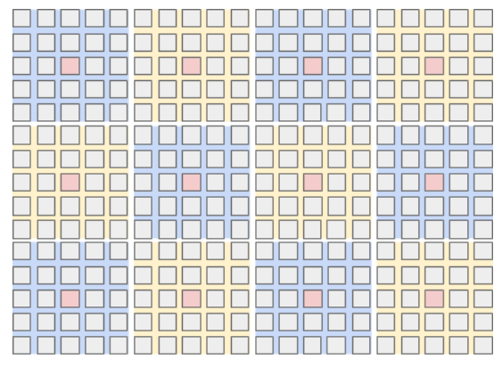

## Annex D: Large scale tile use case (informative)
{:.no_count}

One potential use-case for this process is the representation and rendering of a 3-dimensional environment
as seen through an array of cameras that together capture a 360 degree view of the surrounding environment.
One such arrangement of cameras is shown in the figure below where each small rectangle represents a full
frame captured by a camera placed at a given latitude (row in the diagram) or longitude (column in the diagram), but other variants are possible.

<figure class="figure center-block">
  
  <figcaption class="figure-caption">Example array of 15x20 "camera" frames partitioned into 5x5 sub-arrays,
  where each sub-array has a central "anchor" frame (in red). Each small rectangle represents a frame.</figcaption>
</figure>
 
In order to create a rendered view in an arbitrary direction in the 3-D scene the decoder will potentially need a small number of pixels from many of these frames. Providing a process to decode only a sparsely distributed subset of small regions, each defined as an AV1 tile, can significantly improve efficiency.
 
The algorithm for constructing the 3-dimensional view from the set of decoded tiles is beyond the scope of this specification;
two possible schemes can be found in [8][9].
 
To reduce the amount of memory required and to improve decoder efficiency, a certain subset of the frames are denoted as "Anchor Frames"
and it is assumed that the application makes these frames available to the decoder in uncompressed form.
The example presented in the figure above highlights anchor frames in red.
 
The other (non-anchor) frames are referred to as "Camera Frames" and each one is encoded using only the nearest anchor
frame as a reference. Camera frames are highlighted in gray in the figure above,
and are shown clustered into 5x5 groups to indicate which anchor fame each uses for prediction.
 
The application is required to render a new 3-dimensional view at a rate of 90 fps. Each rendered frame may require at most two tile list OBU as defined in [section 5.12][] to be decoded, resulting in a maximum decode rate of 180 tile list OBU per second. Each decoded tile list OBU produces one output frame.
