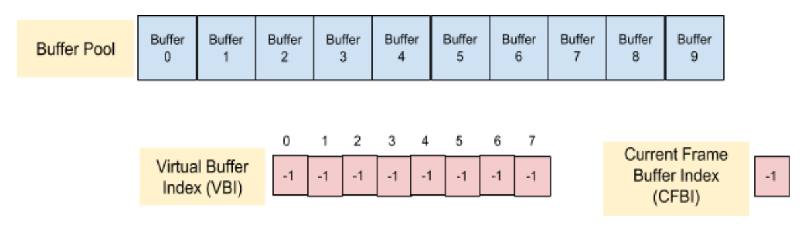

## Annex E: Decoder Model
{:.no_count}

### General
{:.no_count}

The decoder model is used to verify that a bitstream can be decoded within the constraints imposed by one of the coding levels defined in [section A.3][]. The decoder model is also used to verify conformance for a decoder that claims conformance to a certain coding level. 

A set of decoder model parameters may be optionally specified for zero or more operating points. If the new Sequence Header OBU does not signal decoder model parameters for a given operating point the previous set of decoder model parameters does not persist.

The decoder model describes the smoothing buffer, decoding process, operation of the frame buffers and the frame output process. 

The decoder model is applied to the Operating Point of a bitstream, for which the decoder model is specified. Different operating points can have different decoder models that specified conformance to decoder levels signaled for these operating points. 

The decoder model defines two modes of operation. A conformant bitstream shall satisfy constraints imposed by one of these two modes of the decoder model depending on which mode is applicable. The applicability of the two modes of the decoder model used to check the bitstream conformance is described in the following two subsections.

### Resource availability mode
{:.no_count}

In this mode the model simulates the operation of the decoder under the assumption that the complete coded frame
is available in the smoothing buffer when decoding of that frame begins.
In addition, it is assumed that the decoder will begin to decode a frame immediately after it finishes decoding the previous frame
or when a frame buffer becomes available, whichever is later.
This model uses the generated time moment, when the decoding of a frame begins,
as times when the data is removed from the smoothing buffer to check the
conformance of a bitstream to the bitrate specified for a level signaled for the Operating Point of a bitstream.

To verify that a bitstream can be decoded by a decoder under the constraints of a particular level it is assumed that the decoder performs the decoding operations at maximum speed (the minimum time interval) specified for that level in [section A.3][].

To use Resource Availability mode, the following parameters should be set in the encoded video bitstream:

  * timing_info_present_flag equal to 1
  
  * decoder_model_info_present_flag equal to 0
  
  * equal_picture_interval equal to 1

If the parameters listed above are not specified by the bitstream, the parameters necessary to input into this model can be signaled by the application or some other means. If the parameters necessary to run this model are not signaled, it is not possible to check the conformance of the stream to the claimed level. 

In this mode of operation, the decoder model parameters below take the following (default) values:

  * encoder_buffer_delay = 20 000
  
  * decoder_buffer_delay = 70 000
  
  * low_delay_mode_flag[ op ] = 0

The decoder writes the decoded frame into one of the 10 available frame buffers.
Decoding must be delayed until a frame buffer becomes available.

### Decoding schedule mode
{:.no_count}

This mode imposes additional constraints relating to the operation of the smoothing buffer and the timing points, specified for each frame, defining exactly when the decoder should start decoding a frame and when that frame should be presented.

To use Decoding Schedule Mode, the following parameters should be signaled by the encoded video bitstream:

  * timing_info_present_flag equal to 1
  
  * decoder_model_info_present_flag equal to 1
  
  * decoder_model_present_for_this_op[ op ] equal to 1

When these flags are signaled, the bitstream should provide the associated information specified
in decoder_model_info( ), operating_parameters_info( ) and initial_display_delay_minus_1[ op ].

In addition each frame must specify, for operating point op, the following parameters:

  * buffer_removal_time[ op ]
  
  * frame_presentation_time

If the parameters listed above are not specified by the bitstream,
the parameters necessary to input into this model can be signaled by the application or some other means.
If the parameters necessary to run this model are not signaled,
it is not possible to check the conformance of the stream to the claimed level.

### When timing information is not present in the bitstream
{:.no_count}

When the timing_info(), and other info necessary as the input to one of the decoder models and associated information
is not present in the bitstream, it is impossible to verify whether the
bitstream satisfy the levels constraints according to either of the decoder models.
In order to enable the verification of the decoder conformance, the equivalent information necessary to verify
the bitstream compliance can be provided by some external means.

### Buffer model definition
{:.no_count}

The buffer model defines the following elements that are used to define the buffer model behavior.
These elements are not part of the decoding process and are used to verify the bitstream conformance.
The decoder conformance is defined by the decoder ability to decode all bitstreams conformant to the claimed decoder profile
and level, while satisfying constraints on specified output frame timing (and frame content).
 
**Note:** The elements defined in this section do not have to be present in
the conformant decoder implementation and are used to test the bitstream conformance.
These elements may be considered examples of elements of the conformant decoder,
although the actual decoder implementation may differ. 
{:.alert .alert-info }

<figure class="figure center-block">
  
  <figcaption class="figure-caption"> Diagram representation of the BufferPool,
  virtual buffer index and a current frame buffer index</figcaption>
</figure>

**BufferPool** is a storage area for a set of frame buffers.
Buffer pool area allocated for storing separate frames is defined as BufferPool [ i ],
where i takes values from 0 to BufferPoolMaxSize - 1. When a frame buffer is used for storing a decoded frame,
it is indicated by a VBI slot that points to this frame buffer. BufferPoolMaxSize is equal to 10.

**VBI** (virtual buffer index) is an array of indices of the frame areas in the BufferPool.
VBI elements which do not point to any slot in the VBI are set to -1. VBI array size is equal to 8, with the indices taking values from 0 to 7. 

**cfbi** (current frame buffer index) is the variable that contains the index to the area in the BufferPool that contains the current frame.

**DecoderRefCount [ i ]** is a variable associated with a frame buffer i.
DecoderRefCount [ i ] is initialized to 0, and incremented by 1 each time the decoder adds the buffer i to a VBI index slot.
It is decremented by 1 each time the decoder removes the buffer from a VBI index slot i.
The decoder may update multiple VBI index slots with the same frame buffer, as specified by refresh_frame_flags,
so the counter may be incremented several times.
The counter is only modified in this way when refresh_frame_flags is used to update the VBI index once the frame has been fully decoded.
The decoder also increments the counter as it begins the decode process and decrements it again once complete.
When the counter is 0 the pixel data becomes permanently invalid and shall not be used by the decode process.

**PlayerRefCount [ i ]** is a variable associated with a frame buffer i.
PlayerRefCount [ i ] is initialized to 0, incremented by 1 each time the decoder determines that the frame is a presentation frame.
It is decremented by 1 after each time the frame is presented.

**PresentationTimes[ i ]** is an array corresponding to the BufferPool [ i ] that holds the last presentation time
for the decoded frame that is kept in the BufferPool [ i ].

<figure class="figure center-block">
  
  <figcaption class="figure-caption"> Example of how the coded frame buffer fullness varies
  as data arrives from the stream, and is subsequently removed for decoding.
  Relevant timing points and values are indicated.</figcaption>
</figure>

### Operation of the smoothing buffer
{:.no_count}

Coded frames arrive at the decoder smoothing buffer of the size BufferSize at a rate defined by BitRate.
The following variables are used in this section and below:

BitRate is set to a value equal to the MaxBitrate specified for the level signaled for the operating that is being decoded.

BufferSize s set to a value equal to the MaxBufferSize value specified for the level signaled for the operating that is being decoded.

Decodable Frame Group i (DFG i ) consists of all OBUs, including headers,
between the end of the last OBU related to previous frame with show_existing_frame flag equal to 0, (frame  i - 1),
and the end of the data that belongs to the current frame with show_existing_frame flag equal to 0 (frame i).
This comprises the OBUs that make up frame i, plus any additional OBUs present in the bitstream that belong to frame i
(such as the metadata OBU), and OBU that belong to frames with show_existing_frame flag equal to 1
which are located between frame (i - 1) and the frame i.
The decoder model assumes that the decoding time for processing a frame with show_existing_frame flag equal to 1,
a header, or a metadata OBU is 0, hence the smoothing buffer operates in the units of DFG.

CodedBits [ i ] is the amount of the data, in bits, that belongs to the DFG i.
Note that the index i in the DFG only increases with frames with show_existing_frame flag equal to 0,
i.e. frames that need to be decoded by the decoding process.

FirstBitArrival [ i ] is the time when the first bit of the i-th DFG starts entering the decoder smoothing buffer. For the first coded DFG in the sequence, DFG 0 (or after updating decoder model parameters at RAP), FirstBitArrival [ 0 ] = 0.

LastBitArrival [ i ] is the time when the last bit of DFG i finishes entering the smoothing buffer.

### Arrival of OBU data in smoothing buffer
{:.no_count}

#### Start of DFG bits arrival
{:.no_count}

The bits arrive in the smoothing buffer at a constant bitrate BitRate
or the bitrate equal to 0.
Hence, the average bitrate can be lower than the bitrate BitRate specified in the level definition,
which, in this case, represents a peak bitrate.
The first bit of DFG i is expected to arrive by the latest time that would guarantee timely reception of
the entire DFG by the time when the decodable frame in the DFG i is due to be decoded:

~~~~~ c
FirstBitArrival [ i ]  = max ( LastBitArrival [ i - 1 ], LatestArrivalTime [ i ] ),
~~~~~

where LatestArrivalTime [ i ] is the latest time when the first bit of DFG i must arrive in the smoothing buffer
to ensure that the complete DFG is available at the scheduled removal time, ScheduledRemoval [ i ], in units of seconds,
unless the new set of decoding model parameters is received.
In its turn, the latest time the DFG data should start being received is determined as follows:

~~~~~ c
LatestArrivalTime [ i ]  = ScheduledRemoval [ i ]  -  ( encoder_buffer_delay  + decoder_buffer_delay ) ÷ 90 000
~~~~~

The ScheduledRemoval [ i ] time is determined differently in the resource availability and the decoding schedule mode. 

When the decoder model operates in the decoding schedule mode

~~~~~ c
ScheduledRemoval [ i ] = ScheduledRemovalTiming [ i ]
~~~~~

When the decoder model operates in the resource availability mode

~~~~~ c
ScheduledRemoval [ i ] = ScheduledRemovalResource [ i ]
~~~~~

Derivation of ScheduledRemovalTiming [ i ] in the decoding schedule mode is described in section X,
and derivation of ScheduledRemovalResource [ i ] in the resource availability mode is described in section Y.

#### End of DFG bits arrival
{:.no_count}

For the bits that belong to the DFG i, the time of arrival of the last bit of the DFG i is determined as follows:

~~~~~ c
LastBitArrival [ i ] = FirstBitArrival [ i ] + CodedBits [ i ] ÷ BitRate
~~~~~

### Removal of OBU data from smoothing buffer 
{:.no_count}

#### General
{:.no_count}

The decoder starts to decode a frame exactly at the moment when the data corresponding to its DFG
is removed from the smoothing buffer. Each DFG has a scheduled removal time and an actual removal time.
Under certain circumstances these times may be different.

#### Removal times in decoding schedule mode
{:.no_count}

DFG i is scheduled for removal from the smoothing buffer at time ScheduledRemovalTiming [ i ]
which is defined as an offset, buffer_removal_time[ i ],
signaled for the frame of the DFG with show_existing_frame flag equal to 0,
relative to the moment of time when the first DFG is removed from the smoothing buffer, decoder_buffer_delay:

~~~~~ c
ScheduledRemovalTiming [ 0 ] = decoder_buffer_delay ÷ 90 000

ScheduledRemovalTiming [ i ] = ScheduledRemovalTiming [ 0 ]  + buffer_removal_time[ i ] * DecCT
~~~~~

DFG i is removed from the smoothing buffer at time Removal[ i ].

There are two modes of operation of a decoder which determine whether the actual DFG removal time Removal[ i ] may be different from the scheduled DFG removal timing ScheduledRemovalTiming [ i ].
As was mentioned earlier, the decoder starts decoding a frame instantaneously when the data that belongs to its DFG is removed from the smoothing buffer.

In this mode, frame decoding start times / DFG removal times are determined by the buffer_removal_time [ i ] for the chosen operating point, op.

If low_delay_mode_flag[ op ] is equal to 0 the decoder operates in Strict Arrival Mode, and DFG is removed from the smoothing buffer at the scheduled time, that is:

~~~~~ c
Removal[ i ] = ScheduledRemovalTiming[ i ] 
~~~~~

Otherwise, low_delay_mode_flag[ op ] is equal to 1 and the decoder operates in Low-Delay Mode,
where the DFG data may not be available in the smoothing buffer at the scheduled removal time,
i.e. ScheduledRemovalTiming[ i ] < LastBitArrival[ i ].
In that case the removal of the DFG is deferred until the first decode clock tick after the complete DFG is present
in the smoothing buffer, that is:

~~~~~ c
Removal [ i ] = ceil ( LastBitArrival [ i ] ÷ DecCT ) * DecCT
~~~~~

If the entire DFG is available in the smoothing buffer at the scheduled removal time,
i.e. ScheduledRemovalTiming[ i ] >= LastBitArrival[ i ], then it is removed at the scheduled time, that is:

~~~~~ c
Removal [ i ]  =  ScheduledRemovalTiming [ i ]
~~~~~

#### Removal times in resource availability mode
{:.no_count}

In the resource availability mode, buffer_removal_time[ i ] are not signaled for the chosen operating point.
In this mode, timing of the decoder model is driven by the availability of the resources in the decoder,
in particular, by times when the decoding of the previous frame with show_existing_frame flag equal to 0
has been completed and a free frame buffer is available. 

In particular, ScheduledRemovalResource [ i ] times are generated as the earliest time that a
non-assigned frame buffer becomes available for decoding of the frame i.
In this mode, the decoder starts to decode a frame as fast as it can after completing decoding of the previous frame
and a free frame buffer is available. A frame buffer is defined as being available
if it is no longer being used and its content can be overwritten. 

Removal times in the resource availability mode are defined as follows:

~~~~~ c
ScheduledRemovalResource [ 0 ] = decoder_buffer_delay ÷ 90 000 
~~~~~

and ScheduledRemovalResource[ i ] is defined to be the earliest time that a frame buffer becomes available, which can be computed using the function time_next_buffer_is_free( ) below. 

The following function time_next_buffer_is_free () is used to determine the Removal[ i ] time  for the next DFG.

~~~~~ c
time_next_buffer_is_free ( time ) {
    ScheduledRemovalResource[ i ] = UINT_MAX
    for ( k = 0; k < BufferPoolMaxSize; k++ ) {
        if ( DecoderRefCount [ k ] == 0 ) {
            if ( PlayerRefCount [ k ] == 0 ) 
                return ScheduledRemovalResource[ i ] = time
            if ( PresentationTimes[ k ] < bufFreeTime )
                ScheduledRemovalResource[ i ] = PresentationTimes[ k ]
        }
    }
    return ScheduledRemovalResource[ i ]
}
~~~~~

### Frame decoding
{:.no_count}

The time required to decode a frame (i.e. to process the decodable frame’s DFG),
TimeToDecode [ i ], is calculated based on the frame type, a maximum number of luma pixels for the frame,
and the throughput of the decoder as specified in the definition of the level assigned to the operating point that the frame belongs.

The time that it takes the decoder to decode a frame according to the decoder model is estimated
by using the function time_to_decode_frame( ) as follows.

~~~~~ c
time_to_decode_frame( ) {
    if ( show_existing_frame == 1 ) {
        lumaSamples = 0
    } else if ( frame_type == KEY_FRAME ||
                   frame_type == INTRA_ONLY )
        lumaSamples = UpscaledWidth * FrameHeight
    } else {
        if ( spatial_layer_dimensions_present_flag ) 
             lumaSamples =  (spatial_layer_max_width[ spatial_id ]) *
                                    (spatial_layer_max_height[ spatial_id ])
        else
             lumaSamples =  (max_frame_width_minus_1 + 1) *
                                    (max_frame_height_minus_1 + 1)
    }
    return  lumaSamples ÷ MaxDecodeRate[ level[operatingPoint] ]
}
~~~~~

The MaxDecodeRate value is defined Table N for the level signaled for the operating point the decoder has chosen to decode.

### Frame presentation timing
{:.no_count}

Frames with show_existing_frame = 1, or show_frame = 1 are referred to as Displayable Frames.
Each displayable frame j has a scheduled presentation time, PresentationTime [ j ], defined to be a multiple of a display clock tick:

~~~~~ c
DispCT = num_units_in_display_tick ÷ time_scale
~~~~~

Here DispCT represents the expected time interval between displaying two consecutive frames, or a common divisor of the expected times between displaying two consecutive frames if the encoded bitstream has a variable display frame rate.

Initial presentation delay is determined as follows:

~~~~~ c
InitialPresentationDelay =  Removal [ initial_display_delay_minus_1 ] + TimeToDecode [ initial_display_delay_minus_1 ].
~~~~~

When equal_picture_interval is equal to 0, the decoder operates in variable frame rate mode, the frame presentation time is defined as follows:

~~~~~ c
PresentationTime [ 0 ] = InitialPresentationDelay

PresentationTime [ j ] = InitialPresentationDelay + ( frame_presentation_time[ j ] - frame_presentation_time[ 0 ] ) * DispCT
~~~~~

When equal_picture_interval is equal to 1, the decoder operates in the constant frame rate mode,
and the frame presentation time is defined as follows:

~~~~~ c
PresentationTime [ 0 ] = InitialPresentationDelay

PresentationTime [ j ] = PresentationTime [ j - 1] + ( num_ticks_per_picture_minus_1 + 1 ) * DispCT,
~~~~~

where PresentationTime [ j - 1 ] refers to the previous frame in presentation order.

The presentation interval, i.e. the time interval between the display of consecutive frames j and j + 1 in presentation order, is defined as follows: 

~~~~~ c
PresentationInterval [ j ] = PresentationTime [ j + 1 ] - PresentationTime [ j ]
~~~~~

### Bitstream conformance
{:.no_count}

#### General
{:.no_count}

A conformant coded bitstream shall satisfy the following set of constraints.

For the decoder model a DFG shall be available in the smoothing buffer at the scheduled removal time,
i.e. ScheduledRemoval [ i ] >= LastBitArrival [ i ].

It is a requirement of the bitstream conformance that after each RAP, the PresentationTime [ j ],
where j corresponds to the frame decoding order is strictly increasing until the next RAP or the end of the coded video sequence, i.e. PresentationTime [ j + 1] > PresentationTime [ j ].

When buffer_removal_time [ i ] is not present in the bitstream, a bitstream is conformant if the decoder model in resource availability mode can decode pictures successfully before they are scheduled for presentation.

If buffer_removal_time [ i ] is signaled, it shall have a value greater or equal than the
equivalent value that would have been assigned if the decoder model was decoding frames in the resource availability mode.

#### Decoder buffer delay consistency across RAP (applies to decoding schedule mode)
{:.no_count}

For frame i, where i > 0, TimeDelta [ i ] is defined as follows:

~~~~~ c
TimeDelta [ i ] = ( ScheduledRemoval [ i ] - LastBitArrival [ i -1 ] ) * 90 000
~~~~~

For the video sequence that includes one or more random access points, for each key frame,
where the decoder_buffer_delay is signaled, the following expressions should hold to provide smooth playback without the need to rebuffer. 

~~~~~ c
decoder_buffer_delay <= ceil( TimeDelta [ i ]
~~~~~

#### Smoothing buffer overflow
{:.no_count}

Smoothing buffer overflow is defined as the state where the total number of bits in the smoothing buffer
exceeds the size of the smoothing buffer BufferSize. The smoothing buffer shall never overflow.

#### Smoothing buffer underflow
{:.no_count}

Smoothing buffer underflow is defined as the state where a complete DFG is not present in the smoothing buffer at the scheduled removal time, ScheduledRemoval [ i ]:
 
~~~~~ c
ScheduledRemoval [ i ] < LastBitArrival [ i ]
~~~~~

When the low_delay_mode_flag[ op ] is equal to 0, the smoothing buffer shall never underflow.

#### Minimum decode time (applies to decoding schedule mode)
{:.no_count}

There must be enough time between a DFG being removed from the smoothing buffer,
Removal [ i ], and the scheduled removal of the next DFG, ScheduledRemoval [ i + 1 ]:

~~~~~ c
ScheduledRemoval [ i + 1] - Removal [ i ]  >= Max( TimeToDecode [ i ], 1 ÷ MaxNumFrameHeadersPerSec ),
~~~~~

where MaxNumFrameHeadersPerSec is defined in the level constraints.

#### Minimum presentation Interval
{:.no_count}

The difference between presentation times for consecutive displayable frames, shall satisfy the following constraint: 

~~~~~ c
MaxFrameTime = MaxTotalDecodedSampleRate ÷ ( MaxNumFrameHeadersSec * MaxTotalDisplaySampleRate )
 
PresentationInterval [ j ]  >= Max( LumaPels ÷ MaxTotalDisplaySampleRate, MaxFrameTime )
~~~~~

Where MaxTotalDecodedSampleRate, MaxNumFrameHeadersPerSec, and MaxTotalDisplaySampleRate are defined in the level constraints.

#### Decode deadline
{:.no_count}

It is a requirement of the bitstream conformance that each frame shall be fully decoded at,
or before, the time that it is scheduled for presentation:

~~~~~ c
Removal [ i ] + TimeToDecode [ i ] <= PresentationTime [ i ]
~~~~~

#### Level imposed constraints
{:.no_count}

The sum of the  encoder_buffer_delay and the decoder_buffer_delay ( encoder_buffer_delay + decoder_buffer_delay )
shall be constant for the entire video sequence .

When operating in the decoding schedule mode mode, decoder_buffer_delay shall not be equal to 0 and shall not exceed 90000 * ( BufferSize ÷ BitRate).

**Note:** It is common to choose ( encoder_buffer_delay + decoder_buffer_delay ) ÷ 90000 * BitRate equal to BufferSize.
{:.alert .alert-info }

#### Decode Process constraints
{:.no_count}

The decoding process below is shown for the operating point operatingPoint.
It is a requirement of the bitstream conformance that executing the algorithm presented in the decode_process ( ) function
below with the input with the bitstream data for a chosen operating point op and
the decoder level constraints for the level indicated for the chosen operating point op does not result in the
call of the bitstream_non_conformant () function. 

~~~~~ c
free_buffer( idx ) {
    DecoderRefCount [ idx ] = 0
    PlayerRefCount [ idx ] = 0
    PresentationTimes[ idx ] =  -1  
}

initialize_buffer_pool( ) {
    for ( i = 0; i < BufferPoolMaxSize; i++ )
        free_buffer ( i )
    for ( i = 0; i < 8; i++ )
        VBI[ i ] = -1
    cfbi = -1
}
~~~~~

The Decoder needs an un-assigned frame buffer from the BufferPool for each frame that it decodes.
A buffer i is un-assigned if both DecoderRefCount [ i ] is equal to 0, and PlayerRefCount [ i ] is equal to 0. 

~~~~~ c
get_free_buffer( ) {
    for ( i = 0; i < BufferPoolMaxSize; i++ ) {
        if ( DecoderRefCount [ i ] == 0 &&
             PlayerRefCount [ i ] == 0 )
            return i
    return -1
}
~~~~~

Once decoded, frames may update one or more of the VBI index slots, as defined by refresh_frame_flags.
Each time a VBI index slot is updated the decoder reference count is incremented by 1 for the corresponding frame buffer.
If the VBI index slot being updated is currently occupied, the decoder reference count for the frame buffer being displaced must be decremented by 1.

~~~~~ c
update_ref_buffers ( idx, refresh_frame_flags ) {
    for ( i = 0; i < 8; i++ ) {
        if ( refresh_frame_flags & ( 1 << i ) ) {
            if ( VBI[ i ] != -1 )
                DecoderRefCount [ VBI[ i ] ] --
            VBI[ i ] = idx
            DecoderRefCount [ idx ] ++
        }
    }
}
~~~~~

In resource availability mode the decoder may start to decode the next frame as soon as a free reference buffer is available.
If a free frame buffer is not available immediately, the PresentationTimes[ i ] may be used to compute the time when such a buffer will become available.

In decoding schedule mode the decoder only starts to decode a frame at the time designated by a Removal time associated with that frame, and expects a free frame buffer to be immediately available.

~~~~~ c
start_decode_at_removal_time ( Removal ) {
    for ( i = 0; i <BufferPoolMaxSize; i++ ) {
        if ( PlayerRefCount [ i ] > 0) {
            if ( PresentationTimes[ i ] < Removal ) {
                 PlayerRefCount [ i ] = 0
                 if ( DecoderRefCount[ i ] == 0 )
                     free_buffer( i )
            }
            break
        }
    }
    return Removal
}
~~~~~

The Decoder needs to know the number of decoded frames in the BufferPool in order to determine the presentation delay for the first frame.
A buffer is un-assigned if both DecoderRefCount [ i ] is equal to 0, and PlayerRefCount [ i ] is equal to 0. 

~~~~~ c
frames_in_buffer_pool( ) {
    framesInPool = 0
    for ( i = 0; i < BufferPoolMaxSize; i++ )
        if ( DecoderRefCount [ i ] != 0 || PlayerRefCount [ i ] != 0 )
            framesInPool++
    return framesInPool
}
~~~~~

~~~~~ c
get_next_frame( frameNum ) 
{
   // Switch to decoding next frame in the decoding order for the operatingPoint. 
   // The header of the frame is read, and the frame context is re-initialized. 
   // Until the next call of this function, the frame related variable in the decoder model algorithm
   // are read from the frame that is being analyzed and decoded. 
  
   while ( ObuPresentInSmoothingBuffer ) {
      parse_OBU ()
      if ( obu_type == OBU_FRAME_HEADER ) {
          ReadFrameHeader( )
          if (show_existing_frame != 1 ) {
              frameNum++ 
          }
      return frameNum
   }

   return  -1
}
~~~~~

ReadFrameHeader( ) function parses a frame header OBU according to the process described in Section. 

The decode process model simulates the values of selected timing points as successive frames are decoded.
This timing incorporates the time that the decoder has to wait for a free frame buffer,
the time required to decode the frame and various basic checks to make sure that buffer slots are occupied when they are supposed to be.
Non-conformance is signaled by a call to the function bitstream_non_conformant; the various error codes are tabulated below.

~~~~~ c
decode_process ( ) {
    initialize_buffer_pool( )
    time = 0
    frameNum = 0
    InitialPresentationDelay = 0
    while( (frameNum = get_next_frame( frameNum ) ) != - 1) {
        // Decode.
        if ( show_existing_frame != 1 ) {
            if ( Removal [ frameNum ] == -1 )
                Removal [ frameNum ] = time_next_buffer_is_free( time )
            time = start_decode_at_removal_time( Removal [ frameNum ] )
            if ( show_frame == 1 && time > PresentationTime [ frameNum ] )
                bitstream_non_conformant( DECODE_BUFFER_AVAILABLE_LATE )
            cfbi = get_free_buffer( )
            if ( cfbi == -1 )
                bitstream_non_conformant( DECODE_FRAME_BUF_UNAVAILABLE )
            time += time_to_decode_frame ( )
            update_ref_buffers ( cfbi, refresh_frame_flags )
            displayIdx = cfbi
            if ( InitialPresentationDelay == 0 && 
                 ( frames_in_buffer_pool( ) >= initial_display_delay_minus_1[ operatingPoint ] + 1 ) )
                InitialPresentationDelay = time	
        } else {
            displayIdx = VBI[ frame_to_show_map_idx ]
            if ( displayIdx == -1 )
                bitstream_non_conformant( DECODE_EXISTING_FRAME_BUF_EMPTY )
            if ( RefFrameType[ frame_to_show_map_idx ] == KEY_FRAME )
                update_ref_buffers ( displayIdx, 0xFF )
        }
        // Display.
        if ( InitialPresentationDelay != 0 &&
            ( show_existing_frame == 1 || show_frame == 1 )) {
            // Presentation frame.
            if ( time > PresentationTime [ frameNum ] )
                bitstream_non_conformant( DISPLAY_FRAME_LATE )
            PresentationTimes[ displayIdx ]= PresentationTime [ frameNum ]
            PlayerRefCount [ displayIdx ] ++
        }
    }
}
~~~~~

The various non-conformat error codes are:

| Error Type                      | Description
| ------------------------------- | ------------------
| DECODE_BUFFER_AVAILABLE_LATE    | A free frame buffer only became available to the decoder after the time that the frame should have been displayed.
| DECODE_FRAME_BUF_UNAVAILABLE    | All the frame buffers were in use.
| DECODE_EXISTING_FRAME_BUF_EMPTY | The index of the frame designated for display by a frame with show_existing_frame = 1 was empty.
| DISPLAY_FRAME_LATE              | The frame was decoded too late for timely display, i.e. by the PresentationTime[ i ] time associated with the frame.
{:.table .table-sm .table-bordered }

