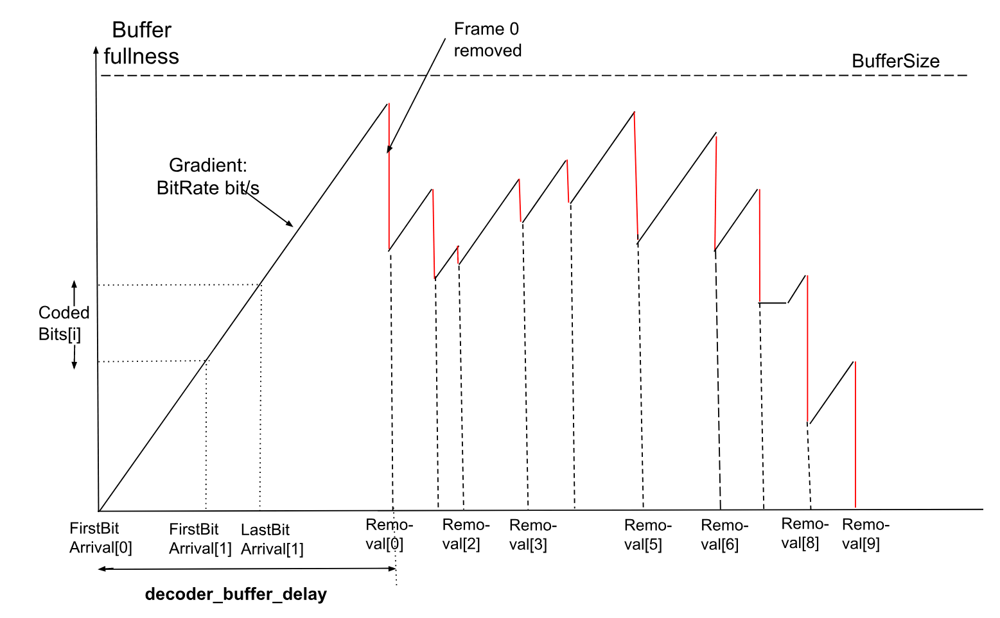

## Annex E: Decoder model
{:.no_count}

### General
{:.no_count}

The decoder model is used to verify that a bitstream can be decoded within the
constraints imposed by one of the coding levels defined in [section A.3][]. The
decoder model is also used to verify conformance for a decoder that claims
conformance to a certain coding level.

A set of decoder model parameters may be optionally specified for zero or more
operating points. If the new Sequence Header OBU does not signal decoder model
parameters for a given operating point the previous set of decoder model
parameters does not persist.

The decoder model describes the smoothing buffer, decoding process, operation
of the frame buffers and the frame output process.

The decoder model is applied to an operating point of a bitstream. Different
operating points can have different decoder models that specify conformance to
the levels signaled for these operating points.

The decoder model defines two modes of operation. A conformant bitstream shall
satisfy constraints imposed by one of these two modes of the decoder model
depending on which mode is applicable.

[Section E.2][] defines additional concepts used by the decoder model.

[Section E.3][] defines the operating modes.

[Section E.4][] specifies how the frame timings can be computed in the
different operating modes.

[Section E.5][] specifies the decoder model process.

[Section E.6][] specifies the conformance requirements.

### Decoder model definitions
{:.no_count}

The decoder model uses the following elements to verify bitstream conformance
that are not part of the decoding process specified in [section 7][].

**Note:** The elements defined in this section do not have to be present in a
conformant decoder implementation. These elements may be considered examples of
elements of a conformant decoder, although the actual decoder implementation
may differ.
{:.alert .alert-info }

**BufferPool** is a storage area for a set of frame buffers. Buffer pool area
allocated for storing separate frames is defined as BufferPool[ i ], where i
takes values from 0 to BUFFER_POOL_MAX_SIZE - 1. When a frame buffer is used for
storing a decoded frame, it is indicated by a VBI slot that points to this frame
buffer.

**VBI** (virtual buffer index) is an array of indices of the frame areas in the
BufferPool. VBI elements which do not point to any slot in the VBI are set
to -1. VBI array size is equal to 8, with the indices taking values from 0 to 7.

**cfbi** (current frame buffer index) is the variable that contains the index to
the area in the BufferPool that contains the current frame.

**DecoderRefCount[ i ]** is a variable associated with a frame buffer i.
DecoderRefCount[ i ] is initialized to 0, and incremented by 1 each time the
decoder adds the buffer i to a VBI index slot. It is decremented by 1 each time
the decoder removes the buffer from a VBI index slot i. The decoder may update
multiple VBI index slots with the same frame buffer, as specified by
refresh_frame_flags, so the counter may be incremented several times. The
counter is only modified in this way when refresh_frame_flags is used to update
the VBI index once the frame has been fully decoded. The decoder also increments
the counter as it begins the decode process and decrements it again once
complete. When the counter is 0 the pixel data becomes permanently invalid and
shall not be used by the decode process.

**PlayerRefCount[ i ]** is a variable associated with a frame buffer i.
PlayerRefCount[ i ] is initialized to 0, incremented by 1 each time the decoder
determines that the frame is a presentation frame. It is reset to 0 after the
last time the frame is presented.

**PresentationTimes[ i ]** is an array corresponding to the BufferPool [ i ]
that holds the last presentation time for the decoded frame that is kept in the
BufferPool [ i ].

<figure class="figure center-block">
  
  <figcaption class="figure-caption"> Example of how the coded frame buffer fullness varies
  as data arrives from the stream, and is subsequently removed for decoding.
  Relevant timing points and values are indicated.</figcaption>
</figure>

Coded frames arrive at the decoder smoothing buffer of the size BufferSize at a
rate defined by BitRate. The following variables are used in this section and
below:

**BitRate** is set to a value equal to MaxBitrate * BitrateProfileFactor
specified for the level signaled for the operating point that is being decoded.

**BufferSize** is set to a value equal to MaxBufferSize * BitrateProfileFactor
value specified for the level signaled for the operating point that is being
decoded.

**Decodable Frame Group i** (DFG i) consists of all OBUs, including headers,
between the end of the last OBU associated with the previous frame with
show_existing_frame flag equal to 0 (frame k), and the end of the last OBU
associated with the current frame with show_existing_frame flag equal to 0
(frame p). This comprises the OBUs that make up frame p, plus any additional
OBUs present in the bitstream that belong to frame p (such as the metadata OBU),
and OBU that belong to frames with show_existing_frame flag equal to 1 which are
located between frame k and frame p. The decoder model assumes that the decoding
time for processing a frame with show_existing_frame flag equal to 1, a header,
or a metadata OBU is 0, hence the smoothing buffer operates in the units of DFG.

**CodedBits[ i ]** is the amount of data, in bits, that belongs to DFG i. Note
that the index i of the DFG only increases with frames with show_existing_frame
flag equal to 0, i.e. frames that need to be decoded by the decoding process.

**FirstBitArrival[ i ]** is the time when the first bit of the i-th DFG starts
entering the decoder smoothing buffer. For the first coded DFG in the sequence,
DFG 0 (or after updating decoder model parameters at a random access point),
FirstBitArrival[ 0 ] = 0.

**LastBitArrival[ i ]** is the time when the last bit of DFG i finishes entering
the smoothing buffer.

Each **shown frame** j has a scheduled presentation time,
**PresentationTime[ j ]**, defined to be a multiple of the display clock tick
DispCT.

**DispCT** represents the expected time interval between displaying two
consecutive frames, or a common divisor of the expected times between displaying
two consecutive frames if the encoded bitstream has a variable display frame
rate.

### Operating modes
{:.no_count}

#### Resource availability mode
{:.no_count}

In this mode the model simulates the operation of the decoder under the
assumption that the complete coded frame is available in the smoothing buffer
when decoding of that frame begins. In addition, it is assumed that the decoder
will begin to decode a frame immediately after it finishes decoding the previous
frame or when a frame buffer becomes available, whichever is later. This model
uses the generated time moment, when the decoding of a frame begins, as times
when the data is removed from the smoothing buffer to check the conformance of a
bitstream to the bitrate specified for a level signaled for the Operating Point
of a bitstream.

To verify that a bitstream can be decoded by a decoder under the constraints of
a particular level it is assumed that the decoder performs the decoding
operations at maximum speed (the minimum time interval) specified for that level
in [section A.3][].

To use Resource Availability mode, the following parameters should be set in the
encoded video bitstream:

  * timing_info_present_flag equal to 1

  * decoder_model_info_present_flag equal to 0

  * equal_picture_interval equal to 1

If the parameters listed above are not specified by the bitstream, the
parameters necessary to input into this model can be signaled by the application
or some other means. If the parameters necessary to run this model are not
signaled, it is not possible to check the conformance of the stream to the
claimed level.

In this mode of operation, the decoder model parameters below take the following
(default) values:

  * encoder_buffer_delay = 20 000

  * decoder_buffer_delay = 70 000

  * low_delay_mode_flag[ op ] = 0

The decoder writes the decoded frame into one of the 10 available frame buffers.
Decoding must be delayed until a frame buffer becomes available.

#### Decoding schedule mode
{:.no_count}

This mode imposes additional constraints relating to the operation of the
smoothing buffer and the timing points, specified for each frame, defining
exactly when the decoder should start decoding a frame and when that frame
should be presented.

To use Decoding Schedule Mode, the following parameters should be signaled by
the encoded video bitstream:

  * timing_info_present_flag equal to 1

  * decoder_model_info_present_flag equal to 1

  * decoder_model_present_for_this_op[ op ] equal to 1

When these flags are signaled, the bitstream should provide the associated
information specified in decoder_model_info( ), operating_parameters_info( ) and
initial_display_delay_minus_1[ op ].

In addition each frame must specify, for operating point op, the following
parameters:

  * buffer_removal_time[ op ]

  * frame_presentation_time

If the parameters listed above are not specified by the bitstream, the
parameters necessary to input into this model can be signaled by the application
or some other means. If the parameters necessary to run this model are not
signaled, it is not possible to check the conformance of the stream to the
claimed level with this model.

#### When timing information is not present in the bitstream
{:.no_count}

When the timing_info(), and other info necessary as the input to one of the
decoder models and associated information is not present in the bitstream, it is
impossible to verify whether the bitstream satisfy the levels constraints
according to either of the decoder models. In order to enable the verification
of the decoder conformance, the equivalent information necessary to verify the
bitstream compliance can be provided by some external means.

### Frame timing definitions
{:.no_count}

#### Start of DFG bits arrival
{:.no_count}

The bits arrive in the smoothing buffer at a constant bitrate BitRate or the
bitrate equal to 0. Hence, the average bitrate can be lower than the bitrate
BitRate specified in the level definition, which, in this case, represents a
peak bitrate. The first bit of DFG i is expected to arrive by the latest time
that would guarantee timely reception of the entire DFG by the time when the
decodable frame in the DFG i is due to be decoded:

~~~~~ c
FirstBitArrival[ i ]  = max ( LastBitArrival[ i - 1 ], LatestArrivalTime[ i ] ),
~~~~~

where LatestArrivalTime[ i ] is the latest time when the first bit of DFG i must
arrive in the smoothing buffer to ensure that the complete DFG is available at
the scheduled removal time, ScheduledRemoval [ i ], in units of seconds, unless
the new set of decoding model parameters is received. In its turn, the latest
time the DFG data should start being received is determined as follows:

~~~~~ c
LatestArrivalTime[ i ]  = ScheduledRemoval[ i ]  -  ( encoder_buffer_delay  + decoder_buffer_delay ) ÷ 90 000
~~~~~

#### End of DFG bits arrival
{:.no_count}

For the bits that belong to the DFG i, the time of arrival of the last bit of
the DFG i is determined as follows:

~~~~~ c
LastBitArrival[ i ] = FirstBitArrival[ i ] + CodedBits[ i ] ÷ BitRate
~~~~~

#### Scheduled removal times
{:.no_count}

The decoder starts to decode a frame exactly at the moment when the data
corresponding to its DFG is removed from the smoothing buffer. Each DFG has a
scheduled removal time and an actual removal time. Under certain circumstances
these times may be different.

The ScheduledRemoval[ i ] time is determined differently in the resource
availability and the decoding schedule mode.

When the decoder model operates in the decoding schedule mode

~~~~~ c
ScheduledRemoval[ i ] = ScheduledRemovalTiming[ i ]
~~~~~

When the decoder model operates in the resource availability mode

~~~~~ c
ScheduledRemoval[ i ] = ScheduledRemovalResource[ i ]
~~~~~

Derivation of ScheduledRemovalTiming[ i ] in the decoding schedule mode is
described in [section E.4.4][], and derivation of ScheduledRemovalResource[ i ]
in the resource availability mode is described in [section E.4.5][].

#### Removal times in decoding schedule mode
{:.no_count}

DFG i is scheduled for removal from the smoothing buffer at time
ScheduledRemovalTiming [ i ] which is defined as an offset,
buffer_removal_time[ i ], signaled for the frame of the DFG with
show_existing_frame flag equal to 0, relative to the moment of time when the
first DFG is removed from the smoothing buffer, decoder_buffer_delay:

~~~~~ c
ScheduledRemovalTiming[ 0 ] = decoder_buffer_delay ÷ 90 000

ScheduledRemovalTiming[ i ] = ScheduledRemovalTiming[ PrevRap ] + buffer_removal_time[ i ] * DecCT
~~~~~

When j is not equal to 0 and frame j is associated with a random access point,
PrevRap is the index associated with the previous random access point.
Otherwise, if frame j is not associated with the random access point, PrevRap corresponds to
the index associated with the most recent random access point.

DFG i is removed from the smoothing buffer at time Removal[ i ].

There are two modes of operation of a decoder which determine whether the
actual DFG removal time Removal[ i ] may be different from the scheduled DFG
removal timing ScheduledRemovalTiming [ i ]. As was mentioned earlier, the
decoder starts decoding a frame instantaneously when the data that belongs to
its DFG is removed from the smoothing buffer.

In this mode, frame decoding start times / DFG removal times are determined by
the buffer_removal_time [ i ] for the chosen operating point, op.

If low_delay_mode_flag[ op ] is equal to 0 the decoder operates in Strict
Arrival Mode, and DFG is removed from the smoothing buffer at the scheduled
time, that is:

~~~~~ c
Removal[ i ] = ScheduledRemovalTiming[ i ]
~~~~~

Otherwise, low_delay_mode_flag[ op ] is equal to 1 and the decoder operates in
Low-Delay Mode, where the DFG data may not be available in the smoothing buffer
at the scheduled removal time, i.e. ScheduledRemovalTiming[ i ] <
LastBitArrival[ i ]. In that case the removal of the DFG is deferred until the
first decode clock tick after the complete DFG is present in the smoothing
buffer, that is:

~~~~~ c
Removal[ i ] = ceil ( LastBitArrival[ i ] ÷ DecCT ) * DecCT
~~~~~

If the entire DFG is available in the smoothing buffer at the scheduled removal
time, i.e. ScheduledRemovalTiming[ i ] >= LastBitArrival[ i ], then it is
removed at the scheduled time, that is:

~~~~~ c
Removal[ i ]  =  ScheduledRemovalTiming[ i ]
~~~~~

#### Removal times in resource availability mode
{:.no_count}

In the resource availability mode, buffer_removal_time[ i ] are not signaled for
the chosen operating point. In this mode, timing of the decoder model is driven
by the availability of the resources in the decoder, in particular, by times
when the decoding of the previous frame with show_existing_frame flag equal to 0
has been completed and a free frame buffer is available.

In particular, ScheduledRemovalResource [ i ] times are generated as the
earliest time that a non-assigned frame buffer becomes available for decoding of
the frame i. In this mode, the decoder starts to decode a frame as fast as it
can after completing decoding of the previous frame and a free frame buffer is
available. A frame buffer is defined as being available if it is no longer being
used and its content can be overwritten.

Removal times in the resource availability mode are produced by the decode
process in [section E.5.2][]

The following function, time_next_buffer_is_free, is used by the decode process
to determine the Removal[ i ] time  for the next DFG and generate the value of
ScheduledRemovalResource[ i ].

~~~~~ c
time_next_buffer_is_free ( i, time ) {
    if ( i == 0 ) {
        time = decoder_buffer_delay ÷ 90000
    }
    foundBuffer = 0
    for ( k = 0; k < BUFFER_POOL_MAX_SIZE; k++ ) {
        if ( DecoderRefCount[ k ] == 0 ) {
            if ( PlayerRefCount[ k ] == 0 ) {
                ScheduledRemovalResource[ i ] = time
                return time
            }
            if ( !foundBuffer || PresentationTimes[ k ] < bufFreeTime ) {
                bufFreeTime = PresentationTimes[ k ]
                foundBuffer = 1
            }
        }
    }
    ScheduledRemovalResource[ i ] = bufFreeTime
    return bufFreeTime
}
~~~~~

#### Frame decode timing
{:.no_count}

The time required to decode a frame (i.e. to process the decodable frame’s DFG),
TimeToDecode [ i ], is calculated based on the frame type, a maximum number of
luma pixels for the frame, and the throughput of the decoder as specified in the
definition of the level assigned to the operating point that the frame belongs.

The time that it takes the decoder to decode a frame according to the decoder
model is estimated by using the function time_to_decode_frame( ) as follows.

~~~~~ c
time_to_decode_frame( ) {
    if ( show_existing_frame == 1 ) {
        lumaSamples = 0
    } else if ( frame_type == KEY_FRAME ||
                frame_type == INTRA_ONLY ) {
        lumaSamples = UpscaledWidth * FrameHeight
    } else {
        if ( spatial_layer_dimensions_present_flag )
             lumaSamples =  (spatial_layer_max_width[ spatial_id ]) *
                                    (spatial_layer_max_height[ spatial_id ])
        else
             lumaSamples =  (max_frame_width_minus_1 + 1) *
                                    (max_frame_height_minus_1 + 1)
    }
    return  lumaSamples ÷ MaxDecodeRate
}
~~~~~

If the spatial_layer_dimensions_present_flag syntax element is not present in
the coded video sequence, it is taken to be equal to 0.

The MaxDecodeRate value is defined in [section A.3] for the level signaled for
the operating point the decoder has chosen to decode.

#### Frame presentation timing
{:.no_count}

Initial presentation delay is determined as follows:

~~~~~ c
InitialPresentationDelay =  Removal [ initial_display_delay_minus_1 ] + TimeToDecode [ initial_display_delay_minus_1 ]
~~~~~

When equal_picture_interval is equal to 0, the decoder operates in variable
frame rate mode, the frame presentation time is defined as follows:

~~~~~ c
PresentationTime[ 0 ] = InitialPresentationDelay

PresentationTime[ j ] = PresentationTime[ PrevPresent ] + frame_presentation_time[ j ] * DispCT
~~~~~

When j is not equal to 0 and frame j is associated with a key frame random access point, a
key frame recovery point or a frame following a delayed random access point and
preceding the associated key frame dependent recovery point,
PrevPresent corresponds to the index associated with the previous random access point
if the previous random access point is a key frame random access point or a previous
key frame dependent recovery point if the previous random access point is a
delayed random access point. Otherwise, PrevPresent corresponds to
the index associated with the last key frame random access point if the previous
random access point is a key frame random access point or a previous
key frame dependent recovery point if the previous random access point is a
delayed random access point.

When equal_picture_interval is equal to 1, the decoder operates in the constant
frame rate mode, and the frame presentation time is defined as follows:

~~~~~ c
PresentationTime[ 0 ] = InitialPresentationDelay

PresentationTime[ j ] = PresentationTime[ j - 1 ] + ( num_ticks_per_picture_minus_1 + 1 ) * DispCT
~~~~~

where PresentationTime[ j - 1 ] refers to the previous frame in presentation
order.

The presentation interval, i.e. the time interval between the display of
consecutive frames j and j + 1 in presentation order, is defined as follows:

~~~~~ c
PresentationInterval[ j ] = PresentationTime[ j + 1 ] - PresentationTime[ j ]
~~~~~

### Decoder model
{:.no_count}

#### Decoder model functions
{:.no_count}

This section defines the buffer management functions invoked by the decoder
model process.

The free_buffer function clears the variables for a particular index in the
BufferPool.

~~~~~ c
free_buffer( idx ) {
    DecoderRefCount[ idx ] = 0
    PlayerRefCount[ idx ] = 0
    PresentationTimes[ idx ] =  -1
}
~~~~~

The initialize_buffer_pool function resets the BufferPool and the VBI.

~~~~~ c
initialize_buffer_pool( ) {
    for ( i = 0; i < BUFFER_POOL_MAX_SIZE; i++ )
        free_buffer( i )
    for ( i = 0; i < 8; i++ )
        VBI[ i ] = -1
}
~~~~~

The get_free_buffer function searches for an un-assigned frame in the
BufferPool. (The decoder needs an un-assigned frame buffer from the BufferPool
for each frame that it decodes.)

~~~~~ c
get_free_buffer( ) {
    for ( i = 0; i < BUFFER_POOL_MAX_SIZE; i++ ) {
        if ( DecoderRefCount[ i ] == 0 &&
             PlayerRefCount[ i ] == 0 )
            return i
    }
    return -1
}
~~~~~

Once decoded, frames may update one or more of the VBI index slots, as defined
by refresh_frame_flags. Each time a VBI index slot is updated the decoder
reference count is incremented by 1 for the corresponding frame buffer. If the
VBI index slot being updated is currently occupied, the decoder reference count
for the frame buffer being displaced must be decremented by 1.

The update_ref_buffers function updates the VBI and reference counts when the
reference frames are updated.

~~~~~ c
update_ref_buffers ( idx, refresh_frame_flags ) {
    for ( i = 0; i < 8; i++ ) {
        if ( refresh_frame_flags & ( 1 << i ) ) {
            if ( VBI[ i ] != -1 )
                DecoderRefCount[ VBI[ i ] ] --
            VBI[ i ] = idx
            DecoderRefCount[ idx ] ++
        }
    }
}
~~~~~

In decoding schedule mode the decoder only starts to decode a frame at the time
designated by a Removal time associated with that frame, and expects a free
frame buffer to be immediately available.

In resource availability mode the decoder may start to decode the next frame as
soon as a free reference buffer is available. If a free frame buffer is not
available immediately, the PresentationTimes[ i ] may be used to compute the
time when such a buffer will become available.

The function start_decode_at_removal_time returns buffers to the BufferPool when
they are no longer required for decode or display.

~~~~~ c
start_decode_at_removal_time( removal ) {
    for ( i = 0; i < BUFFER_POOL_MAX_SIZE; i++ ) {
        if ( PlayerRefCount[ i ] > 0) {
            if ( PresentationTimes[ i ] <= removal ) {
                 PlayerRefCount[ i ] = 0
                 if ( DecoderRefCount[ i ] == 0 )
                     free_buffer( i )
            }
        }
    }
    return removal
}
~~~~~

The decoder needs to know the number of decoded frames in the BufferPool in
order to determine the presentation delay for the first frame. A buffer is
un-assigned if both DecoderRefCount[ i ] is equal to 0, and PlayerRefCount[ i ]
is equal to 0.

The function frames_in_buffer_pool returns the number of assigned frames in the
BufferPool.

~~~~~ c
frames_in_buffer_pool( ) {
    framesInPool = 0
    for ( i = 0; i < BUFFER_POOL_MAX_SIZE; i++ )
        if ( DecoderRefCount[ i ] != 0 || PlayerRefCount[ i ] != 0 )
            framesInPool++
    return framesInPool
}
~~~~~

The function get_next_frame switches to decoding the next frame in decoding
order for the operating point. Variable DfgNum increments with each frame that
needs decoding and corresponds to the DFG index. Variable ShownFrameNum
increments with each shown frame read from the bitstream.

~~~~~ c
get_next_frame( frameNum )
{
    if ( read_frame_header( ) ) {
        frameNum++
        if ( !show_existing_frame ) {
            DfgNum++
        }
        if ( show_frame || show_existing_frame) {
            ShownFrameNum++
        }
        return frameNum
    } else {
        return -1
    }
}
~~~~~

When the function read_frame_header() is invoked, the syntax elements and
variables are set to the values at the conceptual point (in the decoding
process specified in [section 7][]) when the next uncompressed header has just
been parsed. If there are no more frame headers in the bitstream, then a value
of 0 is returned.  Otherwise, a value of 1 is returned.

#### Decoder model process
{:.no_count}

The decoder model process simulates the values of selected timing points as
successive frames are decoded. This timing incorporates the time that the
decoder has to wait for a free frame buffer, the time required to decode the
frame and various basic checks to make sure that buffer slots are occupied
when they are supposed to be. Non-conformance is signaled by a call to the
function bitstream_non_conformant; the various error codes are tabulated
below.

~~~~~ c
decode_process ( ) {
    initialize_buffer_pool( )
    time = 0
    frameNum = -1
    DfgNum = -1
    ShownFrameNum = -1
    cfbi = -1
    InitialPresentationDelay = 0
    while( (frameNum = get_next_frame( frameNum ) ) != - 1) {
        // Decode.
        if ( !show_existing_frame ) {
            if ( UsingResourceAvailabilityMode )
                Removal [ DfgNum ] = time_next_buffer_is_free( DfgNum, time )
            time = start_decode_at_removal_time( Removal[ DfgNum ] )
            if ( show_frame == 1 && time > PresentationTime[ ShownFrameNum ] )
                bitstream_non_conformant( DECODE_BUFFER_AVAILABLE_LATE )
            cfbi = get_free_buffer( )
            if ( cfbi == -1 )
                bitstream_non_conformant( DECODE_FRAME_BUF_UNAVAILABLE )
            time += time_to_decode_frame ( )
            update_ref_buffers ( cfbi, refresh_frame_flags )
            displayIdx = cfbi
            if ( InitialPresentationDelay == 0 &&
                 ( frames_in_buffer_pool( ) >= initial_display_delay_minus_1[ operatingPoint ] + 1 ) )
                InitialPresentationDelay = time
        } else {
            displayIdx = VBI[ frame_to_show_map_idx ]
            if ( displayIdx == -1 )
                bitstream_non_conformant( DECODE_EXISTING_FRAME_BUF_EMPTY )
            if ( RefFrameType[ frame_to_show_map_idx ] == KEY_FRAME )
                update_ref_buffers( displayIdx, 0xFF )
        }
        // Display.
        if ( InitialPresentationDelay != 0 &&
            ( show_existing_frame == 1 || show_frame == 1 )) {
            // Presentation frame.
            if ( time > PresentationTime[ ShownFrameNum ] )
                bitstream_non_conformant( DISPLAY_FRAME_LATE )
            PresentationTimes[ displayIdx ]= PresentationTime[ ShownFrameNum ]
            PlayerRefCount[ displayIdx ] ++
        }
    }
}
~~~~~

where UsingResourceAvailabilityMode is a variable that is set to 1 when using
resource availability mode, or 0 when using decoding schedule mode.

The various non-conformant error codes are:

| Error Type                      | Description
| ------------------------------- | ------------------
| DECODE_BUFFER_AVAILABLE_LATE    | A free frame buffer only became available to the decoder after the time that the frame should have been displayed.
| DECODE_FRAME_BUF_UNAVAILABLE    | All the frame buffers were in use.
| DECODE_EXISTING_FRAME_BUF_EMPTY | The index of the frame designated for display by a frame with show_existing_frame = 1 was empty.
| DISPLAY_FRAME_LATE              | The frame was decoded too late for timely display, i.e. by the PresentationTime[ i ] time associated with the frame.
{:.table .table-sm .table-bordered }

### Bitstream conformance
{:.no_count}

#### General
{:.no_count}

A conformant coded bitstream shall satisfy the following set of constraints.

For the decoder model a DFG shall be available in the smoothing buffer at the
scheduled removal time, i.e. ScheduledRemoval[ i ] >= LastBitArrival[ i ].

It is a requirement of the bitstream conformance that after each random access point, the
PresentationTime[ j ], where j corresponds to the frame decoding order is
strictly increasing until the next random access point or the end of the coded video sequence,
i.e. PresentationTime[ j + 1] > PresentationTime[ j ].

When buffer_removal_time[ i ] is not present in the bitstream, a bitstream is
conformant if the decoder model in resource availability mode can decode
pictures successfully before they are scheduled for presentation.

If buffer_removal_time[ i ] is signaled, it shall have a value greater or
equal than the equivalent value that would have been assigned if the decoder
model was decoding frames in the resource availability mode.

It is a requirement of a bitstream conformance that a conformant bistream
is decodable according to the decoder model if the decoding starts from
any of its random access points. This means that for a conformant bitstream,
a bitstream produced from the conformant bitstream by removing the part of
the bitstream preceding a keyframe random access point
shall also be a conformant bitstream according to the decoder model.

For a conformant bitstream, a bitstream produced from the conformant bitstream by:
1) removing the part of the bitstream preceding a delayed random access point
2) converting the part of the bitstream between the delayed random access point
and the keyframe dependent recovery point into a keyframe random access point
shall also be a conformant bitstream according to the decoder model.

Conformance requirements based on a decoder model are not applicable to a
bitstream with seq_level_idx equal to 31.

In addition to these, a conformant bitstream shall satisfy the constraints
specified in the following sections.

#### Decoder buffer delay consistency across random access points (applies to decoding schedule mode)
{:.no_count}

For frame i, where i > 0, TimeDelta[ i ] is defined as follows:

~~~~~ c
TimeDelta[ i ] = ( ScheduledRemoval[ i ] - LastBitArrival[ i -1 ] ) * 90 000
~~~~~

For the video sequence that includes one or more random access points, for
each key frame, where the decoder_buffer_delay is signaled, the following
expression shall hold.

~~~~~ c
decoder_buffer_delay <= ceil( TimeDelta[ i ] )
~~~~~

#### Smoothing buffer overflow
{:.no_count}

Smoothing buffer overflow is defined as the state where the total number of
bits in the smoothing buffer exceeds the size of the smoothing buffer
BufferSize. The smoothing buffer shall never overflow.

#### Smoothing buffer underflow
{:.no_count}

Smoothing buffer underflow is defined as the state where a complete DFG is not
present in the smoothing buffer at the scheduled removal time,
ScheduledRemoval [ i ]:

~~~~~ c
ScheduledRemoval[ i ] < LastBitArrival[ i ]
~~~~~

When the low_delay_mode_flag[ op ] is equal to 0, the smoothing buffer shall
never underflow.

#### Minimum decode time (applies to decoding schedule mode)
{:.no_count}

There must be enough time between a DFG being removed from the smoothing buffer,
Removal[ i ], and the scheduled removal of the next DFG, ScheduledRemoval[ i + 1 ]:

~~~~~ c
ScheduledRemoval[ i + 1] - Removal[ i ]  >= Max( TimeToDecode[ i ], 1 ÷ MaxNumFrameHeadersPerSec ),
~~~~~

where MaxNumFrameHeadersPerSec is defined in the level constraints.

#### Minimum presentation Interval
{:.no_count}

The difference between presentation times for consecutive shown frames, shall
satisfy the following constraint:

~~~~~ c
MinFrameTime = MaxTotalDecodedSampleRate ÷ ( MaxNumFrameHeadersSec * MaxTotalDisplaySampleRate )

PresentationInterval[ j ]  >= Max( LumaPels ÷ MaxTotalDisplaySampleRate, MinFrameTime )
~~~~~

Where MaxTotalDecodedSampleRate, MaxNumFrameHeadersPerSec, and
MaxTotalDisplaySampleRate are defined in the level constraints.

#### Decode deadline
{:.no_count}

It is a requirement of the bitstream conformance that each frame shall be
fully decoded at, or before, the time that it is scheduled for presentation:

~~~~~ c
Removal[ i ] + TimeToDecode[ i ] <= PresentationTime[ i ]
~~~~~

#### Level imposed constraints
{:.no_count}

When operating in the decoding schedule mode mode, decoder_buffer_delay shall
not be equal to 0 and shall not exceed 90000 * ( BufferSize ÷ BitRate).

**Note:** It is common to choose ( ( encoder_buffer_delay +
decoder_buffer_delay ) ÷ 90000 ) * BitRate equal to a constant within a coded
video sequence, and for this constant to be equal to BufferSize, but these are
not strict requirements for bitstream conformance.
{:.alert .alert-info }

#### Decode Process constraints
{:.no_count}

It is a requirement of bitstream conformance that the decoder model process
can be invoked with the bitstream data for any signaled operating point
without triggering a call to the bitstream_non_conformant function.
